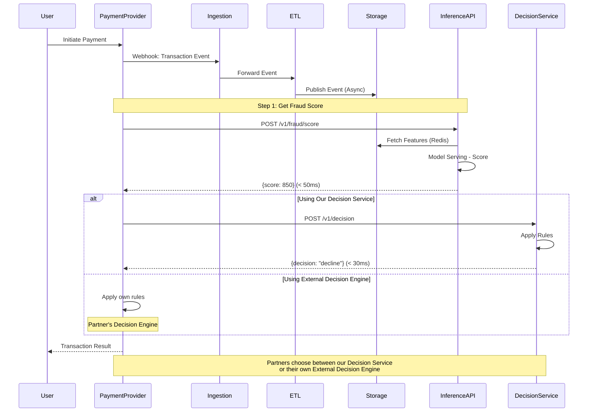

# High-Level Design

## Executive Summary

This document presents the High-Level Design for a Real-time Payment Fraud Detection and ML Operations Platform. The system ingests payment transaction data from heterogeneous sources, maintains optimized storage for analytics and operations, continuously trains and validates fraud detection models, and serves near real-time predictions at high frequency with built-in safety mechanisms for model experimentation.

---

## 1. Architectural Strategy

### 1.1 Design Principles

- **Separation of Concerns**: Each layer has distinct responsibilities and can evolve independently
- **Event-Driven Architecture**: Asynchronous communication enables decoupling and scalability
- **Idempotency**: All operations are safely retryable without side effects
- **Observability-First**: Built-in metrics, logging, and tracing for proactive monitoring
- **Security by Default**: Authentication and encryption enforced at every boundary
- **Safe Experimentation**: Shadow mode, holdout samples, and gradual rollout minimize risk

### 1.2 Non-Functional Requirements

| Category | Requirement | Target |
| -------- | ----------- | ------ |
| **Performance** | Inference Latency | < 100ms (p99) |
| | Throughput | 1,000+ TPS |
| **Availability** | System Uptime | 99.9% |
| | Recovery Time | < 15 minutes |
| **Security** | Compliance | PCI-DSS Level 1 |
| **Consistency** | Data Consistency | Eventual consistency |
| **Maintainability** | Model Freshness | Daily retraining |

---

## 2. System Architecture

### 2.1 Architecture Diagram

### 2.2 Real-time Fraud Detection Workflow

---

## 3. System Decomposition & Module Responsibilities

### 3.1 Ingestion Layer

#### Real-time Ingestion

- Receive Webhook events from payment providers with API
- Authenticate requests and enforce rate limiting
- Forward validated events to processing layer

#### Batch Ingestion

- Handle file-based data from providers without API (SFTP, S3)
- Validate file integrity and parse multiple formats
- Route file content to processing layer

### 3.2 Processing Layer

#### ETL Pipeline

- Validate data schemas and normalize formats
- Extract basic features and enrich data
- Publish events to message queue for distribution

#### Event Bus

- Decouple producers and consumers via message queue
- Enable asynchronous processing and event replay
- Support multiple storage consumers

### 3.3 Storage Layer

#### OLTP Database

- Store transactional records for operational queries and audit trails

#### OLAP Warehouse

- Store historical data for analytics and model training
- Columnar storage optimized for batch processing

#### Feature Store

- Cache pre-computed features for low-latency inference (<10ms)

#### Model Registry

- Version control for trained models and metadata

### 3.4 ML Pipeline

#### Feature Engineering

- Transform raw data into model-ready features (3,000+ variables)
- Maintain consistency between training and inference

#### Model Training

- Automated training of ensemble models (GBDT, XGBoost, Random Forest)
- Hyperparameter tuning and validation

#### Model Optimization

- **Applied before validation** to ensure validation tests the deployment-ready modelmark
- Quantization (FP32 → INT8) for 4x compression and 2-3x speedup
- Pruning to reduce model size
- Convert to ONNX format for cross-platform deployment
- Monitor accuracy degradation (typically <1% AUC loss)

#### Model Validation (Offline Only)

- Test optimized models on historical validation set (last 20% of 90-day data)
- Calculate performance metrics: AUC-ROC, Precision, Recall, F1
- Compare with current champion model
- Register to Model Registry after human approval
- **Does NOT**: Analyze production logs, control production traffic, or run online experiments

#### Feature Selection

- Select top N features based on importance to reduce inference time
- Store selected feature to OLTP Database

### 3.5 Inference Service (Scoring Layer)

**Purpose**: Provide fraud scoring as a service by orchestrating feature retrieval and model inference

#### Model Serving (Triton Inference Server)

- Host optimized ML models (ONNX format)
- Execute model predictions via gRPC
- Support horizontal scaling and GPU acceleration
- Internal component, not directly exposed

#### Inference API (Scoring Service)

- **Public API**: `POST /v1/fraud/score`
- **Orchestration**: Fetch features from Feature Store → Call Model Serving → Return score
- **Output**: Fraud score (0-1000) with model version and confidence
- **SLA**: <50ms latency (p99), 1000+ TPS
- **A/B Testing Management** (Complete Ownership):
  - **Configuration API**: `POST /v1/experiments/config` to set traffic allocation
  - **Experiment State**: Maintain active experiments (model versions, traffic splits)
  - **Traffic Routing**: Route requests to champion/challenger based on configuration
  - **Shadow Mode**: Run multiple models in parallel, return champion result
  - **Progressive Rollout**: Support gradual traffic shift (5% → 20% → 50% → 100%)
- **Metrics Collection**: Track latency, throughput, prediction distributions, score differences per model
- **Safety**: Rate limiting, circuit breaker, automatic failover to champion
- **Used by**: Our Decision Service, External Partner Decision Engines, Analytics

### 3.6 Decision Service (Two Implementation Options)

**Purpose**: Apply business rules on fraud scores to make final transaction decisions

#### Option 1: Our Decision Service (Internal Rules Engine)

- **Public API**: `POST /v1/decision`
- **Input**: Fraud score + transaction context (amount, country, customer history)
- **Logic**: Rule-based decision tree (configurable rules)
- **Output**: Decision (approve/decline/review) with reasoning
- **SLA**: <30ms latency (p99)
- **Configuration**: Hot-reloadable rules via admin dashboard
- **A/B Testing Support**:
  - Implement holdout sample bypass (1-5% traffic for unbiased evaluation)
  - Monitor business metrics (fraud loss, false positive rate, approval rate)
  - **Trigger automatic rollback** if thresholds exceeded (e.g., fraud loss > $X/day)
- **Used by**: Payment providers using our full-service offering

#### Option 2: External Decision Engine (Partner Integration)

- **Scenario**: Partners with existing decision systems
- **Integration**: Partner calls Inference API directly for scores
- **Responsibility**: Partner implements own rule logic and decision-making
- **Benefits**:
  - Keep existing compliance and business logic
  - No migration of decision rules required
  - Only integrate ML scoring capability
- **Used by**: Legacy payment providers, highly regulated partners

**Architectural Principle**: Service separation enables partners to use only the Inference Service (scoring) while maintaining their own Decision Service (rules), avoiding vendor lock-in.

### 3.7 Observability

#### Feedback Loop

- Collect actual outcomes for model monitoring
- Detect model drift and trigger retraining

#### Observability Stack

- Metrics, logs, and dashboards for system health
- Alerting for SLA violations and anomalies

---

## 4. Problem-to-Module Mapping

### Problem 1: API ingestion + ETL + optimized storage + real-time inference

**Core Challenges**: Continuous data ingestion, storage optimization, <100ms inference

**Solution**:

- **Ingestion Layer**: Handles both API and file-based data sources
- **Processing Layer**: Event-driven architecture with async storage writes
- **Storage Layer**: Dual-storage (OLTP for operations, OLAP for training, Feature Store for inference)
- **ML Pipeline**: Continuous training and model optimization
- **Inference Service**: Model serving + scoring API for <50ms inference
- **Decision Service**: Rule engine for <30ms decision-making (or partner's own)

---

### Problem 2: Safe model evaluation without fraud exposure

**Core Challenges**: Test new models without business risk, unbiased metrics, gradual rollout

**Solution** (4-Stage Progressive Validation):

- **Stage 1 - Offline Validation**: ML Pipeline tests challenger on historical data, registers to Model Registry if approved (zero risk)
- **Stage 2 - Shadow Mode**: Inference API Service enables Shadow Mode via config API, runs both models in parallel for 7-14 days (zero business risk)
- **Stage 3 - Holdout Sample**: Inference API configures and marks 1-5% holdout traffic; Decision Layer recognizes flag and bypasses rules; both models scored for unbiased evaluation (controlled risk with loss cap)
- **Stage 4 - Gradual Rollout**: Inference API Service adjusts traffic allocation via config (5% → 20% → 50% → 100%)
- **Manual Control**: Human operators adjust experiment config through Inference API at each stage
- **Automatic Rollback**: Decision Layer monitors business metrics and triggers rollback by calling Inference API to reset traffic to 100% champion
- **Feedback Loop**: Observability layer tracks outcomes; Inference API exposes experiment metrics dashboard

---

### Problem 3: Partner without API + inference integration

**Core Challenges**: Ingest non-API data, deliver predictions to partner

**Solution**:

- **Batch Ingestion**: Handles SFTP/S3 file uploads
- **Integration Options**:
  - **Option A**: Partner calls Inference API for scores, uses their own Decision Engine
  - **Option B**: Partner uses both our Inference Service and Decision Service (full integration)
  - **Option C**: Export model for partner's local deployment

**Architectural Benefit**: Service separation allows partners to use only the Inference Service while keeping their existing decision systems, avoiding the need for "special API endpoints"

---

### Problem 4: 3,000 variables + ensemble model + <100ms latency

**Core Challenges**: Large feature set, complex models, HFT-like latency

**Solution**:

- **Feature Store**: Pre-computed features for <10ms retrieval
- **Model Optimization**: Feature selection, quantization (4x compression), pruning
- **Tiered Inference**: Fast path (simple model) for low-risk, slow path (full ensemble) for high-risk
- **Performance Budget**:
  - **Inference Service**: Feature (10ms) + Model (30ms) + Orchestration (10ms) = 50ms
  - **Decision Service**: Rule Engine (5ms) + Orchestration (5ms) = 10ms
  - **Network Overhead**: 10-15ms (if separate services)
  - **Total**: 70-75ms (buffer: 25-30ms)

---

## 5. Success Metrics

### Technical KPIs

- Inference Latency p99: < 100ms
- System Availability: > 99.9%
- Throughput: > 1,000 TPS

### Business KPIs

- Fraud Detection Rate: > 95%
- False Positive Rate: < 1%

---

## Appendix: Next Steps

**Detailed Design Phase** will cover:

- Technology stack selection and justification
- Database schemas and data models
- API specifications and contracts
- Deployment architecture and scaling strategies
- Security implementation details

---
