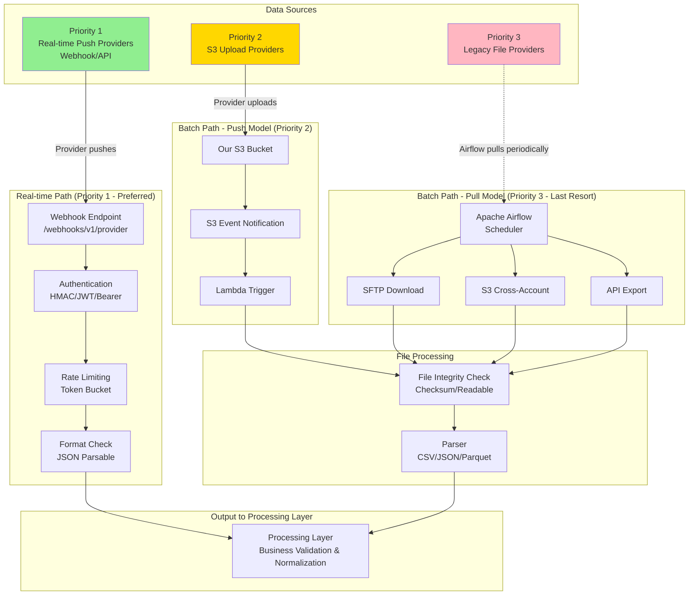
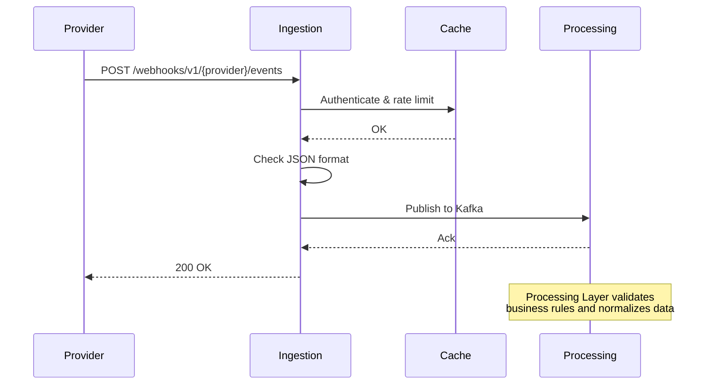
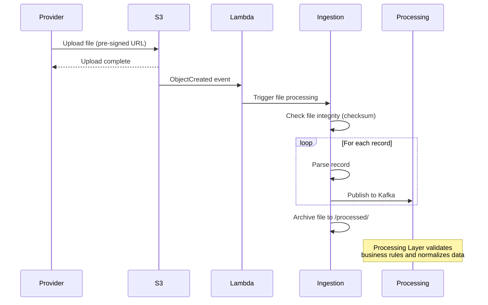
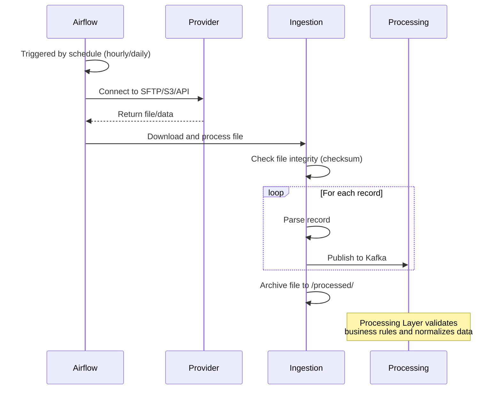

# Ingestion Layer

## Layer Overview

The Ingestion Layer receives payment transaction data from heterogeneous sources and forwards normalized events to the processing layer. It supports two ingestion patterns:

- **Real-time Ingestion**: Event-driven webhook push from providers
- **Batch Ingestion**: Scheduled bulk data fetch (API polling, file download)

**Classification Criteria**:

| Pattern | Trigger | Data Delivery | Examples |
| ------- | ------- | ------------- | -------- |
| **Real-time** | Event-driven (push) | Provider initiates on transaction event | Webhook callbacks |
| **Batch** | Scheduled (pull) | We initiate periodic fetch | SFTP files, API polling (any frequency), bulk export API |

**Rationale**: Webhook is fundamentally different - providers push immediately when events occur. All pull-based methods (regardless of frequency) are batch-oriented, as we control the schedule and fetch data in bulk.

**Primary Responsibility**: Secure, reliable, and efficient ingestion of payment transaction data

**Relation to HLD**:

- Implements the "Ingestion Layer" from architecture diagram
- Real-time path: `Providers → Real-time Ingestion → Processing Layer`
- Batch path: `Providers → Batch Ingestion → Processing Layer`
- **Validation Separation**: Ingestion checks format/integrity, Processing validates business rules
- Note: Fraud scoring happens separately via Inference API (not this layer's responsibility)

---

## Technology Stack

### Programming Language & Framework

**Rust with Axum** - High performance with memory safety and low latency for webhook processing

### Cache Layer

**Redis Cluster** - Sub-millisecond latency for authentication caching, rate limiting, and idempotency checks

### Message Queue (Interface to Processing Layer)

**Apache Kafka** - Decouples Ingestion and Processing layers, provides durable buffering for traffic spikes

**Configuration**:

- Topics: `transactions.realtime`, `transactions.batch`
- Retention: 7 days
- Replication factor: 3

### Batch Processing Orchestration

**Apache Airflow** - Workflow orchestration platform for scheduling and monitoring batch file processing pipelines

---

## Architecture

### Data Flow




### Processing Workflow

#### Real-time Push



#### S3 Upload with Event Trigger



#### Scheduled Pull



---

## Interface Definitions

### Integration Priority Strategy

When a payment provider lacks existing APIs, we follow this priority order for integration:

#### Priority 1: Real-time Push (Preferred)

- **Options**:
  - **Webhook**: Provider calls our `/webhooks/v1/{provider}/events` endpoint to push transaction events
  - **Message Queue Integration**: We subscribe to provider's Kafka/RabbitMQ topics as consumer
    - **Example 1 - Kafka**: Provider publishes to `transactions.created` topic, we consume with consumer group `fraud-detection`
    - **Example 2 - RabbitMQ**: Provider publishes to `payment.events` exchange, we bind queue and consume messages
    - **Example 3 - AWS EventBridge**: Provider publishes events to their event bus, we subscribe via cross-account event rule
- **Advantages**: Near-zero latency, event-driven architecture, no polling overhead
- **Provider effort**: Low (HTTP client for webhooks, or granting MQ/event bus access)
- **Our effort**: Low for webhooks (endpoint ready), medium for MQ (consumer setup, schema mapping)

**Why CDC is Not Supported**:

CDC (Change Data Capture) is excluded from our integration options due to:

- **Database permission requirements**: Requires direct access to provider's database logs (binlog/WAL), which is a significant security concern
- **Compliance risks**: Direct database access raises PCI-DSS and data privacy compliance issues
- **Operational complexity**: Maintaining database connectivity and handling schema changes is operationally expensive
- **Availability**: Few providers are willing to grant database-level access to external systems

For providers who only have database events, we recommend they implement a lightweight event publisher (webhook or message queue) on their side.

#### Priority 2: File Push to Our S3 with Event Trigger

- **Workflow**:
  1. Provider uploads files to our S3 bucket (via pre-signed URLs or IAM role)
  2. S3 ObjectCreated event triggers Lambda function
  3. Lambda initiates Airflow DAG for file processing
- **Advantages**: Serverless automation, no polling needed, scalable
- **Provider effort**: Low (standard S3 SDK, no file server maintenance)
- **Our effort**: Medium (S3 bucket setup, Lambda function, IAM policies)

#### Priority 3: File Pull from Provider Infrastructure (Last Resort)

- **Options**:
  - **SFTP Pull**: Our Airflow connects to provider's SFTP server periodically
  - **S3 Cross-Account Pull**: We access provider's S3 bucket via IAM role
  - **API-based File Export**: We call provider's export API to download files
- **Advantages**: Zero integration effort for provider
- **Disadvantages**: Polling latency (hours), we manage provider credentials, operational complexity
- **Provider effort**: Minimal (provide credentials, maintain file server)
- **Our effort**: High (credential management, DAG configuration, monitoring polling failures)

**Decision Criteria**:

| Factor | Priority 1 (Real-time Push) | Priority 2 (S3 Event) | Priority 3 (Pull) |
| ------ | --------------------------- | --------------------- | ----------------- |
| Latency | Seconds | Minutes | Hours |
| Provider implementation | HTTP client | S3 SDK | None |
| Our operational cost | Low | Medium | High |
| Credential management | Provider stores ours | Provider stores ours | We store theirs (security risk) |
| Scalability | Excellent | Excellent | Limited by polling frequency |

**Recommendation**: Always negotiate for Priority 1 first. Use Priority 2-3 only when provider absolutely cannot implement real-time push mechanisms due to legacy constraints.

---

### Real-time API

#### HTTP Endpoints

**Webhook Endpoint**:

```http
POST /webhooks/v1/{provider}/events
Content-Type: application/json
Authorization: Provider-specific (HMAC-SHA256, JWT, etc.)

Request Body: Provider-specific JSON payload
Response: 200 OK with event_id
```

**Health Check**:

```http
GET /health
Response: 200 OK {"status": "healthy"}
```

#### Core Abstractions

```rust
// Webhook handler interface
pub trait WebhookHandler {
    /// Process incoming webhook event
    async fn handle_webhook(
        &self,
        provider: &str,
        payload: &[u8],
        headers: HashMap<String, String>,
    ) -> Result<IngestionAck, Error>;
}

// Provider-specific authentication
pub trait AuthenticationStrategy {
    /// Verify request authenticity (HMAC-SHA256, JWT, etc.)
    async fn authenticate(
        &self,
        payload: &[u8],
        headers: &HashMap<String, String>,
    ) -> Result<bool, Error>;
}

// Rate limiting
pub trait RateLimiter {
    /// Check if request is within rate limit
    async fn check_limit(
        &self,
        provider: &str,
        client_id: &str,
        limit: u32,
    ) -> Result<(bool, u32), Error>;
}

// Event publishing to Processing Layer
pub trait EventPublisher {
    /// Publish transaction event to Processing Layer
    async fn publish(
        &self,
        message: TransactionMessage,
    ) -> Result<(), Error>;
}
```

### Batch API

Batch API handles file-based ingestion for Priority 2 (S3 upload) and Priority 3 (file pull) scenarios. Refer to [Integration Priority Strategy](#integration-priority-strategy) for when to use batch solutions.

#### Data Flow Model

Batch ingestion supports both **Push** and **Pull** models, chosen based on provider capabilities:

**Pull Model** (We fetch from provider - More common):

- **Workflow**: Our Airflow DAG periodically connects to provider's SFTP/S3/API to download files
- **Provider responsibility**: Maintain file server with predictable file locations
- **Our responsibility**: Implement authentication, scheduling, error handling
- **Use cases**: Large payment processors with existing file export systems

**Push Model** (Provider uploads to us):

- **Workflow**: Provider uploads files to our SFTP server or S3 bucket
- **Provider responsibility**: Implement upload logic and scheduling
- **Our responsibility**: Provide upload infrastructure and credentials
- **Use cases**: Small providers without file hosting infrastructure, or providers who prefer pushing data

**Consistency with Real-time Pattern**:

Both batch models align with real-time ingestion philosophy:

- **Real-time webhook**: Provider pushes to our API (they call us)
- **Real-time API polling**: We pull from provider API (we call them)
- **Batch pull**: We pull from provider file server (we fetch their files)
- **Batch push**: Provider pushes to our file server (they upload to us)

The choice depends on **provider's existing infrastructure** and **integration preference**.

#### Model Selection Criteria

| Factor | Pull Model | Push Model |
| ------ | ---------- | ---------- |
| Provider has file server | ✅ Provider exports files regularly | ❌ No infrastructure |
| Integration effort | We implement download logic | Provider implements upload |
| Credential management | We store provider credentials | Provider stores our credentials |
| Scheduling control | We control polling frequency | Provider controls timing |
| Typical providers | Banks, large processors | Small fintechs, manual uploads |

#### File Content & Format Specifications

**Supported File Formats**:

1. **CSV** (Most common - 80% of providers)
2. **JSON** (Line-delimited NDJSON for large files)
3. **Parquet** (Cloud-native providers with large volumes)

**File Content**: Transaction records with provider-specific fields

Each file contains a batch of payment transactions from a specific time period (typically hourly or daily export).

**CSV Format Example** (Stripe):

```csv
transaction_id,transaction_timestamp,amount,currency,customer_id,payment_method,status,metadata
txn_1234567890,2026-01-08T10:00:00Z,10000,USD,cus_abc123,card,succeeded,"{""fee"":290}"
txn_1234567891,2026-01-08T10:00:05Z,25000,EUR,cus_def456,bank_transfer,pending,"{""fee"":150}"
txn_1234567892,2026-01-08T10:00:10Z,5000,GBP,cus_ghi789,wallet,succeeded,"{""fee"":100}"
```

**JSON Format Example** (PayPal):

```json
{"transaction_id":"PAY-1234567890","create_time":"2026-01-08T10:00:00Z","amount":{"total":"100.00","currency":"USD"},"payer":{"payer_id":"PAYER123"},"payment_method":"paypal","state":"approved"}
{"transaction_id":"PAY-1234567891","create_time":"2026-01-08T10:00:05Z","amount":{"total":"250.00","currency":"EUR"},"payer":{"payer_id":"PAYER456"},"payment_method":"credit_card","state":"pending"}
{"transaction_id":"PAY-1234567892","create_time":"2026-01-08T10:00:10Z","amount":{"total":"50.00","currency":"GBP"},"payer":{"payer_id":"PAYER789"},"payment_method":"debit_card","state":"approved"}
```

**Parquet Format** (Schema):

```proto
message transaction_record {
  required binary transaction_id (STRING);
  required int64 timestamp (TIMESTAMP_MILLIS);
  required int64 amount;
  required binary currency (STRING);
  optional binary customer_id (STRING);
  required binary payment_method (STRING);
  optional binary metadata (JSON);
}
```

**Common Fields Across Providers**:

| Field | Description | Example Values |
| ----- | ----------- | -------------- |
| `transaction_id` | Unique transaction identifier | `txn_abc123`, `PAY-456789` |
| `timestamp` | Transaction creation time | ISO 8601 string or Unix timestamp |
| `amount` | Transaction amount | `10000` (cents) or `"100.00"` (dollars) |
| `currency` | ISO 4217 currency code | `USD`, `EUR`, `GBP` |
| `customer_id` | Customer/payer identifier | `cus_abc123`, provider-specific ID |
| `payment_method` | Payment method type | `card`, `bank_transfer`, `wallet`, `paypal` |
| `status` | Transaction status | `succeeded`, `pending`, `failed`, `approved` |
| `metadata` | Additional provider-specific data | JSON string or nested object |

**File Size & Volume**:

- **Typical file size**: 10 MB - 1 GB (10K - 1M records)
- **Large providers**: Up to 10 GB per file (split recommended)
- **Frequency**: Hourly (high-volume) or daily (low-volume)
- **Compression**: Often gzip compressed (`.csv.gz`, `.json.gz`)

**File Naming Conventions**:

```text
{provider}_transactions_{timestamp}.{format}
Examples:
- stripe_transactions_20260108_100000.csv
- paypal_transactions_2026-01-08T10:00:00Z.json.gz
- adyen_transactions_1704708000.parquet
```

**Provider-Specific Variations**:

- **Column names differ**: `txn_id` vs `transaction_id` vs `payment_id`
- **Amount format varies**: Cents (integer) vs dollars (decimal string)
- **Timestamp format varies**: ISO 8601 vs Unix epoch vs custom format
- **Required fields differ**: Some providers omit `customer_id` or `metadata`
- **Additional fields**: Provider-specific risk scores, fees, refund info

**Column Mapping Configuration** (per provider):

Our system maintains mapping configurations to translate provider-specific formats to standard schema:

```yaml
# Example: Stripe CSV mapping
stripe:
  format: csv
  delimiter: ","
  header_row: true
  column_mapping:
    transaction_id: "id"                    # Stripe uses "id"
    timestamp: "created"                    # Unix timestamp in "created" column
    amount: "amount"                        # Already in cents
    currency: "currency"                    # Standard ISO code
    customer_id: "customer"                 # Stripe customer ID
    payment_method: "payment_method_type"   # Card type
    status: "status"                        # succeeded/pending/failed
  transformations:
    timestamp: "unix_to_iso8601"            # Convert Unix to ISO string
    amount: "keep_as_integer"               # Already in cents
```

#### Core Abstractions

```rust
// File processor interface
pub trait BatchProcessor {
    /// Process file and yield parsed transactions
    async fn process_file(
        &self,
        file_path: &str,
        batch_id: &str,
    ) -> Result<ProcessingStats, Error>;
}

// Format-specific parsers
pub trait FileParser {
    /// Parse file records into standard format
    fn parse(
        &self,
        file_path: &str,
        config: &ParsingConfig,
    ) -> impl Stream<Item = Result<ParsedRecord, ParseError>>;
}
```

### Unified Output Format

Both real-time and batch paths produce standardized messages:

```rust
pub struct TransactionMessage {
    // Event metadata
    pub event_id: String,
    pub ingestion_timestamp: String,  // ISO 8601
    pub provider: String,  // "stripe" | "paypal" | "legacy_bank"
    pub source: String,  // "webhook" | "api" | "batch"
    
    // Transaction data
    pub transaction_id: String,
    pub timestamp: String,
    pub amount: i64,  // Smallest currency unit (cents)
    pub currency: String,  // ISO 4217
    pub customer_id: Option<String>,
    pub payment_method: String,
    pub raw_payload: Value,  // Original provider data
    
    // Schema version
    pub schema_version: String,  // "1.0"
}
```

---

## Key Algorithms & Patterns

### Real-time Processing

**Authentication Pattern**: Strategy pattern with provider-specific implementations

- Stripe: HMAC-SHA256 signature verification with timestamp replay protection
- PayPal: JWT token validation with issuer verification
- Adyen: Basic Auth + HMAC double verification

**Rate Limiting**: Token bucket algorithm with sliding window

- Redis INCR for atomic counter increment
- Key pattern: `ratelimit:{provider}:{client_id}:{window}`
- Configurable limits per provider

**Format Check**: Minimal validation before forwarding to Processing Layer

- Verify JSON is parsable (real-time)
- Verify file checksum matches (batch)
- **Note**: Business rule validation (amount range, required fields, currency codes) is Processing Layer's responsibility

**Idempotency**: Cache-aside pattern with 24-hour window

- Check Redis before processing: `idempotency:{key}`
- Return cached response if duplicate
- Store result after successful Kafka publish

### Batch Processing

**File Integrity Check**:

1. **Checksum Validation**: Verify file not corrupted in transit
2. **Format Detection**: Confirm file type (CSV/JSON/Parquet)
3. **Readability Check**: Ensure file can be opened and parsed

**File Parsing Strategy**:

1. **Streaming**: Process large files in chunks (10,000 records) to avoid memory overload
2. **Parallelization**: Split file across worker threads for faster processing
3. **Fault Tolerance**: Log failed records to DLQ, continue processing remaining records

**Column Mapping**: Provider-specific configuration translates custom formats to standard schema

```text
Provider CSV:     TXN_ID,    TXN_DATE,              AMOUNT
Standard Schema:  transaction_id, transaction_timestamp, amount
```

**Data Transformation** (Basic):

- Parse timestamps to ISO 8601 string format
- Extract fields according to column mapping
- **Note**: Amount conversion (dollars → cents), currency validation, and field requirements are Processing Layer's responsibility

---

## Performance & Capacity

### Real-time Capacity

**Per Instance (1,000 TPS baseline)**:

- CPU: 1 vCPU at moderate utilization
- Memory: 512 MB
- Network: ~64 Mbps (ingress + egress)

**Latency Breakdown**:

- Request parsing: 0.5ms
- Authentication (cached): 0.3ms
- Rate limit check: 0.8ms
- Schema validation: 1.0ms
- Kafka publish: 8.0ms
- Response: 0.3ms
- **Total: ~15ms (p95)**

**Scaling Strategy**:

- Horizontal scaling with stateless instances
- Auto-scale on CPU >70% or latency >40ms
- Target 30% capacity buffer for bursts

### Batch Capacity

**Processing Speed**: 10,000+ records/sec per worker

**File Size Limits**:

- Maximum: 10 GB per file
- Recommended: Split large files at source

**Parallelization**:

- Up to 8 worker threads per batch job
- Streaming prevents memory exhaustion

**Scheduling**:

- Hourly for high-frequency providers
- Daily for low-frequency providers
- On-demand for ad-hoc uploads

### Cache Requirements

**Redis Memory** (~10 GB total):

- Token cache: ~1 MB (100 providers × 10 tokens)
- Rate limiting counters: ~8 KB active set
- Idempotency cache: ~8.64 GB (86.4M tx/day × 100 bytes × 24h TTL)

**Eviction Policy**: LRU for token cache, TTL-based for rate limiting and idempotency

---

## External Integration

### Downstream Interface (to Processing Layer)

Ingestion Layer publishes normalized events to Kafka topics:

**Topics**:

```text
transactions.realtime  - Real-time webhook events
transactions.batch     - Batch file records
```

**Why Two Topics** (by ingestion pattern, not by provider):

- **Processing Priority**: Real-time events need lower latency processing, batch can tolerate higher lag
- **Consumption Patterns**: Consumers care about ingestion method (realtime vs batch), not specific provider
- **Monitoring Strategy**: Different SLA thresholds (realtime: seconds, batch: minutes)
- **Scalability**: Adding new providers doesn't require new topics (avoids topic explosion)
- **Simplicity**: Processing Layer doesn't need provider-specific logic for routing

**Data Processing Note**:

- Ingestion Layer performs **minimal transformation** (parsing, field mapping)
- **No business validation**: Amount range, currency codes, required fields validated by Processing Layer
- **No data normalization**: Currency conversion, method standardization done by Processing Layer
- Preserves `raw_payload` for audit trail and reprocessing

**Delivery**: At-least-once with idempotency handled by Processing Layer using `event_id`

### External Dependencies

| Service | Purpose | Failure Mitigation |
| ------- | ------- | ------------------ |
| Processing Layer | Event processing | Circuit breaker + local buffering |
| Redis Cluster | Caching & rate limiting | Skip cache, process normally |
| SFTP/S3 | File storage (batch) | Local disk cache for 24h |
| PostgreSQL | Batch job metadata | In-memory state (ephemeral) |

### Internal Dependencies

- **Processing Layer**: Receives normalized events from Ingestion Layer
- **Monitoring Stack**: Prometheus, ELK, Grafana

---

## Security

### Compliance

- PCI-DSS Level 1: Payment card data handling
- GDPR: Customer data privacy (EU transactions)
- SOC 2 Type II: Audit controls

### Authentication & Encryption

**Real-time**:

- TLS 1.3 for all external connections
- Provider-specific signature verification (HMAC-SHA256, JWT)
- Timestamp-based replay attack protection (±5 min window)

**Batch**:

- SFTP: SSH key-based authentication (RSA 4096-bit)
- S3: IAM roles with least privilege
- Files encrypted at rest (AES-256)

### Input Validation

- Strict JSON schema validation on all payloads
- String length limits and pattern matching
- Numeric range validation (e.g., amount > 0)
- Enum whitelisting (provider, currency codes)

### Audit Logging

**Security events logged**:

- Authentication failures (provider, IP, timestamp)
- Rate limit violations
- Schema validation failures
- Suspicious activity patterns

**Retention**: 1 year in structured JSON format

---

## Monitoring & Observability

### Key Metrics

**Real-time**:

- Request throughput and error rates by provider
- End-to-end latency (P50, P95, P99)
- Authentication failure rates
- Kafka publish success/failure rates
- Circuit breaker state

**Batch**:

- Batch job duration and success rate
- Records processed vs failed per batch
- File size distribution
- Provider file arrival times

### Distributed Tracing

- End-to-end request tracing with OpenTelemetry
- Sampling: 100% errors, 1% for successful requests
- Trace retention: 7 days
- Context propagation to Processing Layer via Kafka headers

### Dashboards

**Operations**: Real-time TPS, latency, error rates, circuit breaker status

**Capacity**: Resource utilization, queue depths, storage trends

**Batch**: Job completion rate, processing duration, file backlog

---
