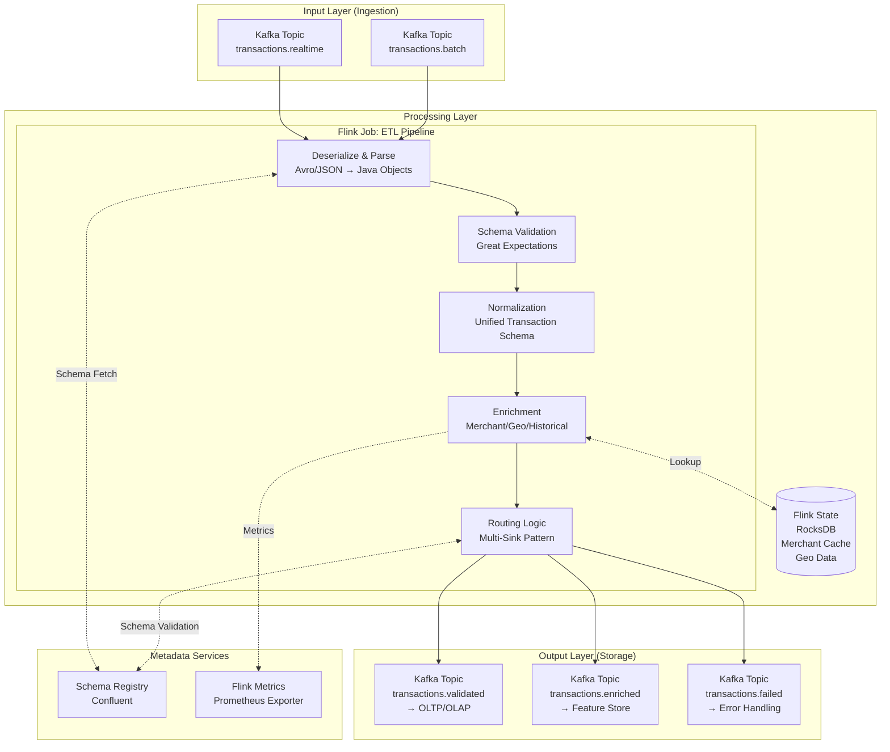
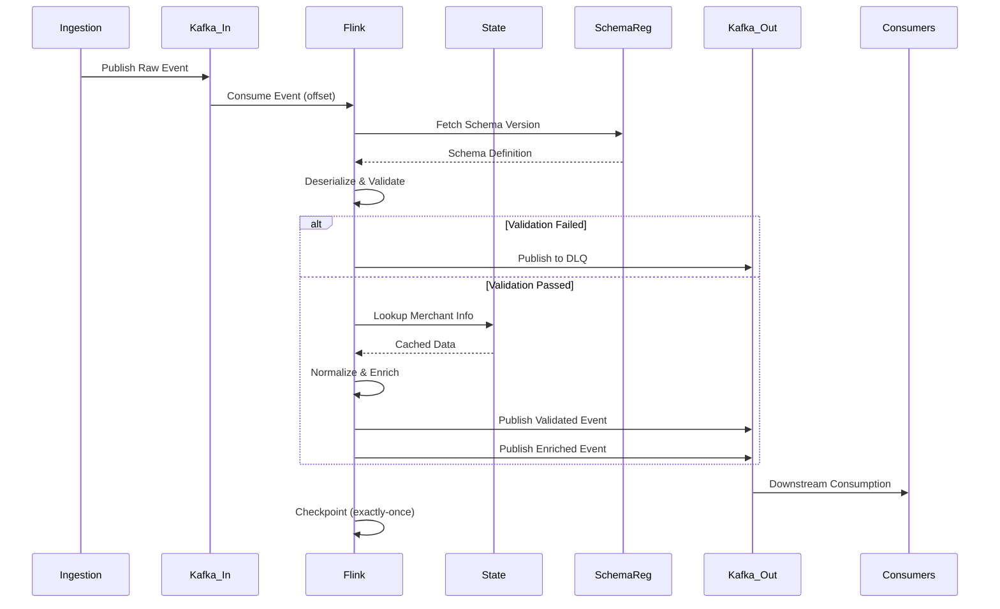

# Processing Layer

## Layer Overview

The Processing Layer acts as the data transformation and distribution hub between the Ingestion Layer and downstream Storage/ML systems. It performs validation, normalization, enrichment, and routing of transaction data through an event-driven architecture.

**Primary Responsibilities**:

- Validate transaction data against business rules and schemas
- Normalize heterogeneous data formats into unified schemas
- Enrich transactions with contextual information
- Route events to multiple downstream consumers (OLTP, OLAP, Feature Store)
- Maintain data quality and lineage

**Relation to HLD**:

- Implements "Processing Layer" (ETL Pipeline + Event Bus) from architecture diagram
- Consumes from: Ingestion Layer (Kafka topics)
- Produces to: Storage Layer (OLTP, OLAP, Feature Store)
- Workflow: `Ingestion → Event Bus → ETL Pipeline → Event Bus → Storage Consumers`

---

## Technology Stack

### Stream Processing

**Apache Flink** - Stateful stream processing with exactly-once semantics for real-time ETL. Chosen for native Kafka integration, low latency (<10ms), built-in state management, and horizontal scaling capabilities.

### Event Bus

**Apache Kafka** - Distributed event streaming platform

**Topics**:

- **Input**: `transactions.realtime`, `transactions.batch` (from Ingestion Layer)
- **Output**: `transactions.validated` (to OLTP/OLAP), `transactions.enriched` (to Feature Store), `transactions.failed` (DLQ)
- **Configuration**: 32 partitions, 7-day retention, replication factor 3

### Schema Management

**Confluent Schema Registry** - Enforces schema evolution compatibility, version control, and prevents breaking changes

### Data Quality

**Great Expectations** - Validation rules, data profiling, and anomaly detection

---

## Architecture

### System Diagram



### Data Flow Sequence



---

## Detailed Design

### 1. ETL Pipeline (Flink Job)

#### 1.1 Deserialization & Parsing

**Objective**: Convert byte streams from Kafka into typed objects

**Schema Support**:

- **Avro** (preferred): Compact binary format with schema evolution
- **JSON**: Fallback for legacy providers

**Error Handling**:

- **Deserialization Errors**: Capture raw bytes, publish to DLQ with error metadata
- **Schema Not Found**: Retry with exponential backoff (3 attempts), then DLQ

---

#### 1.2 Schema Validation

**Objective**: Ensure events conform to expected schema and business constraints

**Validation Layers**:

1. **Structural Validation** (Schema Registry)
   - Field presence: Required fields exist
   - Type checking: Correct data types
   - Enum validation: Values match allowed lists

2. **Business Rule Validation** (Great Expectations)
   - Amount range: `0.01 <= amount <= 1,000,000`
   - Currency codes: ISO 4217 standard
   - Timestamp: Within ±24 hours of current time
   - Provider ID: Exists in registered provider list

**Processing Flow**:

- Valid events → Downstream processing
- Invalid events → DLQ with error metadata + metrics increment

**Validation Rules**:

| Field | Validation | Error Action |
| ----- | ---------- | ------------ |
| `transaction_id` | Non-null, UUID format | DLQ + Alert |
| `amount` | > 0, decimal(12,2) | DLQ |
| `currency` | ISO 4217 code | DLQ |
| `timestamp` | ISO 8601, within ±24h | DLQ + Alert (clock drift) |
| `provider_id` | Exists in provider registry | DLQ + Alert (new provider?) |
| `customer_id` | Non-null, alphanumeric | DLQ |
| `merchant_id` | Non-null | Warning (allow missing merchant) |

**Output**:

- Valid events → Downstream processing
- Invalid events → DLQ with error metadata

---

#### 1.3 Normalization

**Objective**: Transform heterogeneous provider schemas into unified internal schema

**Normalization Tasks**:

1. **Field Mapping**: Convert provider-specific fields to unified schema
   - Example: Stripe `amount_cents` / 100 → normalized `amount`

2. **Currency Standardization**: Convert minor units to major (cents → dollars)

3. **Timestamp Harmonization**: Convert all to UTC epoch milliseconds

4. **Address Normalization**: Extract country code, parse postal codes

**Unified Transaction Schema**:

```json
{
  "transaction_id": "uuid",
  "provider_id": "string",
  "provider_transaction_id": "string",
  "timestamp": "long (epoch millis)",
  "amount": "decimal",
  "currency": "string (ISO 4217)",
  "customer": {
    "customer_id": "string",
    "email": "string (hashed)",
    "phone": "string (hashed)"
  },
  "merchant": {
    "merchant_id": "string",
    "name": "string",
    "category": "string (MCC)"
  },
  "payment_method": {
    "type": "enum (card, bank_transfer, wallet)",
    "card_bin": "string (first 6 digits)",
    "card_last4": "string"
  },
  "billing_address": {
    "country": "string (ISO 3166)",
    "postal_code": "string",
    "latitude": "double (nullable)",
    "longitude": "double (nullable)"
  },
  "metadata": {
    "ingestion_timestamp": "long",
    "processing_timestamp": "long",
    "schema_version": "string"
  }
}
```

---

#### 1.4 Enrichment

**Objective**: Augment transactions with contextual data to improve model accuracy

**Enrichment Sources**:

1. **Merchant Metadata** (from state store)
   - Merchant risk score
   - Historical fraud rate
   - Business category
   - Registration date

2. **Geolocation Data**
   - Country risk score
   - Distance from customer's typical location
   - VPN/proxy detection flags

3. **Historical Features** (from Feature Store)
   - Customer lifetime transaction count
   - Customer average transaction amount
   - Time since last transaction
   - Merchant-customer relationship (new/returning)

4. **External Data** (optional, cached)
   - IP reputation scores
   - Device fingerprints
   - Email domain risk

**State Management**: Flink RocksDB state stores merchant/geo metadata for sub-ms lookups

- Cache invalidation: 24-hour refresh or on-demand via control stream

**Performance Optimization**:

- **State Caching**: Local RocksDB state (sub-ms lookup)
- **Async I/O**: Non-blocking calls to Feature Store (timeout 20ms, capacity 1000)

**Enrichment Budget**:

- Target: < 15ms (within 30ms processing budget)
- State lookup: < 1ms
- Feature Store lookup: < 10ms (async)
- Remaining: 4ms for transformation logic

---

#### 1.5 Routing Logic

**Objective**: Distribute processed events to appropriate downstream systems

**Routing Patterns**:

1. **Multi-Sink Pattern**:
   - Validated events → OLTP Database (operational queries)
   - Validated events → OLAP Warehouse (analytics/training)
   - Enriched events → Feature Store (inference)

2. **Topic-Based Routing**: Configure Kafka sinks with Avro serialization
   - `transactions.validated` → OLTP/OLAP consumers
   - `transactions.enriched` → Feature Store

3. **Conditional Routing** (optional):
   - High-value transactions (> $10k) → Priority queue
   - Suspicious patterns → Real-time alert stream

**Delivery Guarantees**:

- **Exactly-Once Semantics**: Flink checkpointing + Kafka transactions
- **Ordering**: Preserved per `provider_id + transaction_id` partition key
- **Idempotency**: Downstream consumers must handle duplicate events

---

### 2. Event Bus (Kafka)

#### 2.1 Topic Design

**Input Topics** (from Ingestion Layer):

| Topic | Partitions | Retention | Key | Value Schema |
| ----- | ---------- | --------- | --- | ------------ |
| `transactions.realtime` | 32 | 7 days | `provider_id` | Avro: RawTransaction |
| `transactions.batch` | 32 | 7 days | `provider_id` | Avro: RawTransaction |

**Output Topics** (to Storage Layer):

| Topic | Partitions | Retention | Key | Value Schema |
| ----- | ---------- | --------- | --- | ------------ |
| `transactions.validated` | 32 | 7 days | `transaction_id` | Avro: NormalizedTransaction |
| `transactions.enriched` | 32 | 7 days | `transaction_id` | Avro: EnrichedTransaction |
| `transactions.failed` | 8 | 30 days | `transaction_id` | Avro: FailedTransaction |

**Partitioning Strategy**:

- **Input**: Partition by `provider_id` to maintain order per provider
- **Output**: Partition by `transaction_id` for even load distribution
- **Rationale**: Input order matters for incremental loads; output distribution matters for consumer parallelism

---

#### 2.2 Consumer Groups

| Consumer Group | Topics | Purpose | Parallelism |
| -------------- | ------ | ------- | ----------- |
| `etl-pipeline` | Input topics | Flink ETL job | 32 |
| `oltp-writer` | `transactions.validated` | Write to PostgreSQL | 16 |
| `olap-writer` | `transactions.validated` | Write to Snowflake | 8 |
| `feature-store-writer` | `transactions.enriched` | Write to Redis | 32 |
| `dlq-handler` | `transactions.failed` | Error notification | 4 |

---

### 3. Data Quality Monitoring

#### 3.1 Data Quality Checks

**Validation Suite** (Great Expectations):

- `transaction_id`: Non-null, UUID format
- `amount`: Range 0.01-1,000,000
- `currency`: ISO 4217 codes (USD, EUR, GBP, JPY, etc.)
- `timestamp`: Valid ISO 8601 format

**Data Quality Metrics**:

| Metric | SLA | Alert Threshold |
| ------ | --- | --------------- |
| Validation Pass Rate | > 99.9% | < 99.5% |
| Schema Conformance | 100% | < 99.9% |
| Null Value Rate | < 0.1% | > 0.5% |
| Duplicate Rate | < 0.01% | > 0.1% |
| Processing Lag | < 1 minute | > 5 minutes |

---

#### 3.2 Observability

**Metrics** (Prometheus):

```yaml
# Throughput
flink_taskmanager_job_task_operator_recordsInPerSecond
flink_taskmanager_job_task_operator_recordsOutPerSecond

# Latency
flink_taskmanager_job_latency_source_id_operator_id_operator_subtask_index_latency
flink_taskmanager_job_task_operator_currentProcessingTime

# Errors
flink_taskmanager_job_task_operator_numRecordsInErrors
validation_failure_total{reason="amount_out_of_range"}
validation_failure_total{reason="invalid_currency"}

# State Size
flink_taskmanager_job_task_operator_rocksdb_bytes_read
flink_taskmanager_job_task_operator_rocksdb_bytes_written

# Kafka
kafka_consumer_lag{topic="transactions.realtime", partition="0"}
kafka_producer_record_send_total
```

**Logging** (JSON structured):

```json
{
  "timestamp": "2026-01-08T10:30:45.123Z",
  "level": "WARN",
  "logger": "EnrichmentFunction",
  "transaction_id": "123e4567-e89b-12d3-a456-426614174000",
  "provider_id": "stripe",
  "message": "Merchant not found in state, fetching from database",
  "merchant_id": "mch_abc123",
  "latency_ms": 12
}
```

---

## Schema Evolution

### Schema Versioning Strategy

**Principles**:

- **Backward Compatibility**: New consumers can read old data
- **Forward Compatibility**: Old consumers can read new data (ignore unknown fields)
- **Full Compatibility**: Both backward and forward (preferred)

**Evolution Examples**:

1. **Adding Optional Field** (Backward + Forward Compatible):

   ```json
   // v1.0
   { "amount": 100.0, "currency": "USD" }
   
   // v1.1 - Add optional field with default
   { "amount": 100.0, "currency": "USD", "fee": 2.5 }
   ```

2. **Removing Field** (Requires Migration):
   - Deprecate field in v1.1 (keep but mark deprecated)
   - Remove in v2.0 (major version bump)
   - Run dual-write period for safe migration

3. **Changing Field Type** (Breaking Change):
   - Create new field with new type
   - Dual-write old + new field
   - Migrate consumers to new field
   - Deprecate old field

---

## Data Privacy

### PII Handling

- **Hashing**: Email, phone numbers hashed before storage
- **Masking**: Credit card numbers masked (show last 4 digits only)
- **Encryption**: At-rest (S3/Kafka), in-transit (TLS 1.3)

### Compliance

- **PCI-DSS**: No full card numbers stored
- **GDPR**: Support for data deletion (Kafka compacted topics)
- **Audit Logging**: All schema changes and access logged

---

## Appendix

### A. Schema Definitions

**RawTransaction (Input)**:

```json
{
  "type": "record",
  "name": "RawTransaction",
  "namespace": "com.fraud.ingestion",
  "fields": [
    {"name": "transaction_id", "type": "string"},
    {"name": "provider_id", "type": "string"},
    {"name": "timestamp", "type": "long"},
    {"name": "amount", "type": "double"},
    {"name": "currency", "type": "string"},
    {"name": "payload", "type": "string"}
  ]
}
```

**NormalizedTransaction (Output)**:

```json
{
  "type": "record",
  "name": "NormalizedTransaction",
  "namespace": "com.fraud.processing",
  "fields": [
    {"name": "transaction_id", "type": "string"},
    {"name": "provider_id", "type": "string"},
    {"name": "timestamp", "type": "long"},
    {"name": "amount", "type": "double"},
    {"name": "currency", "type": "string"},
    {"name": "customer", "type": {
      "type": "record",
      "name": "Customer",
      "fields": [
        {"name": "customer_id", "type": "string"},
        {"name": "email_hash", "type": "string"},
        {"name": "phone_hash", "type": ["null", "string"], "default": null}
      ]
    }},
    {"name": "merchant", "type": {
      "type": "record",
      "name": "Merchant",
      "fields": [
        {"name": "merchant_id", "type": "string"},
        {"name": "name", "type": "string"},
        {"name": "category", "type": "string"}
      ]
    }},
    {"name": "metadata", "type": {
      "type": "record",
      "name": "Metadata",
      "fields": [
        {"name": "ingestion_timestamp", "type": "long"},
        {"name": "processing_timestamp", "type": "long"},
        {"name": "schema_version", "type": "string"}
      ]
    }}
  ]
}
```

### B. Glossary

- **ETL**: Extract, Transform, Load - data processing pattern
- **DLQ**: Dead Letter Queue - repository for failed messages
- **p95/p99**: 95th/99th percentile latency
- **TPS**: Transactions Per Second
- **RTO**: Recovery Time Objective
- **RPO**: Recovery Point Objective
- **PII**: Personally Identifiable Information

---
