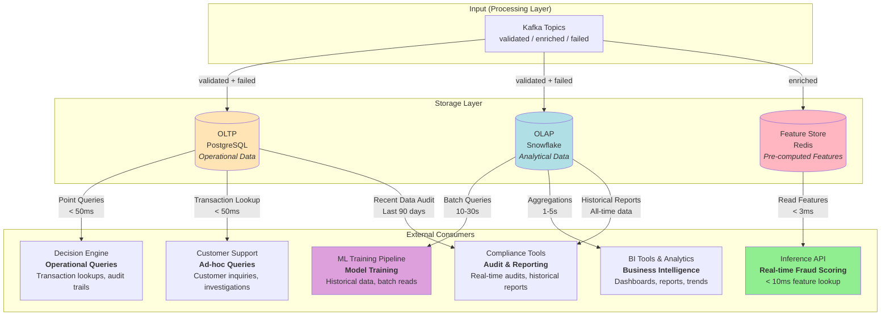
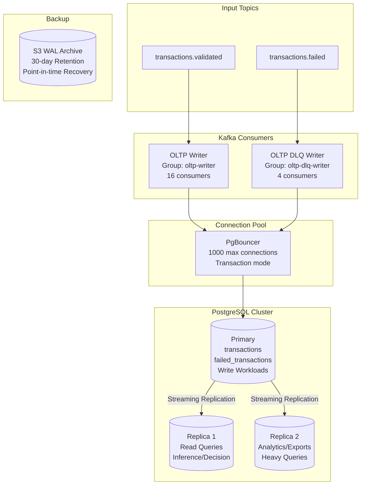
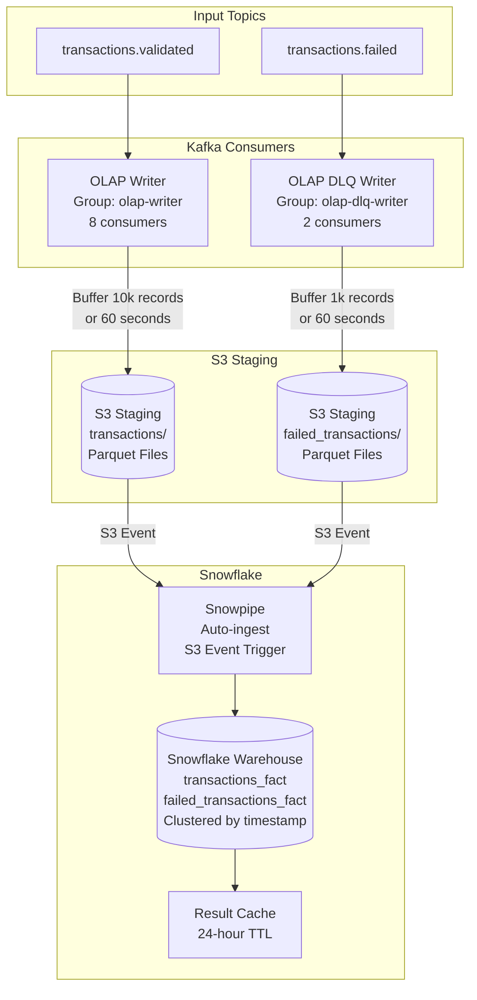
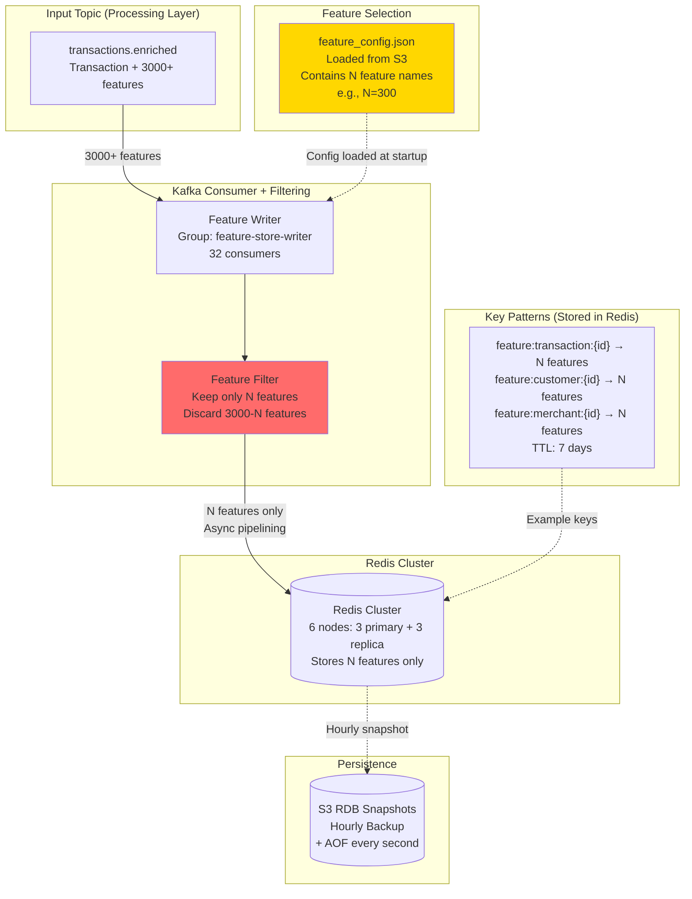
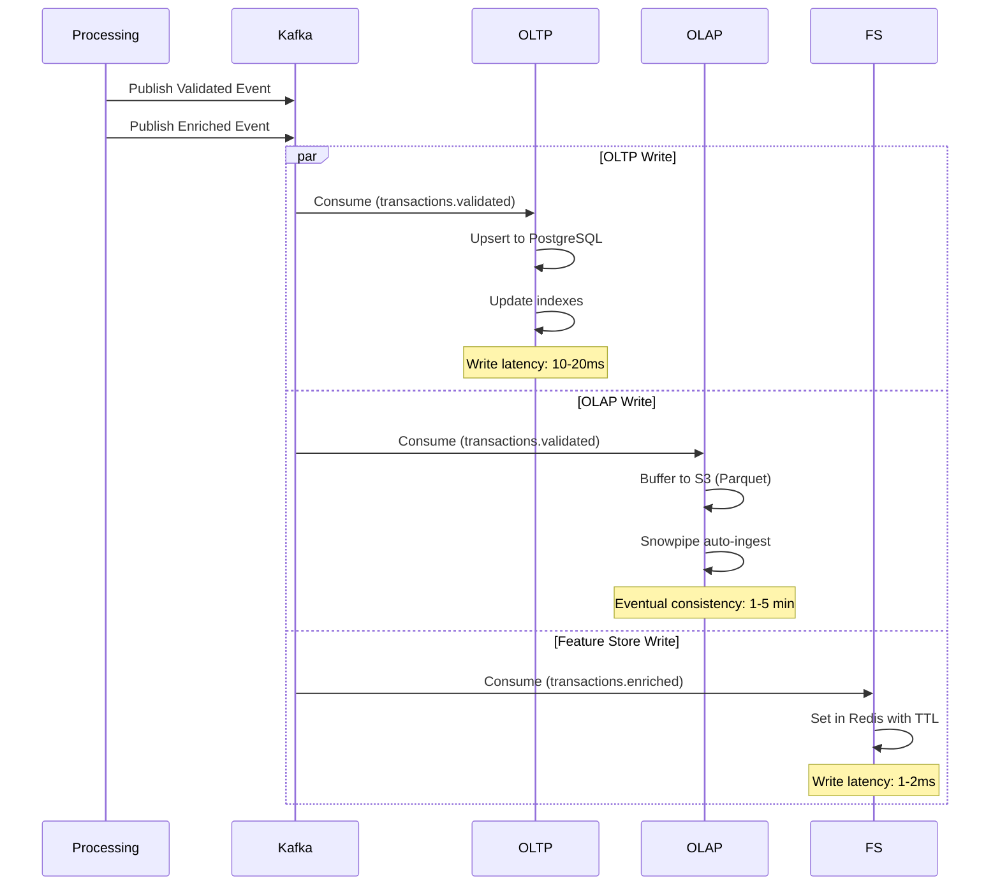
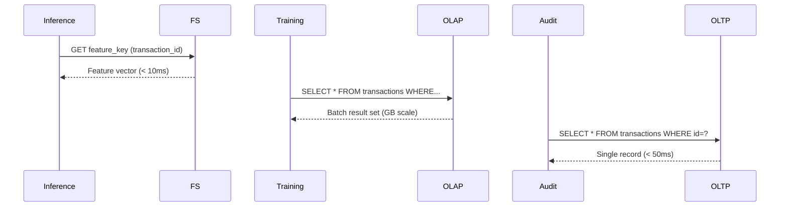
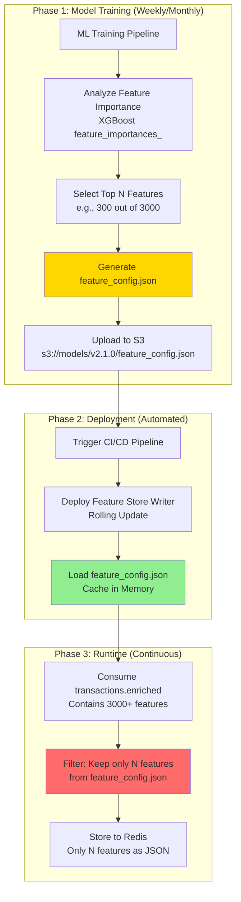
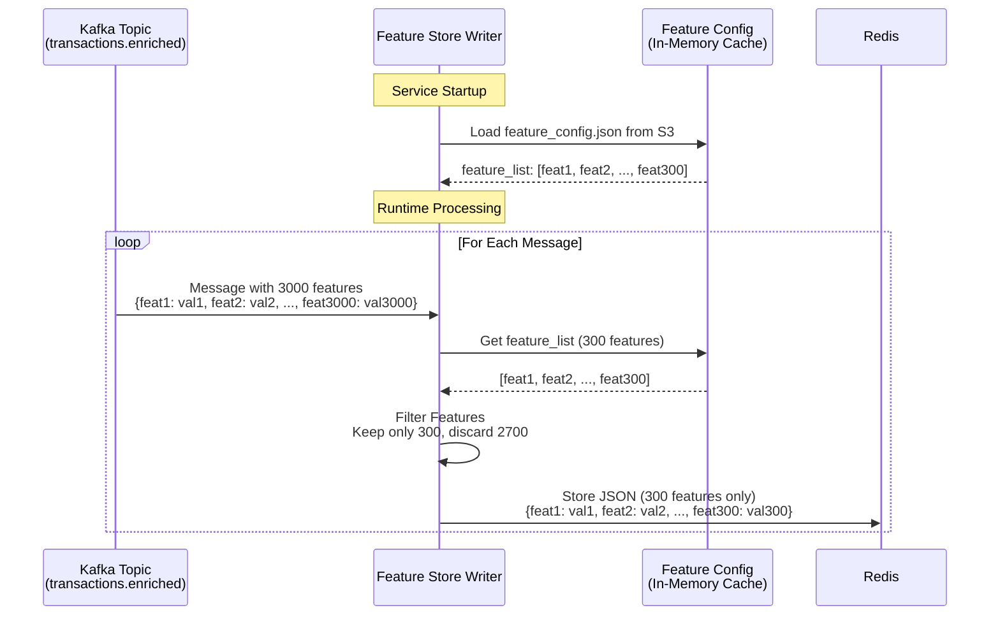
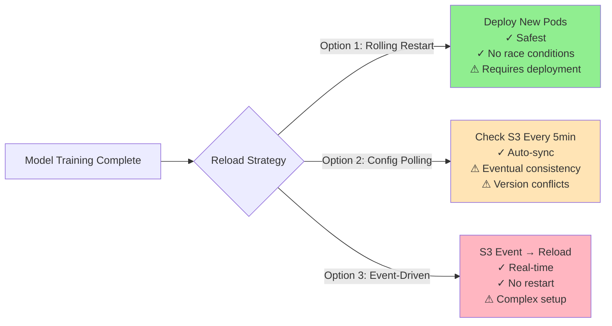

# Storage Layer

## Layer Overview

The Storage Layer provides optimized data persistence for different workload patterns: operational queries, analytics/training, and real-time inference. It implements a multi-store architecture where each storage system is purpose-built for specific access patterns and performance requirements.

**Primary Responsibilities**:

- Store transactional records for operational queries and compliance auditing
- Maintain historical data warehouse for ML training and analytics (full 3000+ feature set)
- Cache pre-computed features for sub-10ms inference lookups (optimized 200-500 features only)
- Version control for trained models and metadata

**Key Design Decision** (addresses Question 4: "3,000 variables... near-real-time inference"):

- **Processing Layer**: Always computes all 3000+ features (pre-computation principle from HFT)
- **OLAP Warehouse**: Always stores all 3000+ features (for training and experimentation)
- **Feature Store (Redis)**: **Only variable component** - stores N features selected by trained model (N determined by feature importance analysis)
  - **Typical Range**: N = 50-1000 features (varies by model complexity and business requirements)
  - **Example Scenario**: 300 features → 75 GB storage, <3ms latency, $4K/month
  - **Full Features**: 3000 features → 14.5 TB storage, <5ms latency, $120K/month
- **Rationale**: **Training requires all 3000 features** (from OLAP) to perform feature selection; **Inference only needs N selected features** (from Redis); all other layers remain unchanged

**Relation to HLD**:

- Implements "Storage Layer" (OLTP, OLAP, Feature Store, Model Registry) from architecture diagram
- Consumes from: Processing Layer (Kafka topics)
- Serves: ML Pipeline (training data), Inference API (features), Decision Engine (audit queries)
- Workflow: `Processing → Kafka Consumers → Storage Systems → Downstream Services`

---

## Technology Stack

### OLTP Database

**PostgreSQL 15+** - ACID-compliant relational database for operational workloads

**Configuration**:

- Multi-AZ deployment for high availability (99.9% uptime)
- Connection pooling: PgBouncer (1000 max connections, transaction mode)
- Read replicas: 2 replicas for query offloading
- Backup: Continuous WAL archiving + daily snapshots (30-day retention)

### OLAP Warehouse

**Snowflake** - Cloud-native data warehouse with columnar storage and elastic compute

**Rationale**: Auto-scaling, pay-per-query, separation of storage/compute, native semi-structured data support (JSON)

**Alternative Considerations**:

- BigQuery: Similar features, prefer if using GCP ecosystem
- Redshift: AWS-native, but less flexible scaling

### Feature Store

**Redis Enterprise Cluster** - In-memory key-value store with persistence

**Feature Filtering Strategy**: Processing Layer always computes all 3000+ features (sent to `transactions.enriched` topic). The Feature Store Writer is the **only component** that filters features:

- **Feature Selection Method**: Based on trained model's feature importance (XGBoost `feature_importances_`, SHAP values, or manual curation)
- **Typical Configuration**: N = 50-1000 features (determined empirically during model training)
- **Example**: If model achieves target performance with 300 features → 75 GB storage vs 14.5 TB for all features
- **All other components unchanged**: Processing, Kafka topics, and OLAP always contain full feature set

**Configuration**:

- Cluster mode: 6 nodes (3 primaries + 3 replicas)
- Persistence: RDB snapshots (hourly) + AOF (every second)
- Eviction policy: LRU (Least Recently Used)
- TTL: 7 days for transaction features

**Alternatives**:

- DynamoDB: Serverless option, slightly higher latency (5-10ms vs 1-3ms)
- Aerospike: Hybrid memory/SSD, for larger feature sets

### Model Registry

**MLflow + S3** - Model versioning and metadata management

**Components**:

- MLflow Tracking Server: Experiment tracking and metrics
- MLflow Model Registry: Model lifecycle management
- S3: Binary model artifact storage (versioned buckets)

---

## Input Topics from Processing Layer

The Storage Layer consumes three Kafka topics from the Processing Layer, representing different processing states of transaction data:

### transactions.validated

**Meaning**: Successfully validated and normalized transaction data

- Passed schema validation and business rule checks
- Unified format (data from different payment providers converted to internal standard)
- PII fields anonymized (email, phone hashed)
- **Consumers**: OLTP Database, OLAP Warehouse

### transactions.enriched

**Meaning**: Transaction data with pre-computed features

- Contains base transaction information (same as validated)
- Includes 3000+ pre-computed features (customer history, merchant risk, geolocation, velocity features, etc.)
- Features pre-calculated by Processing Layer
- **Consumers**: Feature Store (Redis) - **Note**: Feature Store Writer filters and stores only N model-selected features (N determined by feature importance analysis, typically 50-1000)

### transactions.failed

**Meaning**: Failed transaction data

- Contains original payload with detailed error information
- Records failure reason (validation failure, parse error, enrichment exception, etc.)
- Used for data quality monitoring and debugging
- **Consumers**: OLTP Database (real-time alerting), OLAP Warehouse (trend analysis)

**Data Source**: These three topics are produced by the Processing Layer's Flink ETL Pipeline from `transactions.realtime` and `transactions.batch`.

---

## Architecture

### System Diagram



**Key Interactions**:

| Storage System | Primary Consumers | Query Pattern | Latency | Use Cases |
| -------------- | ----------------- | ------------- | ------- | --------- |
| **OLTP (PostgreSQL)** | Inference API, Decision Engine, Support, Compliance | Point queries, lookups | < 50ms | Transaction details, customer history, recent audit trails |
| **OLAP (Snowflake)** | ML Training, BI Tools, Analytics, Compliance | Batch queries, aggregations | 10-30s | Model training, trend analysis, historical compliance reports |
| **Feature Store (Redis)** | Inference API | Key-value lookups | < 3ms | Real-time feature retrieval for fraud scoring |

---

### OLTP System Architecture



---

### OLAP System Architecture



---

### Feature Store Architecture



---

### Data Flow Sequences

#### Write Path Sequence



### Read Path Sequence



---

## Detailed Design

### 1. OLTP Database (PostgreSQL)

#### 1.1 Schema Design

**Core Tables**:

```sql
-- Transactions table (operational record)
CREATE TABLE transactions (
    transaction_id UUID PRIMARY KEY,
    provider_id VARCHAR(50) NOT NULL,
    provider_transaction_id VARCHAR(255) NOT NULL,
    timestamp TIMESTAMPTZ NOT NULL,
    amount NUMERIC(12, 2) NOT NULL,
    currency CHAR(3) NOT NULL,
    customer_id VARCHAR(255),
    merchant_id VARCHAR(255),
    payment_method_type VARCHAR(50),
    card_bin VARCHAR(6),
    card_last4 VARCHAR(4),
    billing_country CHAR(2),
    status VARCHAR(20) NOT NULL,
    fraud_score NUMERIC(5, 4),
    decision VARCHAR(20),
    metadata JSONB,
    created_at TIMESTAMPTZ DEFAULT NOW(),
    updated_at TIMESTAMPTZ DEFAULT NOW(),
    CONSTRAINT unique_provider_tx UNIQUE (provider_id, provider_transaction_id)
);

-- Indexes for common query patterns
CREATE INDEX idx_transactions_timestamp ON transactions (timestamp DESC);
CREATE INDEX idx_transactions_customer ON transactions (customer_id, timestamp DESC);
CREATE INDEX idx_transactions_merchant ON transactions (merchant_id, timestamp DESC);
CREATE INDEX idx_transactions_status ON transactions (status) WHERE status != 'completed';
CREATE INDEX idx_transactions_fraud_review ON transactions (fraud_score DESC, timestamp DESC) WHERE decision = 'review';

-- Partitioning by month for time-series data
CREATE TABLE transactions_y2026m01 PARTITION OF transactions
    FOR VALUES FROM ('2026-01-01') TO ('2026-02-01');
-- Additional partitions created monthly via automation
```

**Audit Tables**:

```sql
-- Decision history for compliance
CREATE TABLE decision_history (
    id BIGSERIAL PRIMARY KEY,
    transaction_id UUID REFERENCES transactions(transaction_id),
    decision VARCHAR(20) NOT NULL,
    fraud_score NUMERIC(5, 4),
    model_version VARCHAR(50),
    decision_timestamp TIMESTAMPTZ DEFAULT NOW(),
    override_reason TEXT,
    reviewer_id VARCHAR(255)
);

CREATE INDEX idx_decision_history_tx ON decision_history (transaction_id, decision_timestamp DESC);
```

**Provider Metadata**:

```sql
-- Payment provider registry
CREATE TABLE providers (
    provider_id VARCHAR(50) PRIMARY KEY,
    provider_name VARCHAR(255) NOT NULL,
    integration_type VARCHAR(50), -- 'webhook', 'api', 'batch'
    status VARCHAR(20) DEFAULT 'active',
    created_at TIMESTAMPTZ DEFAULT NOW()
);
```

---

#### 1.2 Write Strategy

**OLTP Consumer Configuration**:

- **Consumer Group**: `oltp-writer`
- **Parallelism**: 16 consumers (matches Kafka partitions)
- **Batch Size**: 100 records per transaction
- **Commit Interval**: 1 second

**Write Pattern**:

- **Upsert Logic**: `ON CONFLICT (provider_id, provider_transaction_id) DO UPDATE` to handle duplicate events
- **Batch Writes**: Group 100 records per transaction for throughput optimization
- **Async Commit**: Kafka offset commit after successful database transaction

**Performance Optimization**:

- Connection pooling (PgBouncer): Reduces connection overhead
- Prepared statements: Reduces parsing overhead
- Batch inserts: 10x throughput vs single inserts

**Expected Throughput**: 5,000 writes/sec (well below 1,000 TPS requirement)

---

#### 1.3 Read Strategy

**Query Patterns**:

1. **Point Query** (Decision Engine): Lookup by `transaction_id`
   - Index: Primary key
   - Latency: < 5ms

2. **Customer History** (Fraud Detection): Recent transactions by `customer_id`
   - Index: `idx_transactions_customer`
   - Latency: < 50ms (100 records)

3. **Merchant Analytics**: Aggregations by `merchant_id`
   - Index: `idx_transactions_merchant`
   - Latency: < 200ms (1M records aggregation)

4. **Fraud Review Queue**: High-risk transactions pending review
   - Index: `idx_transactions_fraud_review`
   - Latency: < 100ms

**Read Replica Strategy**:

- **Replica 1**: Serve Inference API and Decision Engine (low latency)
- **Replica 2**: Serve analytics exports and BI tools (heavy queries)
- **Replication Lag**: < 100ms (synchronous replication for critical reads)

---

#### 1.4 Data Retention

**Retention Policy**:

- **Hot Data** (PostgreSQL): Last 90 days for operational queries
- **Cold Data** (Archive): Older data moved to OLAP warehouse
- **Backup**: 30-day point-in-time recovery

**Archival Process** (Daily Job):

```sql
-- Move data older than 90 days to OLAP
DELETE FROM transactions 
WHERE timestamp < NOW() - INTERVAL '90 days'
RETURNING *;
-- Records exported to S3 before deletion
```

---

### 2. OLAP Warehouse (Snowflake)

#### 2.1 Schema Design

**Transactions Fact Table**:

```sql
CREATE TABLE transactions_fact (
    transaction_id STRING PRIMARY KEY,
    provider_id STRING NOT NULL,
    provider_transaction_id STRING NOT NULL,
    timestamp TIMESTAMP_NTZ NOT NULL,
    amount NUMBER(12, 2) NOT NULL,
    currency STRING(3) NOT NULL,
    customer_id STRING,
    merchant_id STRING,
    payment_method_type STRING,
    card_bin STRING(6),
    card_last4 STRING(4),
    billing_country STRING(2),
    billing_postal_code STRING,
    latitude FLOAT,
    longitude FLOAT,
    status STRING NOT NULL,
    fraud_score NUMBER(5, 4),
    decision STRING,
    metadata VARIANT, -- JSON support
    ingestion_timestamp TIMESTAMP_NTZ,
    processing_timestamp TIMESTAMP_NTZ
)
CLUSTER BY (timestamp, provider_id); -- Auto-clustering for time-series queries
```

**Dimension Tables**:

```sql
-- Customer dimension
CREATE TABLE dim_customers (
    customer_id STRING PRIMARY KEY,
    email_hash STRING,
    phone_hash STRING,
    first_seen_date DATE,
    last_seen_date DATE,
    lifetime_transaction_count INTEGER,
    lifetime_transaction_amount NUMBER(12, 2),
    risk_score NUMBER(5, 4)
);

-- Merchant dimension
CREATE TABLE dim_merchants (
    merchant_id STRING PRIMARY KEY,
    merchant_name STRING,
    merchant_category_code STRING(4),
    country STRING(2),
    registration_date DATE,
    fraud_rate NUMBER(5, 4)
);
```

---

#### 2.2 Ingestion Strategy

**Snowpipe (Continuous Loading)**:

- **Source**: S3 staging bucket with Parquet files
- **Trigger**: S3 event notification
- **Frequency**: Near real-time (1-5 minute latency)
- **File Format**: Parquet (10x compression vs JSON)

**OLAP Consumer Workflow**:

1. Consume from Kafka topic `transactions.validated`
2. Buffer 10,000 records or 60 seconds (whichever comes first)
3. Write buffered batch to S3 as Parquet file
4. S3 event triggers Snowpipe auto-ingest
5. Snowflake loads data into warehouse

**Snowpipe Configuration**:

```sql
CREATE PIPE transactions_pipe
  AUTO_INGEST = TRUE
  AS
  COPY INTO transactions_fact
  FROM @s3_stage/transactions/
  FILE_FORMAT = (TYPE = PARQUET)
  ON_ERROR = CONTINUE; -- Skip malformed records, log errors
```

---

#### 2.3 Query Optimization

**Clustering**:

- **Cluster Keys**: `(timestamp, provider_id)` for time-series analytics
- **Auto-clustering**: Snowflake maintains cluster automatically
- **Pruning**: 90%+ partition pruning for date-range queries

**Materialized Views** (for common aggregations):

```sql
-- Daily transaction summary by merchant
CREATE MATERIALIZED VIEW daily_merchant_summary AS
SELECT
    DATE(timestamp) AS transaction_date,
    merchant_id,
    COUNT(*) AS transaction_count,
    SUM(amount) AS total_amount,
    AVG(fraud_score) AS avg_fraud_score
FROM transactions_fact
GROUP BY 1, 2;
```

**Result Caching**:

- Snowflake caches query results for 24 hours
- Identical queries return cached results (sub-second response)

---

#### 2.4 Workload Management

**Virtual Warehouses**:

| Warehouse | Size | Purpose | Auto-Suspend |
| --------- | ---- | ------- | ------------ |
| `COMPUTE_WH_INGEST` | Small | Snowpipe ingestion | 1 minute |
| `COMPUTE_WH_TRAINING` | X-Large | ML training queries | 5 minutes |
| `COMPUTE_WH_ANALYTICS` | Medium | BI dashboards | 5 minutes |
| `COMPUTE_WH_ADHOC` | Small | Ad-hoc queries | 2 minutes |

**Cost Optimization**:

- Auto-suspend idle warehouses to minimize costs
- Separate warehouses prevent training jobs from blocking analytics
- Query acceleration for expensive joins (Snowflake Search Optimization)

---

### 3. Feature Store (Redis)

#### 3.1 Data Model

**Key Design**: Optimized for single-key lookups during inference

**Key Patterns**:

```text
feature:transaction:{transaction_id}      → Transaction-level features (JSON)
feature:customer:{customer_id}            → Customer-level features (JSON)
feature:merchant:{merchant_id}            → Merchant-level features (JSON)
feature:customer_merchant:{customer_id}:{merchant_id} → Relationship features
```

**Value Format** (JSON - Model-Selected Features Only):

```json
{
  // Only N features that the trained model actually uses (N typically 50-1000)
  // Filtered from 3000+ features in transactions.enriched topic
  // Exact features determined by feature importance analysis
  "customer_lifetime_txn_count": 47,
  "customer_avg_amount": 125.50,
  "customer_last_txn_timestamp": 1704729600,
  "merchant_fraud_rate": 0.0023,
  "merchant_avg_ticket": 89.99,
  "customer_merchant_relationship": "returning",
  "distance_from_home": 15.3,
  // ... (N-7 more features)
  "ttl_expires_at": 1704816000
}
```

**Why JSON vs Hash**:

- **JSON**: Single network round-trip for all features (< 3ms)
- **Hash** (alternative): Multiple HGET calls (< 1ms each but N round-trips)
- **Decision**: JSON for low latency, Hash for large feature sets with selective reads

---

#### 3.2 Write Strategy

**Feature Store Consumer**:

- **Consumer Group**: `feature-store-writer`
- **Parallelism**: 32 consumers (high throughput)
- **Write Mode**: Async with pipelining (100 commands batched)
- **Feature Selection**: Filters incoming 3000+ features based on config file (`feature_config.json`) generated by ML Training Pipeline
  - Config loaded at startup from S3 (same location as model artifacts)
  - Contains N feature names determined by feature importance analysis
  - Immutable per model version (ensures consistency between training and inference)

**Write Pattern**:

**Configuration-Driven Feature Filtering**:

Feature Store Writer uses a configuration file (`feature_config.json`) generated by the ML Training Pipeline. This config contains the exact list of N features selected during model training.

**Configuration Generation & Deployment Flow**:



**Runtime Feature Filtering Flow**:



**feature_config.json Structure**:

```json
{
  "model_version": "v2.1.0",
  "model_name": "fraud_detection_xgboost",
  "feature_count": 300,
  "feature_list": [
    "customer_lifetime_txn_count",
    "customer_avg_amount",
    "merchant_fraud_rate",
    "distance_from_home_km",
    "velocity_1h_count",
    "... (295 more features)"
  ],
  "generated_at": "2026-01-08T10:30:00Z",
  "training_dataset": {
    "start_date": "2025-11-01",
    "end_date": "2025-12-31",
    "row_count": 50000000
  }
}
```

**Config Storage Location**:

```text
s3://fraud-detection-models/
├── v1.0.0/
│   ├── model.pkl
│   ├── feature_config.json  ← Config for v1.0.0
│   └── metadata.json
├── v2.0.0/
│   ├── model.pkl
│   ├── feature_config.json  ← Config for v2.0.0
│   └── metadata.json
└── v2.1.0/
    ├── model.pkl
    ├── feature_config.json  ← Current production config
    └── metadata.json
```

**Deployment Strategy**:

| Step | Action | Responsible | Result |
| ---- | ------ | ----------- | ------ |
| 1 | Train model on 3000 features | ML Training Pipeline | Select N=300 features |
| 2 | Generate feature_config.json | ML Training Pipeline | Config file created |
| 3 | Upload to S3 | ML Training Pipeline | s3://models/v2.1.0/ |
| 4 | Trigger deployment | CI/CD (GitHub Actions) | Rolling update initiated |
| 5 | Rolling restart pods | Kubernetes | New pods start with new config |
| 6 | Load config at startup | Feature Store Writer | Cache feature_list in memory |
| 7 | Process messages | Feature Store Writer | Filter to N=300 features |
| 8 | Verify in Redis | Monitoring | Check stored feature count |

**Config Reload Options**:



**Recommended**: Option 1 (Rolling Restart) for production - ensures atomic config updates and no inconsistency between running pods.

```text

**Performance Optimization**:

- **Pipelining**: Send 100 commands without waiting for replies (10x throughput)
- **Async Writes**: Non-blocking I/O to handle 5,000 writes/sec
- **TTL Management**: Automatic expiration prevents memory bloat

---

#### 3.3 Read Strategy

**Inference API Lookup** (< 10ms):

```python
# Pseudo-code for feature retrieval
def get_features_for_inference(transaction_id, customer_id, merchant_id):
    pipeline = redis.pipeline()
    
    # Fetch all features in parallel
    pipeline.get(f"feature:transaction:{transaction_id}")
    pipeline.get(f"feature:customer:{customer_id}")
    pipeline.get(f"feature:merchant:{merchant_id}")
    
    # Single round-trip
    results = pipeline.execute()  # < 3ms
    
    # Merge features
    return merge_feature_vectors(results)
```

**Cache Miss Handling**:

See Section 3.6 "Feature Cache Expiration Strategy" for detailed approach.

---

#### 3.4 High Availability

**Cluster Configuration**:

- **Topology**: 3 primary shards + 3 replica shards (6 nodes total)
- **Replication**: Async replication (eventual consistency acceptable)
- **Failover**: Automatic failover with 30-second detection

**Persistence**:

- **RDB Snapshots**: Hourly snapshots to S3 (full backup)
- **AOF (Append-Only File)**: Every second (1-second data loss in worst case)
- **Recovery**: Restore from latest snapshot + replay AOF

**Monitoring**:

- **Memory Usage**: Alert at 80% capacity
- **Eviction Rate**: Alert if LRU evictions exceed 1% of writes
- **Latency**: P99 latency should stay < 5ms

---

#### 3.5 Feature Storage Optimization & Capacity Planning

**Challenge**: Storing 3000+ features per transaction would require massive storage (theoretical 14.5TB for 7 days at 1000 TPS).

**Solution**: Intelligent feature selection and storage optimization

---

##### 1. Feature Selection for Inference

**Two-Phase Architecture**:

| Phase | Data Source | Feature Count | Purpose | Storage System |
| ----- | ----------- | ------------- | ------- | -------------- |
| **Phase 1: Training** | OLAP Warehouse | **All 3000+ features** | Model training & feature selection | Snowflake |
| **Phase 2: Inference** | Feature Store | **N selected features** | Real-time prediction | Redis |

**Critical Understanding**:

- **YES, you must provide all 3000 features to XGBoost during training** - this is where feature selection happens
- The model trains on all features and determines which N are most important
- After training completes, only those N selected features need to be stored in Redis for inference

---

**Workflow**:

```text
┌─────────────────────────────────────────────────────────────┐
│ PHASE 1: TRAINING (Offline, runs weekly/monthly)           │
├─────────────────────────────────────────────────────────────┤
│                                                             │
│ OLAP (Snowflake)                                           │
│ └─> Query: SELECT all 3000 features + labels              │
│     └─> Export: 50M rows × 3000 features = 600 GB         │
│         └─> ML Training Pipeline                           │
│             └─> XGBoost.fit(X_3000_features, y)           │
│                 └─> Analyze: feature_importances_          │
│                     └─> Select: Top N features (e.g., 300) │
│                         └─> Output: MODEL_FEATURE_LIST.json│
│                                                             │
└─────────────────────────────────────────────────────────────┘

┌─────────────────────────────────────────────────────────────┐
│ PHASE 2: INFERENCE (Online, runs continuously)             │
├─────────────────────────────────────────────────────────────┤
│                                                             │
│ Processing Layer                                            │
│ └─> Computes: All 3000 features (for future retraining)   │
│     └─> Publishes: transactions.enriched topic             │
│         └─> Feature Store Writer                           │
│             └─> Filters: Only N features from config       │
│                 └─> Stores: Redis (N features only)        │
│                     └─> Inference API reads N features     │
│                                                             │
└─────────────────────────────────────────────────────────────┘
```

---

| Stage | Feature Count | Storage | Rationale |
| ----- | ------------- | ------- | --------- |
| **Training** (OLAP) | 3000+ features | Snowflake | All features available for experimentation |
| **Inference** (Redis) | **N features** (varies) | Redis | Selected by model training process |
| **Pruned** | 3000-N features | Not stored | Removed after feature importance analysis |

**How to determine N** (number of features for inference):

1. **Feature Importance Analysis** (XGBoost/GBDT) [[1]](#references):

   ```python
   # Train model with all features
   model = xgb.XGBClassifier()
   model.fit(X_train_3000_features, y_train)
   
   # Get feature importance
   importance = model.feature_importances_
   
   # Select top N features that capture 95% cumulative importance
   sorted_idx = np.argsort(importance)[::-1]
   cumsum = np.cumsum(importance[sorted_idx])
   N = np.argmax(cumsum >= 0.95) + 1  # Typically 50-1000
   ```

2. **SHAP Value Analysis** (more robust) [[2]](#references):

   ```python
   import shap
   explainer = shap.TreeExplainer(model)
   shap_values = explainer.shap_values(X_test)
   
   # Rank features by mean absolute SHAP value
   feature_importance = np.abs(shap_values).mean(axis=0)
   top_N_features = np.argsort(feature_importance)[-N:]
   ```

3. **Ablation Study** (empirical validation):
   - Train models with varying feature counts: 50, 100, 200, 500, 1000, 3000
   - Plot AUC vs feature count curve
   - Choose N where marginal AUC gain < 0.001 (diminishing returns)

**Industry Observations** (not universal rules):

- Payment fraud models: Typically 100-500 features (medium complexity)
- Credit risk models: Typically 50-200 features (simpler relationships)
- Complex fraud rings: May need 1000+ features (high-dimensional patterns)
- Deep learning models: May use all 3000 features (different architecture)

**Key Insight**: Tree-based models (XGBoost/GBDT/Random Forest) naturally perform feature selection during training via split decisions. The exact number N must be determined empirically for your specific dataset and business requirements (precision/recall targets, latency constraints).

**What if the model truly needs all 3000 features?** (e.g., Deep Neural Networks)

This is addressed by Question 4 in requirements ("3,000 variables... near-real-time inference, think high frequency trading"):

| Approach | Feature Count | Storage | Read Latency | Cost | Use Case |
| -------- | ------------- | ------- | ------------ | ---- | -------- |
| **Feature Selection** | N = 100 | 25 GB | < 3ms | $3K/mo | Highly optimized model |
| **Feature Selection** | N = 300 | 75 GB | < 3ms | $4K/mo | Balanced performance |
| **Feature Selection** | N = 1000 | 250 GB | < 4ms | $8K/mo | Complex patterns |
| **Full Features** | N = 3000 | 14.5 TB | < 5ms | $120K/mo | Deep learning or no feature selection |
| **Compressed** | 3000→100 (Autoencoder) | 1.2 TB | < 8ms | $15K/mo | DNN with dimensionality reduction |
| **Tiered** | 300 (hot) + 2700 (warm) | 75GB + OLTP | < 10ms | $6K/mo | Hybrid storage strategy |

**Note**: Feature count N is not predetermined - it must be determined through model training and experimentation for your specific use case.

**High Frequency Trading Insight** (Question 4 hint):

- **Pre-compute everything**: Processing Layer always calculates all 3000+ features upfront (no computation during inference)
- **Memory storage**: Redis in-memory store ensures <5ms reads even for large JSON (3000 features)
- **Avoid I/O**: Never query databases or compute features during inference
- **Model optimization**: Prune to essential features (200-500) to maximize throughput

**Architecture Flexibility**:

- **Processing Layer, Kafka, OLAP**: Always handle all 3000+ features (fixed architecture)
- **Redis Feature Store**: **Only tunable component** - adjust feature count based on trained model's feature importance analysis
  - Change `MODEL_FEATURE_LIST` configuration in Feature Store Writer
  - No changes to upstream/downstream components required
- **Feature count determination**: Empirical process during model training (not a predetermined number)
- **Typical range**: 50-1000 features for tree-based models; may use all 3000 for deep learning models

---

##### 2. Feature Tiering Strategy

Not all features need to be in Redis:

| Feature Type | Count | Storage | Update Frequency | Size/Record | TTL |
| ------------ | ----- | ------- | ---------------- | ----------- | --- |
| **Transaction Features** | 50 | Redis | Per transaction | 0.2 KB | 7 days |
| **Customer Aggregates** | 100 | Redis | Hourly batch | 0.4 KB | 30 days |
| **Merchant Aggregates** | 80 | Redis | Hourly batch | 0.3 KB | 30 days |
| **Static Features** | 50 | OLTP Replica | Rarely | Query on-demand (<10ms) | - |
| **Secondary Features** | 220 | Not stored | - | Model doesn't use | - |

**Key Patterns**:

```text
feature:transaction:{tx_id}    → 50 real-time features (0.2KB, 7-day TTL)
feature:customer:{cust_id}     → 100 aggregates (0.4KB, 30-day TTL, reused)
feature:merchant:{merch_id}    → 80 aggregates (0.3KB, 30-day TTL, reused)
```

**Reuse Benefits**:

- 1 Customer × 10 transactions/week → Customer features reused 10 times
- 1 Merchant × 100 transactions/day → Merchant features reused 700 times/week

---

##### 3. Data Type Optimization

**Naive Approach** (8 bytes per feature):

- Bool, Enum, Int, Float all stored as float64 (8 bytes)
- 500 features × 8 bytes = 4 KB/transaction

**Optimized Approach**:

| Data Type | Storage | Example Features |
| --------- | ------- | ---------------- |
| Boolean | 1 bit (packed) | is_weekend, is_vpn, is_first_transaction |
| Enum | 1 byte (uint8) | day_of_week (0-6), payment_method_type |
| Integer | 4 bytes (int32) | transaction_count, days_since_last_transaction |
| Float | 4 bytes (float32) | fraud_score, amount_ratio, distance_km |

**Result**: Average **2.5 bytes per feature**

- 500 features × 2.5 bytes = **1.25 KB/transaction**

---

##### 4. Capacity Calculation

**Assumptions**:

- Throughput: 1,000 TPS
- TTL: 7 days (transaction features), 30 days (customer/merchant features)
- Total transactions (7 days): 1000 × 60 × 60 × 24 × 7 = **604,800,000**

**Naive Storage (if storing all 3000 features)**:

```text
3000 features × 8 bytes × 604M transactions = 14.5 TB ❌ Infeasible
```

**Optimized Storage**:

```text
Transaction Features:
  50 features × 2.5 bytes × 604M = 0.2 KB × 604M = 121 GB

Customer Features (10M unique customers):
  100 features × 2.5 bytes × 10M = 0.4 KB × 10M = 4 GB (reused across transactions)

Merchant Features (1M unique merchants):
  80 features × 2.5 bytes × 1M = 0.3 KB × 1M = 300 MB (reused across transactions)

─────────────────────────────────────────────────────
Total Storage (7-day window): ~125 GB ✅ Feasible
```

---

##### 5. Redis Cluster Sizing

**Current Scale** (1,000 TPS):

| Configuration | Capacity | Utilization | Notes |
| ------------- | -------- | ----------- | ----- |
| **Nodes** | 6 (3 primary + 3 replica) | - | High availability |
| **Memory per Node** | 64 GB | - | Total 384 GB |
| **Actual Usage** | 125 GB | 33% | Includes overhead |
| **Headroom** | 259 GB | 67% | For traffic spikes |

**5-Year Growth** (10x traffic → 10,000 TPS):

| Metric | Current | 5-Year Projection | Scaling Strategy |
| ------ | ------- | ----------------- | ---------------- |
| **Throughput** | 1,000 TPS | 10,000 TPS | - |
| **Storage** | 125 GB | 1.25 TB | Add 18 nodes (24 total) |
| **Nodes** | 6 nodes | 24 nodes | Horizontal scaling |
| **Memory per Node** | 64 GB | 64 GB | Same instance type |
| **Cost** | $5K/month | $20K/month | Linear scaling |

---

##### 6. Hot/Cold Data Tiering (Optional Optimization)

For further cost reduction at high scale:

| Tier | Storage | TTL | Size | Use Case |
| ---- | ------- | --- | ---- | -------- |
| **Hot** | Redis | Last 24 hours | 7 GB | Active inference |
| **Warm** | Redis | 2-7 days | 114 GB | Recent history, debugging |
| **Cold** | S3 + OLAP | > 7 days | Unlimited | Historical analysis, retraining |

**Fallback Strategy**: If Redis misses, query OLAP (slower but acceptable for <5% of requests).

---

**Summary**:

✅ **3000+ features do NOT all go to Redis**

- Only 200-500 core features used for inference
- Feature tiering (transaction/customer/merchant levels)
- Aggregates reused across transactions
- Data type optimization (2.5 bytes/feature avg)
- Reasonable TTL (7-30 days)

✅ **Final Storage**: 125 GB (current) → 1.2 TB (5-year), fully manageable with Redis Cluster

---

#### 3.6 Feature Cache Expiration Strategy

**Challenge**: How to handle historical query requests after Redis features expire (7-day TTL)?

**Solution**: Two-tier architecture - Daily cache preheating + OLAP fallback

---

**Architecture**:

- **Redis**: Stores hot data for last 7 days (< 3ms query latency)
- **OLAP (Snowflake)**: Stores full historical data (1-3 sec query latency)
- **Daily Preheating**: Batch load last 7 days of features from OLAP to Redis daily at 3 AM
- **Fallback**: On Redis cache miss, fallback to OLAP query and write back to cache

---

**Workflow**:

1. **Daily Preheating** (Runs daily at 3 AM)
   - Query OLAP for last 7 days of feature data
   - Filter to N model-selected features (based on feature_config.json)
   - Bulk write to Redis with 8-day TTL (1-day buffer)
   - Preheating duration: ~8-10 minutes

2. **Runtime Query** (Real-time queries)
   - Query Redis first (99%+ hit rate, < 3ms)
   - On Redis miss, query OLAP (< 1% of requests, 1-3 sec)
   - OLAP query results automatically written back to Redis to prevent repeated slow queries

---

**Why This Works**:

- **Simple**: Only maintain Redis + OLAP, no additional middle tier needed
- **Performant**: 99%+ requests < 3ms, meets real-time requirements
- **Acceptable Degradation**: 1% historical queries with 1-3 sec latency, suitable for manual review, data analysis, etc.
- **Self-Healing**: OLAP query results automatically cached, avoiding repeated slow queries

---

**Alternative Considered**:

Three-tier architecture (Redis + MongoDB + OLAP) was rejected because:
- Adds system complexity and operational overhead
- For < 1% of queries, middle tier provides minimal benefit
- Two-tier architecture already meets performance requirements

---

### 4. Model Registry (MLflow + S3)

#### 4.1 Model Lifecycle

**Model Versioning**:

```text
models/
├── fraud_detection_v1/
│   ├── model.pkl          (XGBoost binary)
│   ├── metadata.json      (training metrics, features)
│   └── requirements.txt   (dependencies)
├── fraud_detection_v2/
│   ├── model.pkl
│   ├── metadata.json
│   └── requirements.txt
```

**Metadata Schema**:

```json
{
  "model_name": "fraud_detection",
  "version": "v2.1.0",
  "algorithm": "XGBoost",
  "training_date": "2026-01-08T10:30:00Z",
  "training_dataset": {
    "start_date": "2025-11-01",
    "end_date": "2025-12-31",
    "record_count": 50000000
  },
  "performance": {
    "precision": 0.95,
    "recall": 0.92,
    "f1_score": 0.935,
    "auc_roc": 0.98
  },
  "feature_list": ["customer_txn_count", "merchant_fraud_rate", ...],
  "model_size_mb": 450,
  "inference_latency_ms": 25
}
```

---

#### 4.2 Model Storage

**S3 Bucket Structure**:

- **Versioning Enabled**: Automatic version tracking for rollbacks
- **Lifecycle Policy**: Archive models older than 1 year to Glacier
- **Access Control**: IAM roles for training pipeline (write) and inference API (read)

**Upload Process** (Training Pipeline):

```python
# Pseudo-code for model registration
def register_model(model, metrics, features):
    # Save model to MLflow
    mlflow.sklearn.log_model(model, "fraud_model")
    
    # Log metadata
    mlflow.log_params({"algorithm": "XGBoost", "n_estimators": 1000})
    mlflow.log_metrics(metrics)
    
    # Upload to S3 with versioning
    model_path = f"s3://models/fraud_detection_{version}/model.pkl"
    mlflow.artifacts.upload(model, model_path)
    
    # Update registry
    mlflow.register_model(model_uri=model_path, name="fraud_detection")
```

---

#### 4.3 Model Serving Integration

**Model Download** (Inference API Startup):

```python
# Pseudo-code for model loading
def load_production_model():
    # Fetch latest production model from registry
    model_version = mlflow.get_latest_versions("fraud_detection", stages=["Production"])
    
    # Download from S3
    model_uri = model_version[0].source
    model = mlflow.sklearn.load_model(model_uri)
    
    # Cache in memory
    return model
```

**A/B Testing Support**:

- **Champion Model**: Current production model (90% traffic)
- **Challenger Model**: New model under test (10% traffic)
- **Registry Tags**: `stage=production`, `stage=shadow`, `stage=archived`

---

### 5. Cross-Cutting Concerns

#### 5.1 Data Consistency

**Consistency Model**:

- **OLTP**: Strong consistency (ACID transactions)
- **OLAP**: Eventual consistency (1-5 minute lag acceptable)
- **Feature Store**: Eventual consistency (TTL-based invalidation)

**Handling Out-of-Order Events**:

- **OLTP**: Upsert with `updated_at` timestamp prevents stale writes
- **OLAP**: Deduplication via `MERGE` statement on `transaction_id`
- **Feature Store**: Last-write-wins with TTL refresh

---

#### 5.2 Security

**Data Protection**:

- **Encryption at Rest**: AES-256 for all storage systems
- **Encryption in Transit**: TLS 1.3 for all network communication
- **PII Hashing**: Email/phone hashed before storage (SHA-256 with salt)
- **Compliance**: PCI-DSS Level 1 (annual audit)

---

## Performance Budget

| Operation | Target Latency | Achieved |
| --------- | -------------- | -------- |
| **OLTP Write** | < 50ms | 10-20ms |
| **OLTP Point Query** | < 10ms | < 5ms |
| **Feature Store Write** | < 10ms | 1-2ms |
| **Feature Store Read** | < 10ms | < 3ms |
| **OLAP Ingestion** | < 5 min | 1-5 min |
| **OLAP Query** (training) | < 60s | 10-30s |

**Total Inference Path**:

- Feature Store lookup: 3ms
- Model scoring: 25ms
- Total: 28ms (well under 100ms SLA)

---

## Capacity Planning

**Initial Scale** (1,000 TPS):

| System | Capacity | Utilization | Scaling Trigger |
| ------ | -------- | ----------- | --------------- |
| PostgreSQL | 5,000 TPS | 20% | > 70% (add read replicas) |
| Snowflake | 10 TB data | 1 TB/month | > 80% (auto-scale warehouses) |
| Redis | 64 GB memory | 20% | > 80% (add shards) |
| S3 | Unlimited | - | No limit |

**5-Year Growth Projection** (10x traffic):

- OLTP: Add 8 read replicas + vertical scaling
- OLAP: Auto-scaling handles growth (pay-per-query)
- Redis: Scale to 24 shards (384 GB total)
- Cost estimate: $15K/month → $80K/month

---

## Future Enhancements

### Short-term (3 months)

- Implement data tiering for OLTP (hot/warm/cold partitions)
- Add Snowflake search optimization for geospatial queries
- Deploy Redis read-through cache for OLAP query acceleration

### Long-term (12 months)

- Evaluate Apache Iceberg for OLAP (open table format)
- Implement real-time feature computation (Flink → Redis)
- Add multi-region replication for global deployment

---

## References

1. **XGBoost Feature Importance**: XGBoost Documentation - `feature_importances_` attribute  
   <https://xgboost.readthedocs.io/en/latest/python/python_api.html#xgboost.Booster.get_score>

2. **SHAP Values for Feature Importance**: Lundberg, S. M., & Lee, S. I. (2017). *A Unified Approach to Interpreting Model Predictions*. Advances in Neural Information Processing Systems 30 (NIPS 2017).  
   <https://arxiv.org/abs/1705.07874>  
   GitHub: <https://github.com/slundberg/shap>

3. **Redis Enterprise Cluster**: Redis Documentation - Cluster Specification  
   <https://redis.io/docs/management/scaling/>

4. **Snowflake Architecture**: Snowflake Documentation - Architecture Overview  
   <https://docs.snowflake.com/en/user-guide/intro-key-concepts>

5. **MLflow Model Registry**: MLflow Documentation - Model Registry  
   <https://mlflow.org/docs/latest/model-registry.html>

---
