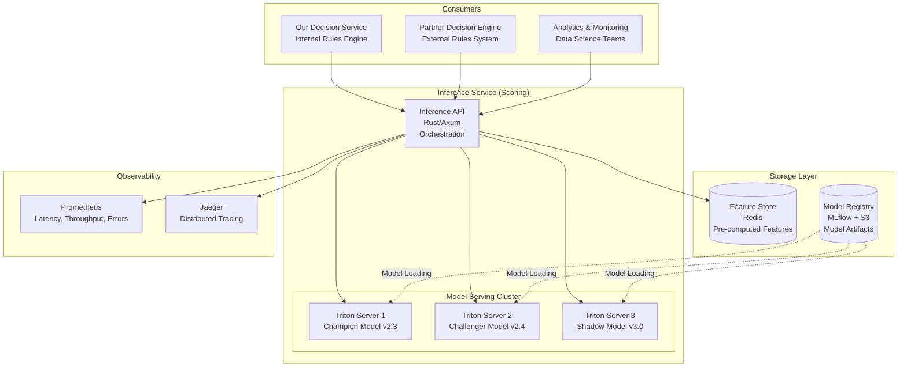
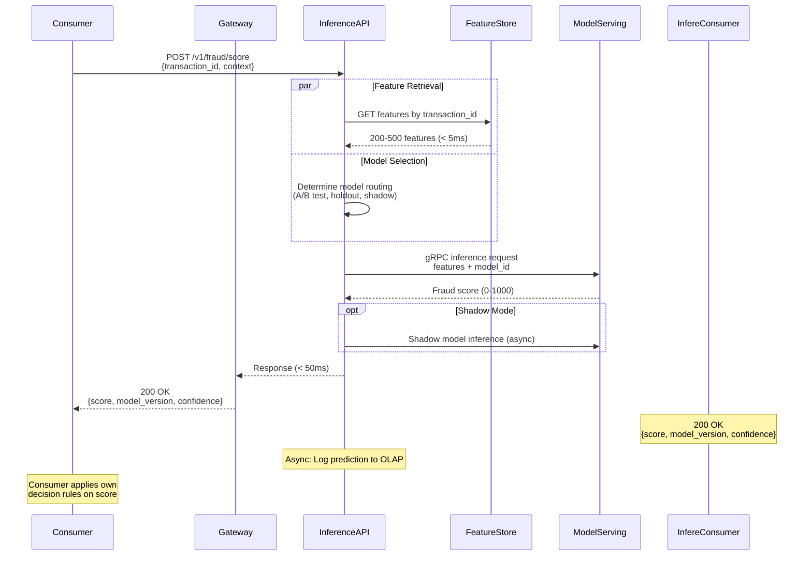
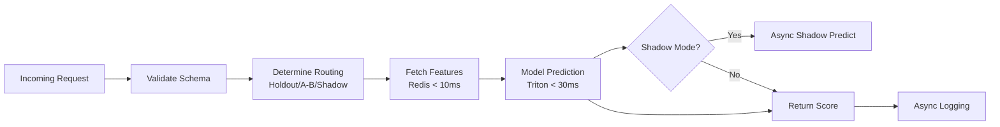
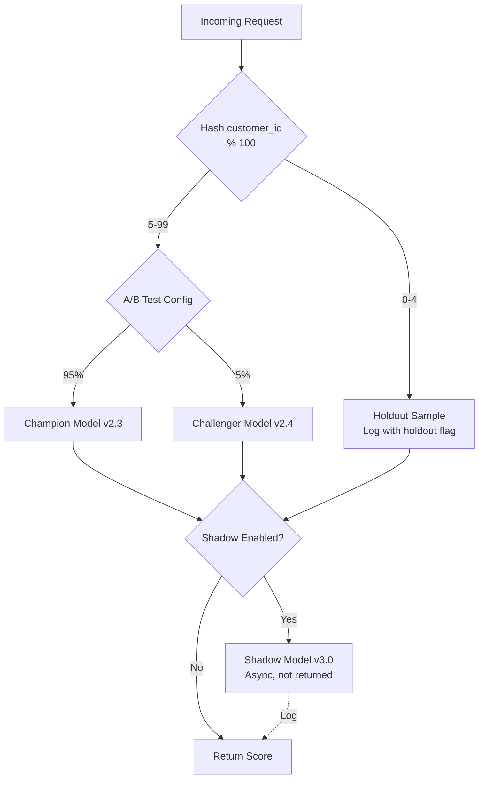
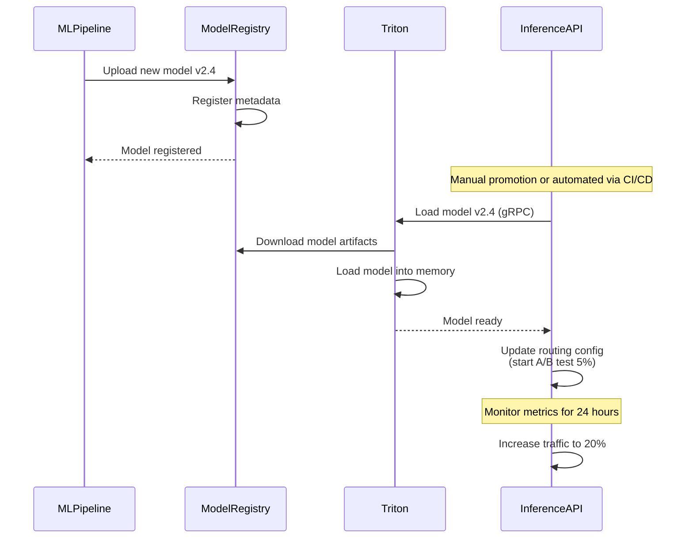
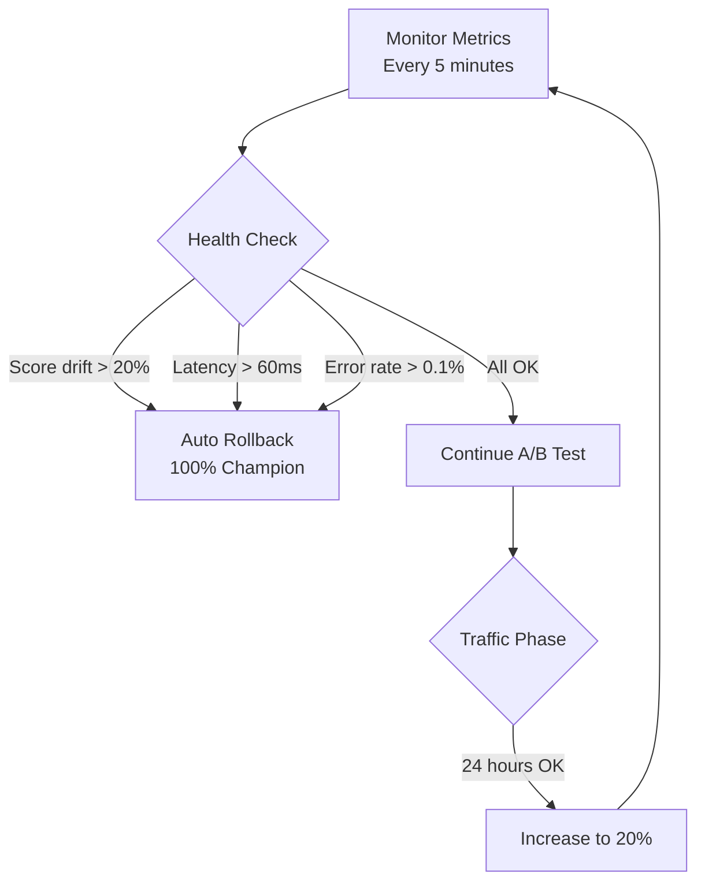
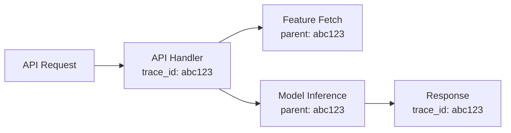

# Inference Service (Scoring Layer)

## Service Overview

The Inference Service provides near real-time fraud scoring for payment transactions by orchestrating feature retrieval and model prediction. It serves as a **scoring-as-a-service** platform, returning ML-based fraud scores to downstream consumers (our Decision Service or partners' external decision engines).

**Primary Responsibilities**:

- Orchestrate real-time scoring workflow (< 50ms end-to-end)
- Fetch pre-computed features from Feature Store with sub-10ms latency
- Execute model predictions using optimized ensemble models
- Return fraud scores (0-1000) with model metadata
- Support safe model experimentation (shadow mode, A/B testing, holdout samples)
- Provide scoring API for multiple consumers (internal/external)

**What This Service Does NOT Do**:

- **No decision-making**: Does not apply business rules or return approve/decline decisions
- **No transaction blocking**: Only provides risk assessment, decision responsibility lies with consumers

**Relation to HLD**:

- Implements "Inference Service" from architecture diagram
- Contains: Model Serving (Triton) + Inference API (Scoring Service)
- Consumes from: Feature Store (pre-computed features), Model Registry (trained models)
- Serves: Decision Service (our rules engine), External Partner Decision Engines, Analytics systems
- Workflow: `Client Request → Inference API → Feature Store + Model Serving → Fraud Score Response`

---

## Technology Stack

### Inference Orchestration

**Rust with Axum Framework** - Memory-safe, zero-cost abstractions with predictable performance for sub-millisecond latency guarantees. Native async/await for handling 1000+ TPS with minimal resource overhead.

**Rationale**: Rust provides deterministic performance without GC pauses, critical for maintaining consistent p99 latency under high load.

### Model Serving

**NVIDIA Triton Inference Server** - Production-grade model serving with GPU acceleration, dynamic batching, and multi-framework support (XGBoost, TensorFlow, PyTorch)

**Configuration**:

- Deployment: Kubernetes with HPA (Horizontal Pod Autoscaler)
- GPU: NVIDIA T4 or A10 for ensemble model acceleration
- Concurrency: Dynamic batching (max batch size: 32, max delay: 5ms)
- Model format: ONNX (optimized for cross-platform deployment)

### Feature Cache

**Redis Cluster** - Sub-millisecond feature retrieval (shared with Feature Store from Storage Layer)

---

## Architecture

### System Diagram



### Scoring Workflow



**Note**: Standard K8s components (Ingress Controller for routing, Service for load balancing) are assumed as cluster-level infrastructure and not shown in diagram.

## Detailed Design

### 1. Inference API (Scoring Service)

#### 1.1 API Contract

**Endpoint**:

```http
POST /v1/fraud/score
Content-Type: application/json
Authorization: Bearer {api_key}

Request Body:
{
  "transaction_id": "string (required)",
  "amount": number (optional, for context logging),
  "currency": "string (optional)",
  "merchant_id": "string (optional)",
  "customer_id": "string (optional)",
  "metadata": {} (optional, for experimentation routing)
}

Response (< 50ms):
{
  "transaction_id": "string",
  "score": number (0-1000),
  "risk_level": "low|medium|high|critical",
  "model_version": "string",
  "confidence": number (0-1),
  "latency_ms": number,
  "timestamp": "ISO8601"
}
```

**Response Interpretation**:

| Score Range | Risk Level | Typical Interpretation |
| ----------- | ---------- | ---------------------- |
| 0-200 | low | Low fraud probability, safe to approve |
| 200-500 | medium | Moderate risk, review business rules |
| 500-800 | high | High fraud risk, careful review needed |
| 800-1000 | critical | Very high fraud probability, likely decline |

**Note**: Final decision-making (approve/decline/review) is the **consumer's responsibility** (Decision Service or Partner's engine).

#### 1.2 Request Processing Flow

**Core Logic**:



#### 1.3 Traffic Routing Strategy

**Implementation Approach: Application-Level Routing**
Current design implements routing logic at application layer (Rust/Axum code), offering **deployment-agnostic** benefits:

- **Infrastructure Independence**: Works identically on Kubernetes, VMs, bare metal, or cloud functions
- **Full Control**: Custom routing algorithms (hash-based, feature-based, time-based) without infrastructure constraints
- **Simplified Operations**: Single configuration point in application code, no external traffic manager dependencies
- **Multi-Environment Compatibility**: Same codebase deploys to K8s clusters or traditional infrastructure

**Deployment Flexibility**:

```yaml
# Kubernetes deployment
triton_endpoints:
  champion: "triton-champion.inference.svc.cluster.local:8001"
  challenger: "triton-challenger.inference.svc.cluster.local:8001"

# Non-Kubernetes deployment (VM/bare metal)
triton_endpoints:
  champion: "10.0.1.10:8001"
  challenger: "10.0.1.11:8001"
```

**Holdout Sample (1-5% traffic)**:

- **Purpose**: Unbiased model evaluation without downstream intervention
- **Inference Layer Responsibilities**:
  - **Configure holdout percentage** (1-5%) via experiment config API
  - Hash-based traffic selection: `hash(customer_id) % 100 < holdout_percentage`
  - Score transactions with **both** champion and challenger models
  - Log both scores with `holdout=true` flag
  - Mark transactions for Decision Layer bypass
- **Decision Layer Responsibility**: Recognize `is_holdout=true` flag and bypass all fraud rules
- **Use case**: ML Pipeline evaluates logged scores after true labels arrive (90 days)

**A/B Testing (Champion vs Challenger)**:

- **Purpose**: Gradual model rollout with controlled traffic split
- **Inference Layer Responsibilities**:
  - Read rollout configuration from Model Registry (percentage: 5% → 20% → 50% → 100%)
  - Route traffic based on `hash(customer_id) % 100 < challenger_percentage`
  - Log model version used for each request
  - Collect latency and score distribution metrics
- **Configuration**: Rollout stages defined by ML Pipeline (see 06-ml-pipeline.md)
- **Decision**: Engineers manually progress through stages based on monitoring (see 05-decision-layer.md)

**Shadow Mode**:

- **Purpose**: Production testing without consumer impact
- **Inference Layer Responsibilities**:
  - Execute shadow model scoring **asynchronously** (non-blocking)
  - Log shadow predictions without returning them to client
  - Monitor shadow model latency and errors independently
- **Implementation**: Use async task queue (Tokio spawn) to avoid latency impact
- **Use case**: ML Pipeline evaluates shadow logs to validate model before holdout/rollout

**Future Enhancement: Service Mesh-Based A/B Testing**
For Kubernetes-native deployments, infrastructure-level traffic splitting can be explored:

- **Istio VirtualService**: Weight-based traffic distribution (e.g., 95% to v2.3, 5% to v2.4)
- **Benefits**: Declarative configuration, centralized traffic management, no application code changes
- **Tradeoffs**:
  - Loses fine-grained control (cannot route based on `customer_id` features)
  - K8s-only solution, reduces deployment flexibility
  - Adds Service Mesh operational complexity
- **Use Case**: When organization already operates Istio/Linkerd and prefers centralized policy management

Current application-level approach is **recommended** for maximum flexibility and operational simplicity. Service Mesh option can be revisited if organization standardizes on K8s + Istio stack.

**Routing Decision Logic**:



### 2. Model Serving (Triton Inference Server)

#### 2.1 Model Optimization

**Challenge**: Large ensemble models (GBDT, XGBoost, Random Forest) with 3000+ variables slow for inference

**Optimization Techniques**:

- **Feature Selection**: Reduce from 3000 → 200-500 features (based on SHAP values, feature importance)
- **Model Quantization**: FP32 → INT8 (4x compression, minimal accuracy loss < 0.5%)
- **Tree Pruning**: Remove low-impact branches (depth reduction, min leaf samples)
- **ONNX Conversion**: Convert native models to ONNX for optimized inference

**Performance Impact**:

| Configuration | Features | Model Size | Latency (p99) | Accuracy |
| ------------- | -------- | ---------- | ------------- | -------- |
| **Baseline** | 3000 | 2.4 GB | 180ms | 96.5% |
| **Optimized** | 300 | 80 MB | 25ms | 96.2% |

#### 2.2 Model Deployment Process

**Inference Layer Responsibilities**:

1. **Monitor Model Registry** for new Production models (polling or webhook)
2. **Download model artifacts** from MLflow/S3 (ONNX files + config)
3. **Deploy to Triton** - Copy to Triton model repository
4. **Configure Triton** - Create/update config.pbtxt (batch size, instance count)
5. **Hot reload** - Triton auto-detects new model version and loads it
6. **Health check** - Verify model responds correctly with test requests
7. **Update routing** - Enable traffic routing to new model based on configuration

**Model Registry Interface** (consumed from ML Pipeline):

```yaml
# Model metadata from MLflow
model:
  name: "fraud_detection_ensemble"
  version: "v13.0"
  stage: "Production"  # ML Pipeline sets this
  format: "onnx"
  artifact_uri: "s3://mlflow-artifacts/models/v13.0/model.onnx"
  
  deployment_config:
    recommended_rollout: ["shadow", "canary_5pct", "ramp_20pct", "full"]
    monitoring_thresholds:
      auc_degradation: -0.01
      latency_p99_ms: 50
```

**Triton Model Configuration** (`config.pbtxt`):

```protobuf
name: "fraud_detection_v2_3"
platform: "onnxruntime_onnx"
max_batch_size: 32
dynamic_batching {
  max_queue_delay_microseconds: 5000
}
input [
  {
    name: "features"
    data_type: TYPE_FP32
    dims: [300]
  }
]
output [
  {
    name: "fraud_score"
    data_type: TYPE_FP32
    dims: [1]
  }
]
instance_group [
  {
    count: 4
    kind: KIND_GPU
  }
]
```

**Model Update Process**:



---

## Performance Optimization

### Latency Budget (< 50ms target for scoring)

| Component | Target Latency | Optimization Strategy |
| --------- | -------------- | --------------------- |
| **API Gateway** | < 3ms | Kong with local cache, minimal plugins |
| **Request Validation** | < 2ms | Schema validation with compiled validators |
| **Feature Retrieval** | < 10ms | Redis cluster with pipelining, connection pooling |
| **Model Inference** | < 25ms | GPU acceleration, dynamic batching, ONNX optimization |
| **Response Marshaling** | < 3ms | Efficient JSON serialization (Rust serde) |
| **Network Overhead** | < 7ms | Co-located services, HTTP/2 with keepalive |
| **Total** | **< 50ms** | - |

**Rationale**: Consumers (Decision Service) need additional 30-50ms for rule processing, targeting 80-100ms end-to-end latency.

### Throughput Optimization

**Target**: 1,000+ TPS (Transactions Per Second)

**Strategies**:

- **Horizontal Scaling**: Kubernetes HPA based on CPU/memory, scale 5-30 pods
- **Connection Pooling**: Reuse Redis/Triton connections (pool size: 200 per pod)
- **Async Logging**: Non-blocking prediction logging to Kafka
- **Dynamic Batching**: Triton batches multiple requests for GPU efficiency (max 32, delay 5ms)
- **Circuit Breaker**: Fail fast if Feature Store or Model Serving unavailable (return cached fallback scores)
- **Request Coalescing**: Deduplicate concurrent requests for same transaction_id

---

## Safe Model Experimentation

### Holdout Sample Design

**Implementation**:

```rust
fn is_holdout_sample(customer_id: &str) -> bool {
    let hash = fnv1a_hash(customer_id);
    hash % 100 < 5  // 5% holdout
}

async fn handle_scoring(req: Request) -> Response {
    let is_holdout = is_holdout_sample(&req.customer_id);
    
    let score = predict_model(&req).await;
    
    // Log with holdout flag for analytics
    log_prediction(score, &req.model_version, is_holdout).await;
    
    Response {
        score,
        model_version: req.model_version,
        is_holdout, // Consumer can choose how to handle
    }
}
```

**Monitoring**:

- Compare holdout sample actual fraud rate vs non-holdout
- Measure model lift: `(baseline_fraud_rate - treated_fraud_rate) / baseline_fraud_rate`
- Consumer responsibility: Whether to apply decision rules to holdout traffic

### A/B Test Rollout

**Configuration**:

```yaml
ab_test:
  enabled: true
  champion:
    model_id: "fraud_detection_v2_3"
    traffic_percentage: 95
  challenger:
    model_id: "fraud_detection_v2_4"
    traffic_percentage: 5
  rollback_conditions:
    score_distribution_drift: 20  # %
    latency_p99_ms: 60
    error_rate: 0.1  # %
```

**Automated Rollback**:



---

## Consumer Integration Patterns

### Pattern 1: Internal Decision Service (Full Integration)

**Use Case**: Our Decision Service consumes scores for rule-based decisions

**Flow**:

```text
Payment Provider → Inference API (score) → Our Decision Service (rules) → Decision
```

**Benefits**: Single vendor, unified SLA, seamless model updates

### Pattern 2: External Decision Engine (Partner Integration)

**Use Case**: Partners with existing decision systems

**Flow**:

```text
Partner System → Inference API (score) → Partner's Decision Engine (rules) → Decision
```

**Benefits**: Keep existing compliance logic, minimal integration, ML-as-a-service

### Pattern 3: Analytics & Monitoring

**Use Case**: Data science teams validate model performance

**Flow**:

```text
Batch Jobs → Inference API (score) → OLAP Warehouse → Analysis
```

**Benefits**: Consistent scoring logic, no separate batch inference pipeline

### Pattern 4: Model Export (On-Premise Deployment)

**Use Case**: Partner deploys and runs inference on their own infrastructure

#### Distribution Methods

**Option A: Manual Download (Recommended for security)**
Partner downloads model package from secure portal:

1. **What We Provide**:
   - ONNX model file (`fraud_model_v13.onnx`)
   - Feature calculation code (Python/Java libraries)
   - Deployment guide (README with setup instructions)
   - Model metadata (JSON with version, performance metrics, feature list)
   - Checksum file for integrity verification

2. **How Partner Accesses**:
   - Secure download portal with authentication (e.g., AWS S3 pre-signed URLs with expiration)
   - Partner downloads via `wget` or SDK: `aws s3 cp s3://model-exports/partner-xyz/v13.zip`
   - Model package versioned: `fraud_model_v13_20260109.zip`

3. **Update Process**:
   - We notify partner via email/webhook when new version available
   - Partner manually downloads and redeploys (at their schedule)
   - No automatic push to maintain security and partner control

**Option B: Automated Push (For trusted partners)**
We push model updates to partner's infrastructure automatically:

1. **Push Mechanism**:
   - Partner provides S3 bucket or SFTP endpoint
   - Our CI/CD pipeline uploads model package after validation
   - Partner's system detects new file and triggers deployment

2. **Automation Tools**:
   - AWS S3 cross-account copy: `aws s3 sync s3://our-models/ s3://partner-bucket/`
   - SFTP upload: Airflow DAG runs `sftp put` after model registration
   - Webhook notification: POST to partner's endpoint with download link

3. **Safety Controls**:
   - Model only pushed to `staging/` folder, partner promotes to `production/`
   - Version pinning: Partner specifies which versions to accept
   - Rollback: Partner keeps last N versions locally

**Model Package Structure**:

```text
fraud_model_v13_20260109.zip
├── model.onnx                    # ONNX model file (150 MB)
├── feature_config.json           # Feature list and types
├── feature_calculator.py         # Python feature calculation logic
├── feature_calculator.jar        # Java version (if needed)
├── deployment_guide.md           # Setup instructions
├── metadata.json                 # Model metrics and requirements
└── checksum.sha256               # Integrity verification
```

**metadata.json Example**:

```json
{
  "model_version": "13.0",
  "trained_date": "2026-01-09",
  "framework": "XGBoost",
  "onnx_version": "1.15",
  "performance": {
    "auc": 0.923,
    "precision": 0.89,
    "recall": 0.85
  },
  "features": {
    "count": 487,
    "list": ["customer_age_days", "transaction_amount", ...]
  },
  "runtime_requirements": {
    "onnx_runtime": ">=1.15.0",
    "memory_mb": 512,
    "cpu_cores": 2
  }
}
```

**Partner Deployment Steps**:

1. Download and verify checksum
2. Extract model package
3. Install dependencies (ONNX Runtime)
4. Deploy feature calculation logic to their ETL pipeline
5. Load model into their inference service (e.g., ONNX Runtime, TensorFlow Serving)
6. Test with sample transactions
7. Route production traffic

**Considerations**:

- **Feature drift risk**: Partner must replicate feature engineering exactly (we provide test data for validation)
- **Manual updates**: Partner controls deployment timing (trade-off: slower updates vs stability)
- **Limited observability**: We can't monitor partner's inference performance
- **Support burden**: Partner responsible for infrastructure and troubleshooting
- **Data sovereignty**: Partner keeps all data on-premise (regulatory compliance benefit)

---

## Monitoring & Observability

### Key Metrics

**Performance Metrics**:

- Scoring latency (p50, p95, p99)
- Throughput (requests/sec)
- Feature Store cache hit rate
- Model serving GPU utilization
- Request queue depth

**Model Quality Metrics**:

- Score distribution (histogram by risk level)
- Model version usage distribution
- A/B test traffic split accuracy
- Shadow model prediction correlation

**Model Health Metrics**:

- Prediction drift (score distribution over time)
- Feature importance drift (from retraining pipeline)
- Model staleness (time since last update)
- Anomaly detection (unusual score patterns)

### Alerting Rules

| Alert | Condition | Severity | Action |
| ----- | --------- | -------- | ------ |
| High Latency | p99 > 60ms for 5 min | Critical | Scale up pods, check Feature Store |
| Low Throughput | TPS < 500 for 10 min | Warning | Investigate bottleneck |
| Feature Store Down | Connection errors > 10% | Critical | Failover to backup, return cached scores |
| Model Drift | Score distribution change > 20% | Warning | Trigger model retraining, notify ML team |
| GPU OOM | GPU memory > 90% | Warning | Scale Triton pods |

### Distributed Tracing

**Instrumentation** (using OpenTelemetry):



**Trace Attributes**:

- `transaction_id`, `customer_id`
- `model_version`, `model_routing` (champion/challenger/shadow/holdout)
- `feature_count`, `feature_latency_ms`
- `model_latency_ms`, `total_latency_ms`
- `fraud_score`, `risk_level`

---

## Data Privacy

- **PII Masking**: Customer emails/phones hashed before logging
- **Encryption**: All data in transit (TLS 1.3), at rest (AES-256)
- **Audit Logging**: All predictions logged for compliance (7-year retention)
- **Score Retention**: Scores cached with 5-min TTL, then deleted from local memory

---

## Relation to Decision Service

**Clear Separation of Concerns**:

- **Inference Service (this document)**: Provides fraud scores (0-1000), does NOT make decisions
- **Decision Service (separate service)**: Consumes scores, applies business rules, returns approve/decline/review

**Integration Flow**:

```text
Payment Provider → Inference Service (score) → Decision Service (decision) → Provider
```

**Alternative for Partners**:

```text
Partner → Inference Service (score) → Partner's Decision Engine (decision) → Customer
```

**Why Separate?**:

1. **Single Responsibility**: Inference focuses on ML quality, Decision focuses on business logic
2. **Independent Scaling**: ML inference (GPU-bound) vs Rule engine (CPU-bound)
3. **Flexible Integration**: Partners can use their existing decision systems
4. **Independent Updates**: Model retraining doesn't require rule changes, vice versa

---

## Appendix: Future Enhancements

### Real-time Feature Computation

**Current**: Pre-computed features from Feature Store

**Future**: Compute dynamic features on-demand (e.g., "transactions in last 5 minutes")

**Challenge**: Maintain < 50ms latency with real-time aggregation

### Multi-Model Ensemble

**Current**: Single model per routing group

**Future**: Weighted ensemble of 3-5 models for improved accuracy

**Challenge**: Latency overhead (parallel inference + aggregation), increased serving complexity

### Contextual Bandits for Model Selection

**Current**: Static A/B test configuration

**Future**: Dynamic model selection based on transaction context (amount, merchant category, time of day)

**Benefit**: Optimize model performance for different transaction patterns

**Challenge**: Latency overhead, increased serving complexity

### AutoML Model Selection

**Current**: Manual model promotion

**Future**: Automated A/B testing with multi-armed bandit algorithm

**Benefit**: Faster model iteration, reduced human intervention
