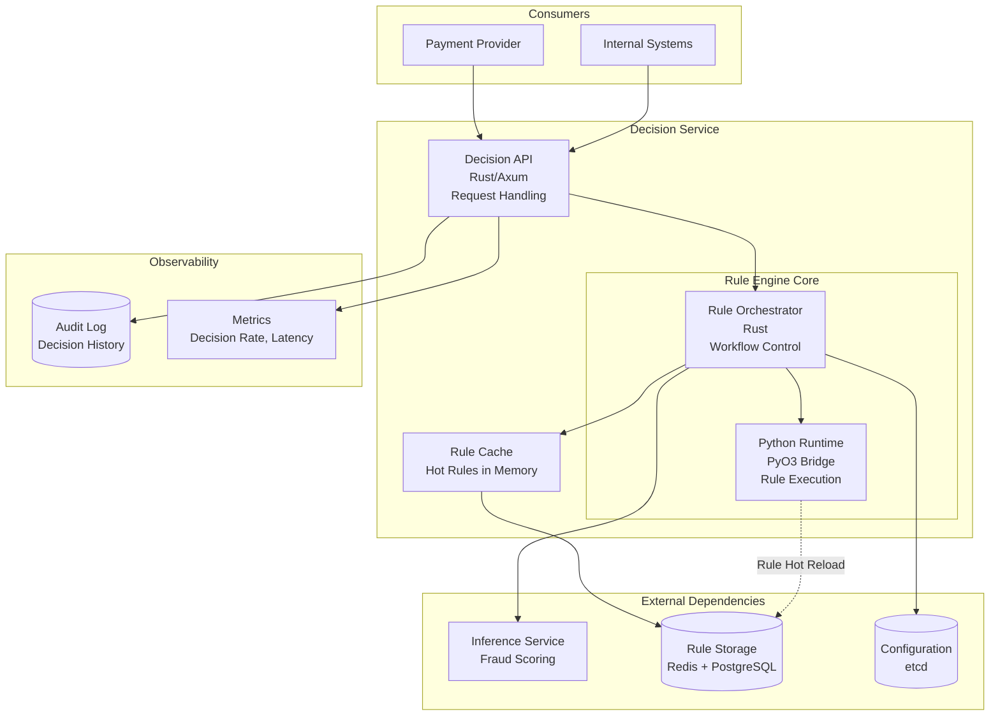
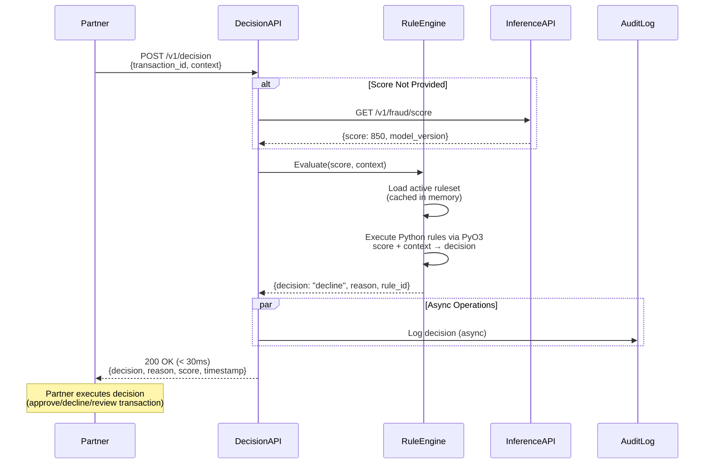
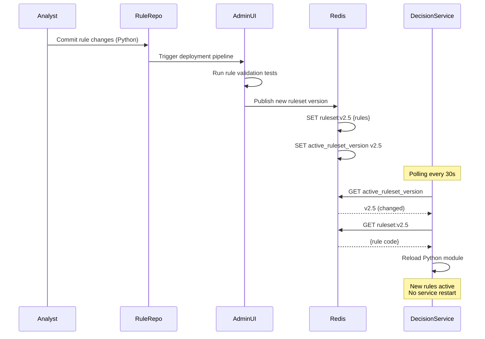

# Decision Layer

## Layer Overview

The Decision Layer applies business rules on fraud scores to make final transaction decisions (approve/decline/review). It translates ML predictions into actionable outcomes based on configurable rule logic, risk tolerance, and business constraints.

**Two Implementation Modes**:

- **Our Decision Service**: Internal rules engine for partners using full-service offering
- **External Decision Engine**: Partners with existing decision systems integrate scoring only

**Primary Responsibilities**:

- Apply configurable business rules on fraud scores
- Make final transaction decisions with reasoning
- Support dynamic rule updates without service restart
- Provide decision API with <30ms latency
- Maintain audit trail for compliance

**Relation to HLD**:

- Implements "Decision Layer" from architecture diagram
- Workflow: `Score → Rule Evaluation → Decision`
- Input: Fraud score from Inference Service + transaction context
- Output: Decision (approve/decline/review) + reasoning
- **Service Separation**: Partners can use only Inference Service (scoring) and skip this layer entirely

---

## Technology Stack

### Programming Language & Framework

**Rust with Axum** - Core service framework providing memory safety and predictable performance

**PyO3 Integration** - Embedded Python runtime for dynamic rule execution

**Rationale**: Rust handles high-performance API orchestration and data validation, while Python (via PyO3) enables data scientists and business analysts to write/update fraud detection rules without recompiling the service. This hybrid approach balances performance (Rust) with flexibility (Python).

### Rule Storage

**Redis Cluster** - Hot-reloadable rule cache for sub-10ms lookup with TTL for version control

**PostgreSQL** - Persistent storage for rule versions, audit logs, and historical decisions

**Storage Architecture**:

- **PostgreSQL (Source of Truth)**: 
  - Stores all rule versions with complete metadata and history
  - Schema: `rules` table with columns: `id`, `version`, `code`, `created_at`, `created_by`, `status` (draft/active/archived)
  - Enables version history, rollback, and compliance audit trail
  
- **Redis (Performance Cache)**:
  - Caches active ruleset for fast retrieval (<10ms)
  - Key pattern: `ruleset:v{version}` → Python code string
  - TTL: 1 hour (auto-refresh from PostgreSQL)
  
- **Data Flow**: `PostgreSQL (persist) → Redis (cache) → Service (execute)`

### Configuration Management

**etcd** - Distributed configuration store for rule versioning and rollback

---

## Architecture

### System Diagram



### Decision Workflow



---

## Detailed Design

### 1. Decision API

#### 1.1 API Contract

**Endpoint**:

```http
POST /v1/decision
Content-Type: application/json
Authorization: Bearer {api_key}

Request Body:
{
  "transaction_id": "string (required)",
  "score": number (optional, if not provided, will fetch from Inference API),
  "amount": number (required),
  "currency": "string (required)",
  "merchant_id": "string (required)",
  "customer_id": "string (optional)",
  "country": "string (optional)",
  "payment_method": "string (optional)",
  "customer_history": {
    "total_transactions": number,
    "declined_count": number,
    "avg_amount": number
  } (optional)
}

Response (< 30ms):
{
  "transaction_id": "string",
  "decision": "approve|decline|review",
  "reason": "string (human-readable explanation)",
  "rule_id": "string (matched rule identifier)",
  "score": number (0-1000),
  "confidence": number (0-1),
  "model_version": "string",
  "ruleset_version": "string",
  "latency_ms": number,
  "timestamp": "ISO8601"
}
```

**Decision Types**:

| Decision | Meaning | Use Case |
| -------- | ------- | -------- |
| **approve** | Transaction is safe to proceed | Low risk score, passes all rules |
| **decline** | Transaction should be rejected | High risk score or critical rule violation |
| **review** | Manual review required | Medium risk, ambiguous signals, VIP customer |

#### 1.2 Request Processing Flow

```rust
// Core orchestration logic (simplified)
pub async fn handle_decision_request(
    req: DecisionRequest,
    ctx: &ServiceContext,
) -> Result<DecisionResponse> {
    // 1. Get fraud score (from request or fetch from Inference API)
    let score = match req.score {
        Some(s) => s,
        None => ctx.inference_client.get_score(&req.transaction_id).await?,
    };
    
    // 2. Load active ruleset from cache
    let ruleset = ctx.rule_cache.get_active_ruleset().await?;
    
    // 3. Execute rules via PyO3
    let decision = ctx.rule_engine.evaluate(
        score,
        &req,
        &ruleset,
    ).await?;
    
    // 4. Async audit logging
    tokio::spawn(async move {
        let _ = ctx.audit_log.record_decision(&decision).await;
    });
    
    Ok(decision)
}
```

---

### 2. Rule Engine (Rust + PyO3)

#### 2.1 Architecture Overview

**Design Philosophy**: Rust for orchestration and performance-critical path, Python for rule logic flexibility

**Components**:

- **Rust Orchestrator**: Request validation, caching, error handling, observability
- **PyO3 Bridge**: Embeds Python interpreter, manages GIL (Global Interpreter Lock)
- **Python Rule Runtime**: Executes rule logic written by data scientists/analysts

#### 2.2 Python Rule Interface

**Design Philosophy**: Users only write rule logic, all functions are provided by Rust

**Available Variables** (injected by Rust):

| Variable | Type | Description |
| -------- | ---- | ----------- |
| `score` | float | ML fraud score (0-1000) |
| `amount` | float | Transaction amount |
| `currency` | str | Currency code (USD, EUR, etc.) |
| `merchant_id` | str | Merchant identifier |
| `country` | str | Transaction country code |
| `payment_method` | str | Payment method type |

**Available Helper Functions** (provided by Rust via PyO3):

| Function | Purpose | Example |
| -------- | ------- | ------- |
| `approve(reason, rule_id)` | Approve transaction and exit | `approve("Low risk", "RULE_LOW_SCORE")` |
| `decline(reason, rule_id)` | Decline transaction and exit | `decline("High risk", "RULE_HIGH_SCORE")` |
| `review(reason, rule_id)` | Send to manual review and exit | `review("Needs review", "RULE_MANUAL")` |
| `get_customer_tx_count()` | Get customer's total transaction count | `if get_customer_tx_count() > 100:` |
| `get_customer_declined_count()` | Get customer's declined transaction count | `if get_customer_declined_count() > 5:` |
| `get_customer_avg_amount()` | Get customer's average transaction amount | `if amount > get_customer_avg_amount() * 3:` |
| `is_high_risk_country(country)` | Check if country is high-risk | `if is_high_risk_country(country):` |

**Rule Structure** (Python):

```python
# fraud_rules.py
# Users only write business logic - all variables/functions pre-injected by Rust

# Critical rules first
if score > 800:
    decline("High fraud score", "RULE_HIGH_SCORE")

if is_high_risk_country(country) and score > 500:
    decline("High-risk country", "RULE_COUNTRY")

# VIP exception
if get_customer_tx_count() > 100:
    approve("Trusted customer", "RULE_VIP")

# Default decision by score
if score < 300:
    approve("Low risk", "RULE_LOW")
else:
    review("Manual review needed", "RULE_REVIEW")
```

**Note**: First `approve()`, `decline()`, or `review()` call exits immediately.

#### 2.3 Rust PyO3 Integration

**Bridge Implementation** (conceptual):

```rust
use pyo3::prelude::*;

pub struct PythonRuleEngine {
    // Embedded Python interpreter
}

impl PythonRuleEngine {
    pub async fn evaluate(&self, score: f64, context: &Context) -> Result<Decision> {
        Python::with_gil(|py| {
            // 1. Inject variables: score, amount, country, etc.
            let globals = create_globals(py, score, context)?;
            
            // 2. Inject helper functions: approve(), decline(), review()
            //    get_customer_tx_count(), is_high_risk_country()
            inject_helpers(py, globals)?;
            
            // 3. Execute user's rule script
            let rule_code = load_from_redis()?;
            py.run(&rule_code, Some(globals), None)?;
            
            // 4. Extract decision result
            extract_decision(globals)
        })
    }
}

// Helper functions are implemented in Rust for performance
#[pyfunction]
fn approve(reason: String, rule_id: String) {
    // Set decision and exit
}

#[pyfunction]
fn get_customer_tx_count() -> i32 {
    // Query from context (no database call)
}
```

**Key Design Points**:

- **Variables**: Injected directly into Python scope (no wrapper objects)
- **Functions**: Rust implementations exposed to Python via PyO3 macros
- **Early Exit**: Decision functions use exception-like mechanism to stop execution
- **Performance**: Helper functions are Rust closures, no Python overhead (~1-2ms total)

#### 2.4 Security: Code Injection Prevention

**Risk**: Malicious Python code could access files, make network calls, or execute system commands

**Multi-Layer Defense Strategy**:

| Layer | Measure | Protection |
| ----- | ------- | ---------- |
| **1. Sandbox** | Restrict Python builtins | Block `import`, `open`, `exec`, `eval`, `__import__` |
| **2. AST Analysis** | Pre-deployment scan | Detect forbidden operations before deployment |
| **3. Whitelist** | Only allow specific functions | `approve()`, `decline()`, `review()`, helper functions |
| **4. Resource Limits** | Timeout + memory cap | 100ms timeout, 10MB memory limit |

**Example Protections**:

```python
# ✅ ALLOWED
if score > 800:
    decline("High risk", "RULE_001")

# ❌ BLOCKED by sandbox
import os                    # Module imports disabled
open('/etc/passwd')         # File access disabled
exec("malicious_code")      # Code execution disabled
```

---

### 3. Rule Management System

#### 3.1 Rule Storage & Hot Reload

**Two-Tier Storage Architecture**:

| Storage | Purpose | Data | Latency |
| ------- | ------- | ---- | ------- |
| **PostgreSQL** | Source of truth, persistence | All rule versions + metadata | ~50ms |
| **Redis** | Hot cache for active rules | Current production ruleset | <5ms |

**PostgreSQL Schema**:

```sql
CREATE TABLE rules (
    id SERIAL PRIMARY KEY,
    version VARCHAR(50) UNIQUE NOT NULL,     -- e.g., "v2.5.0"
    code TEXT NOT NULL,                       -- Python rule code
    created_at TPostgreSQL
    participant Redis
    participant DecisionService
    
    Analyst->>RuleRepo: Commit rule changes (Python)
    RuleRepo->>AdminUI: Trigger deployment pipeline
    AdminUI->>AdminUI: Run validation tests
    
    AdminUI->>PostgreSQL: INSERT new rule version (status=draft)
    AdminUI->>AdminUI: Run shadow mode tests
    AdminUI->>PostgreSQL: UPDATE status=active (old→archived)
    
    PostgreSQL->>Redis: Publish new ruleset
    Redis->>Redis: SET ruleset:v2.5 {code}
    Redis->>Redis: SET active_ruleset_version v2.5
    
    Note over DecisionService: Polling every 30s
    DecisionService->>Redis: GET active_ruleset_version
    Redis-->>DecisionService: v2.5 (changed from v2.4
- **Write Path**: Admin UI → PostgreSQL (persist) → Redis (publish) → Service (reload)
- **Read Path**: Service → Redis (cache hit) or PostgreSQL (cache miss) → Redis (update cache)
- **Polling**: Service checks Redis every 30s for version changes
- **Instant Rollback**: Update `status` in PostgreSQL, service auto-reloads from Redis

**Deployment Workflow**:



#### 3.2 Rule Testing & Validation

**Pre-deployment Checks**:

- **AST Analysis**: Scan for forbidden operations (import, open, exec, eval)
- **Syntax Validation**: Python linter (pylint, flake8)
- **Security Scan**: Check for known malicious patterns
- **Unit Tests**: Test against historical transactions
- **Shadow Mode**: Compare decisions with current production
- **Code Review**: Mandatory human approval (Git PR workflow)
- **Automated Rollback**: On error rate spike or security anomaly

**A/B Testing Support**:

- Route percentage of traffic to new ruleset
- Compare decision distributions and business metrics
- Gradual rollout: 5% → 20% → 50% → 100%

---

### 4. Integration Options

#### 4.1 Option A: Full Integration (Recommended for New Partners)

**Flow**: `Partner → Decision API → Inference API (internal) → Response`

**Benefits**:

- Single API call for complete fraud decision
- Managed rule engine (no need to maintain own rules)
- Continuous rule improvements by our team

**Use Case**: New payment providers, startups without existing fraud systems

#### 4.2 Option B: Scoring Only (Recommended for Legacy Partners)

**Flow**: `Partner → Inference API → Partner's Decision Engine`

**Benefits**:

- Keep existing compliance-approved rule logic
- No migration of business rules required
- Only integrate ML scoring capability

**Use Case**: Banks, large payment processors with established fraud systems

---

## Performance Optimization

### Latency Budget (Target: <30ms p99)

| Component | Target | Optimization |
| --------- | ------ | ------------ |
| **Request Parsing** | <1ms | Zero-copy deserialization |
| **Score Fetching** | <5ms | Optional (if not provided), async call |
| **Rule Loading** | <2ms | In-memory cache with hot reload |
| **Python Execution** | <15ms | Pre-compiled bytecode, GIL optimization |
| **Response Encoding** | <1ms | Efficient JSON serialization |
| **Async Logging** | N/A | Fire-and-forget (not in critical path) |
| **Buffer** | <6ms | Network jitter, cold cache |

### Scalability Strategy

- **Horizontal Scaling**: Kubernetes HPA based on request rate
- **Python Interpreter Pool**: Pre-fork multiple Python runtimes to reduce GIL contention
- **Rule Caching**: Store compiled Python bytecode in memory
- **Database Connection Pool**: Reuse connections for audit logging

---

## Model Validation Support: Configuration & Monitoring

### Overview

The Decision Layer plays a critical role in **safe model experimentation** by configuring validation strategies and monitoring production metrics. While ML Pipeline designs validation approaches and Inference Layer executes them, Decision Layer provides the operational controls and monitoring.

### Holdout Sample Bypass

**Decision Layer Responsibilities**:

1. **Recognize holdout flag** from Inference Layer
2. **Bypass all fraud rules** for holdout transactions
3. **Monitor fraud losses** in holdout sample (observability only)
4. **Alert if losses exceed threshold** (circuit breaker trigger)

**Note**: Holdout percentage (1-5%) is configured in **Inference Layer**, not here. Decision Layer only receives `is_holdout` flag and acts accordingly.

**Configuration Management**:

```yaml
# config/holdout_monitoring.yaml
holdout_monitoring:
  enabled: true
  
  alerting:
    max_fraud_rate: 0.01  # 1% fraud rate (2x baseline)
    evaluation_window: "1 hour"
    alert_channel: "pagerduty"  # Alert ops team
    
  # Note: Exclusions are managed by Inference Layer
  # Decision Layer simply bypasses rules when is_holdout=true
```

**Decision Logic for Holdout Transactions**:

```rust
// Simplified decision logic
fn make_decision(request: &Request) -> Decision {
    // Check if Inference Layer marked this as holdout
    if request.is_holdout {
        // Holdout: ALWAYS approve (bypass fraud rules)
        log_holdout_transaction(request);
        return Decision::Approve;
    }
    
    // Normal flow: apply fraud rules
    apply_fraud_rules(request)
}
```

**Risk Management**:

- **Real-time monitoring**: Dashboard tracks holdout fraud losses every 15 minutes
- **Circuit breaker**: Auto-disable if fraud rate exceeds 2x baseline
- **Executive approval**: Required for holdout percentage > 3%
- **Compliance**: Document justification for auditors (PCI-DSS)

### Gradual Rollout Monitoring

**Decision Layer Responsibilities**:

1. **Monitor production metrics** during rollout (AUC, false positive rate, fraud losses)
2. **Alert engineers** if thresholds breached
3. **Provide rollback interface** (manual decision)
4. **Track deployment history**

**Monitoring Thresholds** (alert if breached):

```yaml
# config/rollout_monitoring.yaml
rollout_thresholds:
  auc_degradation: -0.01  # Alert if 1% worse than champion
  false_positive_increase: +0.005  # Alert if 0.5% FPR increase
  fraud_loss_increase: +0.10  # Alert if 10% fraud loss increase
  inference_latency_p99: 50  # Alert if latency > 50ms
  score_distribution_shift: 0.20  # Alert if KL divergence > 0.2
  
  alert_channels:
    critical: "pagerduty"
    warning: "slack-ml-ops"
```

**Rollout Dashboard**:

- **Current stage**: Shadow → Canary 5% → Ramp 20% → Ramp 50% → Full 100%
- **Champion vs Challenger metrics**: AUC, precision, recall, false positive rate
- **Business metrics**: Fraud loss, approval rate, customer friction
- **Infrastructure metrics**: Latency, throughput, error rate

**Manual Rollout Controls** (Operations team):

```bash
# CLI tool for rollout management
$ fraud-ops rollout status
Current stage: canary_5pct
Challenger model: v13.0
Champion model: v12.3
Traffic split: 5% challenger, 95% champion
Duration: 3 days / 7 days

Metrics comparison:
  AUC: 0.971 vs 0.962 (+0.009) ✅
  FPR: 0.006 vs 0.008 (-0.002) ✅
  Latency p99: 45ms vs 42ms (+3ms) ✅

$ fraud-ops rollout next-stage
→ Progressing to ramp_20pct (20% traffic)

$ fraud-ops rollout rollback
→ Rolling back to champion v12.3 (100% traffic)
```

### Shadow Mode Monitoring

**Decision Layer Responsibilities**:

- Monitor shadow model errors (don't impact production, but need visibility)
- Track shadow model latency (should not exceed budget)
- Alert if shadow model behaves unexpectedly

**Shadow Model Metrics**:

- Error rate (target: < 0.1%)
- Latency (target: < 30ms async execution)
- Score distribution comparison (vs champion)

**Implementation Note**: Shadow scores are **never used** for fraud decisions, only logged for ML Pipeline evaluation.

---

## Observability & Compliance

### Audit Logging

**Requirements**: PCI-DSS compliance mandates complete decision audit trail

**Logged Fields**:

- Transaction ID, timestamp, decision, reason, rule_id
- Score, model version, ruleset version
- Request context (amount, merchant, customer)
- Latency metrics

**Storage**: PostgreSQL with 7-year retention (regulatory requirement)

### Monitoring Dashboards

- Decision distribution (approve/decline/review percentages)
- Latency percentiles (p50, p95, p99)
- Rule execution time breakdown
- Error rate by rule_id

---

## Security Considerations

### API Authentication

- Bearer token authentication (JWT)
- API key rotation policy (90-day)
- Rate limiting: 1000 req/min per API key

### Data Protection

- TLS 1.3 for all API communication
- Field-level encryption for sensitive customer data
- GDPR-compliant data retention and deletion

### Rule Integrity

- Version control for all rule changes (Git)
- Code review required before production deployment
- Automated rollback on critical errors

---

## Summary

The Decision Layer provides a flexible, high-performance rule engine for fraud decision-making by leveraging:

- **Rust** for low-latency API orchestration and resource management
- **PyO3** for dynamic Python rule execution without service restarts
- **Hot reload** mechanism for continuous rule improvements
- **Service separation** enabling partners to use only the scoring API

This architecture balances **performance** (Rust native speed), **flexibility** (Python rule logic), and **safety** (A/B testing, rollback, audit trail) to deliver compliant fraud prevention at scale.
