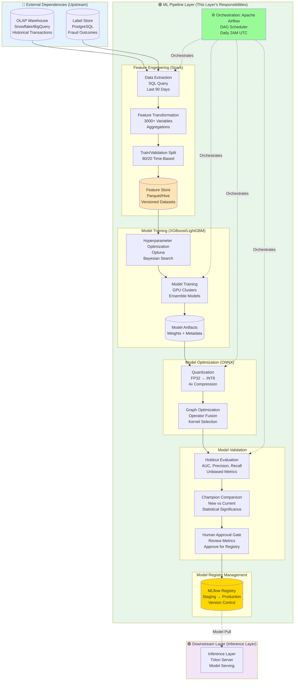
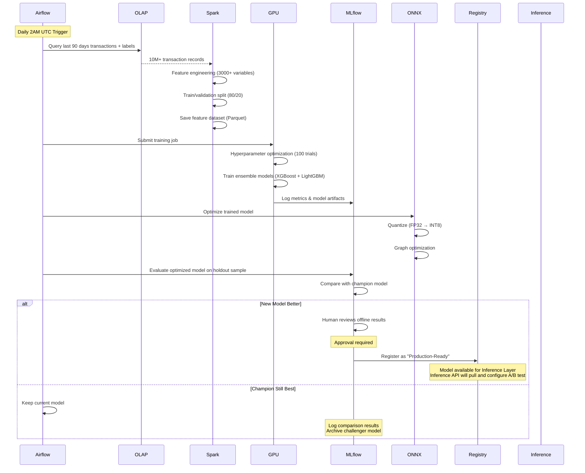
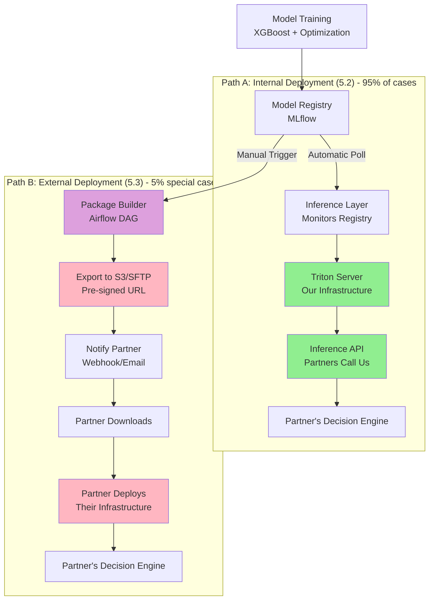

# ML Pipeline

## Layer Overview

The ML Pipeline orchestrates the continuous training, validation, and deployment of fraud detection models. It transforms raw transaction data into high-quality features, trains ensemble models, validates their performance, and deploys optimized models to production with safety mechanisms.

**Primary Responsibilities**:

- Feature engineering: Transform raw data into 3,000+ model-ready variables
- Model training: Automated training of ensemble models (XGBoost, GBDT, Random Forest)
- Model optimization: Quantization, pruning, and format conversion for low-latency inference
- Model validation: Offline evaluation on holdout data, champion/challenger comparison
- Model registration: Register validated models to Model Registry for Inference Layer deployment

**Relation to HLD**:

- Implements "ML Pipeline" component from architecture diagram
- Data flow: `OLAP Warehouse → Feature Engineering → Model Training → Model Optimization → Model Validation → Model Registry → Inference Layer`
- **Separation from Inference**: Training happens offline (batch), inference happens online (real-time)
- **Continuous Learning**: Daily retraining keeps models fresh without manual intervention

---

## Technology Stack

### Orchestration

**Apache Airflow** - Workflow scheduler for ML pipeline automation

**Responsibilities**:

- Schedule daily training jobs
- Coordinate multi-stage pipeline (feature → train → validate → deploy)
- Monitor job status and trigger alerts
- Manage pipeline dependencies and retries

**Configuration**:

- Executor: Kubernetes (dynamic scaling)
- Schedule: Daily at 2:00 AM UTC
- Retention: 30-day pipeline run history

### Feature Engineering

**Apache Spark** - Distributed data processing for large-scale feature computation

**Why Spark**:

- Processes billions of historical transactions efficiently
- Native integration with OLAP warehouse (Snowflake/BigQuery)
- Scalable feature transformation (3,000+ variables)
- Consistent DataFrame API for training and inference

**Cluster Configuration**:

- Worker nodes: 10-20 instances (auto-scaling)
- Memory per executor: 16 GB
- Processing speed: 100K+ transactions/sec

### Model Training

**XGBoost / LightGBM** - Gradient boosting frameworks for fraud detection

**Why Gradient Boosting**:

- State-of-the-art performance for tabular data
- Handles feature interactions and non-linearity
- Built-in feature importance for interpretability
- Robust to missing values and outliers

**Training Infrastructure**:

- GPU acceleration: NVIDIA A100 (4x training speedup)
- Hyperparameter tuning: Optuna (Bayesian optimization)
- Distributed training: Dask-ML for parallel search

### Model Validation

**MLflow** - Experiment tracking and model comparison

**Capabilities**:

- Log metrics, parameters, and artifacts
- Compare models across runs
- Track champion vs challenger performance
- Store validation reports and dashboards

### Model Optimization

**ONNX Runtime** - Cross-platform model optimization and deployment

**Optimization Techniques**:

- Quantization: FP32 → INT8 (4x compression, 2-3x speedup)
- Graph optimization: Fuse operators, eliminate redundant nodes
- Format conversion: XGBoost → ONNX for Triton Inference Server

**Performance Gains**:

- Model size: 400 MB → 100 MB
- Inference latency: 50ms → 15ms (per model)

### Model Registry

**MLflow Model Registry** - Centralized model versioning and lifecycle management

**Model Stages**:

- **Staging**: New models awaiting validation
- **Production**: Currently serving models (champion)
- **Archived**: Retired models (historical reference)

**Metadata Tracked**:

- Model version, training date, author
- Training metrics (AUC, precision, recall)
- Validation results (holdout performance)
- Optimization details (quantization, model size, latency)

---

## Architecture

### Pipeline Overview



### Training Workflow



---

## Detailed Design

### 1. Feature Engineering

#### 1.1 Data Extraction

**Objective**: Retrieve historical transactions and fraud labels from OLAP warehouse

**Query Strategy**:

- **Time window**: Last 90 days (balance freshness vs volume)
- **Filtering**: Exclude test transactions, internal accounts
- **Join logic**: Transactions LEFT JOIN labels (many transactions lack labels)
- **Partitioning**: Query by date partition for performance

**Output**: 10M+ records (~5 GB) for 90-day window at 1,000 TPS

#### 1.2 Feature Transformation

**Objective**: Transform raw transaction data into 3,000+ predictive features

**Feature Categories**:

| Category | Examples | Count |
| -------- | -------- | ----- |
| **Transaction Attributes** | Amount, currency, payment method, merchant category | 50 |
| **Temporal Features** | Hour of day, day of week, time since account creation | 30 |
| **Customer Aggregations** | Total spend (7d/30d/90d), transaction count, avg amount | 200 |
| **Merchant Aggregations** | Merchant fraud rate, avg transaction amount, customer count | 150 |
| **Velocity Features** | Transactions per hour/day, unique merchants per day | 100 |
| **Geolocation Features** | IP country, distance from billing address, VPN detection | 80 |
| **Device Features** | Device type, browser, OS, fingerprint consistency | 60 |
| **Network Features** | Card BIN country, issuer bank, card type | 40 |
| **Behavioral Features** | Time since last transaction, purchase pattern deviation | 90 |
| **Cross-Feature Interactions** | Amount × merchant risk, velocity × customer age | 2,200 |

**Transformation Logic**:

**Aggregation Features**:

- Customer-level: 30-day transaction count, total spend, average amount, standard deviation
- Merchant-level: Fraud rate, transaction count, average amount

**Velocity Features**:

- Time-windowed aggregations (1h, 24h, 7d): Transaction count, unique merchants
- Implemented using Spark window functions with time-based partitioning

**Feature Interactions**:

- Cross-product of high-value features (e.g., amount × merchant_risk_score)
- Automatically generated for selected feature combinations

**Feature Versioning**:

- Features saved with version tag: `features_v1.2_20260109.parquet`
- Schema evolution tracked in metadata table
- Enables A/B testing with different feature sets

#### 1.3 Train/Validation Split

**Strategy**: Time-based split to avoid data leakage

- **Training set**: First 80% of time window (days 0-72)
- **Validation set**: Last 20% of time window (days 73-90)
- **Rationale**: Future data cannot influence past predictions (temporal causality)

**Alternative Strategies Considered**:

- **Random split**: Risk of leakage (future features in training)
- **Stratified split**: Ensures fraud class balance but breaks time ordering
- **Rolling window**: More complex, used for time series models

**Label Distribution**:

- **Fraud rate**: ~0.5% (class imbalance)
- **Handling**: Use `scale_pos_weight` in XGBoost to balance classes

---

### 2. Model Training

#### 2.1 Hyperparameter Optimization

**Objective**: Find optimal model configuration using Bayesian search

**Optimization Framework**: Optuna (Tree-structured Parzen Estimator)

**Search Space**: max_depth, learning_rate, n_estimators, min_child_weight, subsample, colsample_bytree, gamma, scale_pos_weight

**Optimization Budget**:

- Trials: 100 iterations
- Early stopping: Prune if validation AUC < 0.85 after 50 trees
- Time limit: 6 hours
- Parallelization: 4 GPU workers (distributed Optuna)

**Output**: Best hyperparameters logged to MLflow

#### 2.2 Ensemble Training

**Objective**: Train multiple models and combine predictions for robustness

**Ensemble Strategy**: Weighted averaging of heterogeneous models

**Model Components**:

| Model | Weight | Rationale |
| ----- | ------ | --------- |
| **XGBoost** | 0.5 | Best overall performance, handles interactions |
| **LightGBM** | 0.3 | Faster training, better with categorical features |
| **Random Forest** | 0.2 | Reduces overfitting, stable predictions |

**Training Configuration**:

- **XGBoost**: max_depth=6, learning_rate=0.1, n_estimators=500, GPU acceleration
- **LightGBM**: Similar params, optimized for categorical features
- **Random Forest**: n_estimators=200, max_depth=10, for ensemble diversity

**Training Process**:

1. Train each model independently on same training data
2. Validate on holdout validation set
3. Compute weighted ensemble predictions: `score = 0.5*xgb + 0.3*lgb + 0.2*rf`
4. Log all models to MLflow as single ensemble artifact

**Training Time**:

- XGBoost: 2 hours (GPU)
- LightGBM: 1.5 hours (GPU)
- Random Forest: 3 hours (CPU)
- Total: ~3 hours (parallel training)

---

### 3. Model Validation

**Addressing the Classical Problem**: How to measure new model effectiveness without exposing business to fraud risk

This section addresses a fundamental challenge in payment fraud detection: evaluating new models in production without risking business losses. Our solution combines multiple strategies with different risk-reward tradeoffs.

#### 3.1 Holdout Sample Evaluation

**Objective**: Measure model performance on unbiased data not seen during training

**Holdout Strategy**: 1-5% of production traffic **bypasses fraud rules**

- **Purpose**: Collect true fraud labels for unbiased evaluation
- **Business risk**: Controlled exposure (1-5% of transactions)
- **Label collection**: Observe actual fraud outcomes (chargebacks, disputes)
- **Evaluation**: Compare model predictions vs actual outcomes

**Metrics Tracked**:

| Metric | Definition | Target |
| ------ | ---------- | ------ |
| **AUC-ROC** | Area under ROC curve | > 0.95 |
| **Precision @ 1% recall** | Precision when catching 1% of fraud | > 90% |
| **False Positive Rate** | % legit transactions flagged | < 1% |
| **True Positive Rate** | % fraud transactions caught | > 95% |
| **Log Loss** | Calibration quality | < 0.1 |

**Evaluation Approach**:

- Predict on holdout sample using ensemble model
- Calculate core metrics: AUC-ROC, precision-recall curve
- Compute business-oriented metrics: precision at 99% recall
- Log all metrics to MLflow for tracking and comparison

#### 3.2 Champion vs Challenger Comparison

**Objective**: Determine if new model outperforms current production model

**Comparison Methodology**:

1. **Load champion model** from MLflow Registry (Production stage)
2. **Predict on same holdout sample** with both models
3. **Statistical significance test**: McNemar's test or bootstrap confidence intervals
4. **Business impact simulation**: Estimate fraud loss reduction vs false positive cost

**Decision Criteria**:

| Condition | Recommendation |
| --------- | ------ |
| **Challenger AUC > Champion + 0.01** | Recommend promotion to Staging |
| **Challenger AUC < Champion - 0.01** | Archive challenger, do not deploy |
| **Difference < 0.01** | Marginal improvement, engineer decides |

**Comparison Report Example**:

```text
Champion Model (v12.3):
  - AUC: 0.962
  - Precision @ 99% recall: 0.89
  - False positive rate: 0.8%

Challenger Model (v13.0):
  - AUC: 0.971 (+0.009)
  - Precision @ 99% recall: 0.93 (+0.04)
  - False positive rate: 0.6% (-0.2%)

Statistical Test:
  - McNemar test p-value: 0.003 (significant)
  
Business Impact:
  - Estimated fraud loss reduction: $120K/year
  - Customer friction reduction: 2,000 fewer false positives/month
  
Recommendation: Approve for production deployment
```

#### 3.3 Model Registration

**Objective**: Register validated model to Model Registry for Inference Layer to pull and deploy

**ML Pipeline Responsibilities** (this layer ONLY):

- ✅ Validate new model against champion (offline evaluation on holdout data)
- ✅ Determine if new model is deployment-ready based on offline metrics
- ✅ Register validated models to Model Registry with offline validation results
- ❌ **NOT responsible for**: Deployment strategy, traffic routing, Shadow Mode execution, runtime monitoring, rollout planning

**Model Registration Output**:

```yaml
model_metadata:
  model_version: "v13.0"
  champion_version: "v12.3"
  
  offline_validation_results:
    auc: 0.971
    precision_at_99_recall: 0.93
    false_positive_rate: 0.006
    auc_improvement: +0.009
    statistical_significance: 0.003  # p-value
    
  approval_status:
    approved_for_production: true
    approved_by: "data-scientist@company.com"
    approved_at: "2026-01-09T14:30:00Z"
```

**Handoff to Inference Layer**:

- Inference API Service discovers new models from Model Registry
- Inference API Service decides deployment strategy (Shadow Mode, traffic splits, rollout stages)
- Inference API Service configures and executes all online experiments
- Human operators control experiments through Inference API's `/v1/experiments/config` endpoint

**ML Pipeline ends here** - all deployment decisions and execution belong to Inference Layer

---

### 4. Model Optimization

#### 4.1 Quantization

**Objective**: Reduce model size and inference latency while maintaining accuracy

**Technique**: Post-training quantization (FP32 → INT8)

**Process**:

1. **Calibration**: Run 1,000 representative samples through model
2. **Range estimation**: Compute min/max values for each layer
3. **Quantize**: Convert weights and activations to INT8
4. **Validation**: Ensure accuracy drop < 0.1%

**Benefits**:

- **Model size**: 400 MB → 100 MB (4x compression)
- **Memory bandwidth**: Reduced by 4x (faster loading)
- **Inference latency**: 50ms → 15ms (GPU) or 25ms (CPU)

**Accuracy Impact**:

- Expected: < 0.001 AUC degradation
- Mitigation: Use per-channel quantization for better precision

#### 4.2 Graph Optimization

**Objective**: Optimize computation graph for deployment platform (Triton Server)

**Optimizations Applied**:

- **Operator fusion**: Combine consecutive operations (e.g., MatMul + Add → FusedMatMulAdd)
- **Constant folding**: Pre-compute static operations
- **Dead code elimination**: Remove unused branches
- **Kernel selection**: Choose optimal CUDA kernels for GPU inference

**ONNX Conversion Process**:

1. Convert trained models to ONNX format
2. Apply graph optimization (operator fusion, constant folding, kernel selection)
3. Save optimized model for deployment

**Optimization Validation**:

- **Latency benchmark**: Run 10,000 inferences, measure p50/p95/p99
- **Accuracy check**: Compare ONNX predictions vs original model (tolerance: 1e-5)
- **Throughput test**: Measure max TPS with concurrent requests

---

### 5. Model Deployment

#### 5.1 Model Registry Management

**Objective**: Version control and lifecycle management for trained models

**Model Stages**: Staging → Production → Archived

**Stage Transitions**:

- New models registered to **Staging** after training
- Promoted to **Production** after validation
- Old models moved to **Archived** for historical reference

**Metadata Tracked**:

```json
{
  "model_version": "13.0",
  "training_date": "2026-01-09T02:00:00Z",
  "author": "ml-pipeline-airflow",
  "training_data": {
    "start_date": "2025-10-11",
    "end_date": "2026-01-09",
    "record_count": 10234567,
    "fraud_rate": 0.0051
  },
  "feature_version": "v1.2",
  "hyperparameters": {
    "xgb_max_depth": 6,
    "xgb_learning_rate": 0.1,
    "xgb_n_estimators": 500
  },
  "validation_metrics": {
    "auc": 0.971,
    "precision_at_99_recall": 0.93,
    "false_positive_rate": 0.006
  },
  "optimization": {
    "format": "onnx",
    "quantization": "int8",
    "model_size_mb": 98,
    "inference_latency_ms": 14
  },
  "deployment": {
    "stage": "Production",
    "rollout_percentage": 100,
    "deployed_at": "2026-01-23T10:00:00Z"
  }
}
```

#### 5.2 Model Registration (Not Direct Deployment)

**Objective**: Register optimized model to Model Registry for Inference Layer to fetch

**ML Pipeline Responsibilities** (ends here):

1. **Upload to Model Repository**: Copy ONNX model to MLflow artifact store (S3)
2. **Register Metadata**: Record model version, metrics, deployment recommendations
3. **Transition Stage**: Move from Staging → Production (or keep in Staging for review)

**What ML Pipeline Does NOT Do**:

- ❌ Does not deploy directly to Triton Inference Server
- ❌ Does not configure traffic routing
- ❌ Does not trigger hot reload

**Handoff to Inference Layer**:

- Inference Layer monitors Model Registry for new Production models
- Inference Layer pulls model artifacts and deploys to Triton
- Inference Layer performs health checks and configures routing

**Model Versioning in Registry**:

- Models stored in directory structure: `fraud_detection_ensemble/13/model.onnx`
- Triton serves multiple versions simultaneously for A/B testing
- Inference API specifies version in request: `model_version: 13`

#### 5.3 Model Export for External Partners (Optional - Ambiguity Resolution)

**Context**: The requirement "deliver the model for inference on their architecture" can be interpreted in two ways:

1. **Inference as a Service** (covered in 5.2 above): Model stays on our infrastructure, partners call our API
2. **Model Distribution** (covered here): Model is exported and deployed on partner's infrastructure

**Use Case**: Partners with regulatory requirements or data sovereignty needs who must run inference on their own servers.

**Deployment Comparison: Internal vs External**



**Export Process Details** (Path B only):

**Step 1: Model Package Creation**

Airflow DAG creates deployable package containing:

- ONNX model file from MLflow
- Feature calculation logic (Python/Java libraries)
- Deployment guide (README with setup instructions)
- Model metadata (version, metrics, feature list, runtime requirements)
- Checksum file for integrity verification

**Step 2: Export to Partner-Accessible Location**

**Option A: Manual Download (Recommended)**

- Upload package to secure S3 bucket with partner-specific folder
- Generate pre-signed URL with 7-day expiration
- Partner downloads at their convenience

**Option B: Automated Push (For Trusted Partners)**

- Push directly to partner's S3 bucket (cross-account)
- Or upload to partner's SFTP server
- Partner's system auto-detects new file and triggers deployment

**Step 3: Partner Notification**

Notify partner via:

- Webhook POST to partner's endpoint (with download URL)
- Email notification with model version and download link

**Airflow DAG**: Orchestrates all three steps, triggered when model reaches `Production` stage in MLflow.

**Model Package Structure**:

```text
fraud_model_v13_20260109.zip
├── model.onnx                    # ONNX model file
├── feature_config.json           # Feature list and types
├── feature_calculator.py         # Python feature calculation logic
├── feature_calculator.jar        # Java version (if needed)
├── deployment_guide.md           # Setup instructions
├── metadata.json                 # Model metrics and requirements
└── checksum.sha256               # Integrity verification
```

**Key Differences from Internal Deployment** (5.2):

| Aspect | Internal (5.2) | External (5.3) |
| ------ | -------------- | ------------- |
| **Deployment Target** | Our Inference Layer (Triton) | Partner's infrastructure |
| **Handoff Mechanism** | MLflow Registry → Inference Layer polls | Package → Partner downloads |
| **Update Automation** | Automatic (Inference Layer monitors) | Manual (Partner decides when) |
| **Artifacts Included** | ONNX only | ONNX + feature code + docs |
| **Feature Calculation** | Pre-computed in our Feature Store | Partner must replicate in their ETL |
| **Monitoring** | We monitor inference performance | Limited (partner's responsibility) |
| **ML Pipeline Responsibility** | Register to MLflow (ends here) | Package + Export + Notify (additional steps) |

**Important Note**: Model export is **not the default path** - it's only triggered when partner explicitly requires on-premise deployment (regulatory/data sovereignty constraints). The standard flow (5.2) covers 95%+ of use cases.

---

## Key Algorithms & Patterns

### Feature Engineering Patterns

**Aggregation Windows**: Sliding time windows (1h, 24h, 7d, 30d, 90d) for velocity features

**Ratio Features**: Cross-feature ratios capture relative magnitudes (e.g., `current_amount / avg_amount_30d`)

**Deviation Features**: Standard deviation from historical behavior (e.g., `|amount - avg_amount| / std_amount`)

**Categorical Encoding**: Target encoding for high-cardinality features (merchant_id, customer_id)

### Training Patterns

**Gradient Boosting**: Sequential ensemble where each tree corrects previous errors

**Early Stopping**: Stop training if validation metric doesn't improve for 50 rounds (prevents overfitting)

**Cross-Validation**: 5-fold time-series CV for robust hyperparameter selection

### Deployment Patterns

**Shadow Mode**: Run new model in parallel without affecting decisions (log predictions only)

**Canary Deployment**: Gradually increase traffic to new model (5% → 20% → 50% → 100%)

**Champion/Challenger**: Always compare new model against current best before promotion

**Automated Rollback**: Revert to previous model if metrics degrade below threshold

---

## External Integration

### Upstream Dependencies

| Service | Purpose | Interface |
| ------- | ------- | --------- |
| **OLAP Warehouse** | Historical transaction data | SQL query (JDBC) |
| **Label Store** | Fraud outcome labels | PostgreSQL query |
| **Feature Store** | Feature metadata | REST API (feature schema) |

### Downstream Interface

**Model Registry** (MLflow):

- **Protocol**: REST API
- **ML Pipeline Operations**: Register model, upload artifacts, transition stage, record metadata
- **Inference Layer Operations**: Fetch model by version, list production models, download artifacts
- **Decoupling**: Model Registry acts as intermediate, no direct ML Pipeline → Inference Layer communication

### Internal Dependencies

- **Apache Airflow**: Orchestrates entire pipeline (scheduler + DAG execution)
- **MLflow**: Tracks experiments, logs metrics, stores artifacts
- **Monitoring Stack**: Prometheus (metrics), ELK (logs), Grafana (dashboards)

---

## Data Privacy

**PII Handling**:

- **Training data**: Customer IDs pseudonymized (SHA-256 hashing)
- **Feature store**: No raw PII (only derived features)
- **Model artifacts**: No customer data embedded

**Compliance**:

- **GDPR**: Right to deletion (retrain models without deleted users)
- **PCI-DSS**: No credit card numbers in training data

---

## Monitoring & Observability

### Key Metrics

**Training Metrics**:

- Model AUC, precision, recall, false positive rate
- Training duration, hyperparameter optimization trials
- Feature importance distribution

**Deployment Metrics**:

- Model version in production (from Model Registry)
- Validation metrics comparison (champion vs new model)
- Deployment success rate

**Data Quality Metrics**:

- Feature distribution drift (KL divergence vs training data)
- Missing value rate, outlier rate
- Label lag (time between transaction and label)

### Alerting

**Critical Alerts** (PagerDuty):

- Training job failure (pipeline broken)
- Model performance degradation (AUC drop > 5%)
- Automated rollback triggered

**Warning Alerts** (Slack):

- Feature drift detected (distribution shift)
- New model shows marginal improvement (< 1% AUC gain)
- High false positive rate in validation (> 1.5%)

### Dashboards

**Training Dashboard**:

- Daily training job status (success/failure/duration)
- Model performance over time (AUC, precision, recall)
- Feature importance ranking

**Deployment Dashboard**:

- Current production model version and validation metrics
- Model comparison (champion vs challenger offline performance)
- Deployment history and stage transitions

**Data Quality Dashboard**:

- Feature distribution (histograms, quantiles)
- Label lag distribution
- Data freshness (last update timestamp)

---

## Failure Modes & Mitigation

### Training Failures

| Failure | Impact | Mitigation |
| ------- | ------ | ---------- |
| **Data extraction timeout** | Training delayed | Retry 3x, use cached data, alert if failure |
| **GPU out of memory** | Training crashes | Reduce batch size, use gradient accumulation |
| **Hyperparameter search timeout** | Suboptimal model | Use previous best params, run full search later |
| **Validation AUC below threshold** | Bad model | Do not deploy, keep champion, investigate data quality |

### Deployment Failures

| Failure | Impact | Mitigation |
| ------- | ------ | ---------- |
| **Model load error in Triton** | Inference API returns 500 | Health check catches before production deployment |
| **Production metrics degradation** | Poor fraud detection | Alert engineers, evaluate rollback decision |
| **Model drift (feature distribution shift)** | Accuracy degrades over time | Daily retraining, alert if drift exceeds threshold |
| **Inference latency spike** | SLA violation | Alert for investigation (quantization, pruning, scaling) |

### Operational Failures

| Failure | Impact | Mitigation |
| ------- | ------ | ---------- |
| **Airflow scheduler crash** | Pipeline stops | Kubernetes auto-restart, backup scheduler |
| **MLflow server unavailable** | Cannot log metrics | Local caching, retry on recovery |
| **OLAP warehouse slow query** | Feature extraction delayed | Query optimization, add indexes, cache frequent queries |

---

## Model Validation Strategy: Addressing the Classical Problem

### Problem Statement

**How to measure the effectiveness of a new fraud model without exposing business to fraud by substituting a model that performs well in training but fails in production?**

This is one of the most critical challenges in payment fraud detection, as offline metrics (AUC, precision, recall) may not reflect real-world performance due to:

- **Distribution shift**: Production data differs from training data
- **Adversarial adaptation**: Fraudsters adapt to existing models
- **Label bias**: Training labels influenced by existing fraud rules (selection bias)
- **Temporal drift**: Fraud patterns evolve over time

### ML Pipeline's Role in Validation Strategy

**ML Pipeline Responsibilities** (this layer):

1. **Offline Validation** - Validate models on historical holdout data before any production deployment
2. **Define Validation Metrics** - Specify AUC, precision, recall, false positive rate targets
3. **Champion vs Challenger Comparison** - Statistical testing on historical data only
4. **Model Registration** - Automatically register validated models to Model Registry

**What ML Pipeline Does NOT Do**:

- ❌ Analyze production logs (shadow mode, holdout, rollout)
- ❌ Generate deployment recommendation reports (Data Engineer responsibility)
- ❌ Query production data from OLAP Warehouse (Data Engineer responsibility)
- ❌ Runtime traffic routing (Inference Layer responsibility)
- ❌ Real-time monitoring and alerting (Observability responsibility)
- ❌ Deployment decisions and rollback (Human decision)

**Production Data Analysis** (Not ML Pipeline):

- Data Engineers query OLAP Warehouse for production logs
- Data Engineers use BI tools (Tableau, Looker) or SQL notebooks
- Data Engineers generate analysis reports for human review
- Human Operators make deployment decisions based on reports

### Multi-Layered Validation Approach

Our system uses **three complementary validation methods**, with responsibilities distributed across layers:

#### 1. Offline Validation (Zero Risk)

**Responsibility**: ✅ **ML Pipeline** (this layer)

**Approach**: Validate on historical holdout data (Section 3.1-3.2)

**ML Pipeline Actions**:

- Load historical transactions and labels from OLAP Warehouse
- Split data: training (80%) vs validation (20%)
- Train model on training set, evaluate on validation set
- Compare challenger vs champion using AUC, precision, recall
- Generate comparison report with recommendation

**Limitations**: Cannot detect distribution shift or real-world performance issues

---

#### 2. Holdout Sample Evaluation (Controlled Risk) ⭐ **Primary Solution**

**Responsibility**: **Multi-layer collaboration**

- **Inference Layer** (see 04-inference-layer.md): Traffic routing and logging to OLAP
- **Decision Layer** (see 05-decision-layer.md): Rule bypass and logging to OLAP
- **Storage Layer** (see 03-storage-layer.md): OLAP Warehouse streaming ingestion
- **Data Engineer** (manual): Query OLAP and analyze results

**Data Engineer Actions** (after labels arrive 30-90 days):

1. Query OLAP Warehouse for holdout sample transactions with labels
2. Join with logged scores from both champion and challenger models
3. Compare predictions against true outcomes (chargebacks, disputes)
4. Calculate unbiased metrics: AUC, precision at various recall levels
5. Perform statistical significance testing (McNemar's test)
6. Generate deployment recommendation report for Human Operator review

**Business Considerations** (for Operations team):

- Fraud exposure: 5% × 0.5% fraud rate = 0.025% of revenue at risk
- Statistical power: 5% sample ≈ 130K transactions/month
- Time to results: 90 days for chargeback labels
- See 05-decision-layer.md for configuration and risk management

**Advantages**:

- ✅ Unbiased evaluation (no selection bias)
- ✅ Real-world performance measurement
- ✅ Detects distribution shift

**Disadvantages**:

- ❌ Controlled fraud exposure
- ❌ Slow feedback (90-day wait)

---

#### 3. Shadow Mode Evaluation (Low Risk)

**Responsibility**: **Multi-layer collaboration**

- **Inference Layer** (see 04-inference-layer.md): Parallel scoring and logging to OLAP
- **Storage Layer** (see 03-storage-layer.md): OLAP Warehouse streaming ingestion
- **Data Engineer** (manual): Query and analyze logged predictions

**Data Engineer Actions** (after shadow mode period 7-14 days):

1. Query OLAP Warehouse for shadow mode predictions
2. Compare champion vs challenger predictions on same traffic
3. Analyze score distribution differences
4. Identify edge cases where models disagree significantly
5. Generate shadow mode report with recommendation (proceed to holdout or archive challenger)

**Limitation**: Label bias still present (see only transactions champion allowed/flagged)

---

#### 4. Gradual Rollout Analysis (Post-Deployment)

**Responsibility**: **Multi-layer collaboration**

- **Inference Layer** (see 04-inference-layer.md): Execute traffic split and log to OLAP
- **Decision Layer** (see 05-decision-layer.md): Execute rules and log to OLAP
- **Storage Layer** (see 03-storage-layer.md): OLAP Warehouse streaming ingestion
- **Data Engineer** (manual): Monitor metrics and analyze results

**Data Engineer Actions**:

1. **Before rollout**: Query champion baseline metrics (AUC, FPR, latency) from OLAP for reference
2. **During rollout**: Monitor real-time metrics via BI dashboards (query OLAP)
3. **After each stage**: Analyze logged metrics and generate stage report
4. **If issues detected**: Perform statistical analysis and recommend rollback decision to Human Operator

---

### Alternative Validation Approaches

**Evaluated but not primary solutions**:

| Approach | ML Pipeline Role | Verdict |
| -------- | ---------------- | ------- |
| **Synthetic Fraud Injection** | Generate synthetic fraud transactions | Useful for unit tests, insufficient for production validation |
| **Time-Based Backtesting** | Score historical transactions with new model | Good initial validation, but cannot detect distribution shift |
| **Adversarial Simulation** | Simulate fraudster behavior in offline replay | Research area, not production-ready |

---

### Validation Workflow Summary

```text
1. ML Pipeline: Offline validation (historical data)
   ML Pipeline: Generate comparison report
   Human Operator: Review report and approve for shadow mode
   ↓
   
2. Inference Layer: Deploy to shadow mode (7-14 days, parallel scoring)
   Inference Layer: Log predictions to OLAP Warehouse (streaming API)
   ↓
   Data Engineer: Query shadow mode logs from OLAP Warehouse
   Data Engineer: Analyze champion vs challenger predictions
   Data Engineer: Generate shadow mode evaluation report
   Human Operator: Review report and approve for holdout test
   ↓
   
3. Inference Layer: Configure holdout sample ratio (1-5%)
   Inference Layer: Mark holdout transactions and execute routing
   Inference Layer: Log scores to OLAP Warehouse (streaming API)
   Decision Layer: Recognize holdout flag and bypass all rules
   Decision Layer: Log bypass decisions to OLAP Warehouse (streaming API)
   ↓ (Wait 30-90 days for fraud labels)
   
4. Data Engineer: Query labeled holdout data from OLAP Warehouse
   Data Engineer: Calculate unbiased metrics (AUC, precision, recall)
   Data Engineer: Perform statistical significance testing
   Data Engineer: Generate holdout evaluation report with recommendation
   Human Operator: Review report and approve for gradual rollout
   ↓
   
5. Inference Layer: Execute gradual rollout (5% → 20% → 50% → 100%)
   Inference Layer: Log all predictions to OLAP Warehouse (streaming API)
   Decision Layer: Log all decisions to OLAP Warehouse (streaming API)
   Data Engineer: Monitor metrics via BI dashboards (query OLAP)
   Human Operator: Review metrics and approve progression to next stage
   (At any stage: if metrics degrade, operator decides rollback)
   ↓ (After 100% rollout is stable)
   
6. Human Operator: Approve model promotion to champion
   Inference Layer: Switch 100% traffic to new model
   ML Pipeline: Archive old champion model in Registry (automated)
```

**Key Principles**: 
- **ML Pipeline**: Automated training pipeline only (OLAP → Training → Registry)
- **Inference/Decision Layers**: Stream all logs directly to OLAP Warehouse (Snowflake/BigQuery streaming API)
- **Data Engineers**: Manual analysis of production data from OLAP
- **Human Operators**: All critical deployment decisions

See:
- **04-inference-layer.md** for runtime traffic routing and logging
- **05-decision-layer.md** for rule execution and logging
- **03-storage-layer.md** for OLAP Warehouse streaming ingestion

---

## Future Enhancements

### Advanced Techniques

**AutoML**: Automated feature selection and model architecture search (H2O.ai, AutoGluon)

**Online Learning**: Incrementally update models with new data (reduce retraining frequency)

**Multi-Task Learning**: Train single model for fraud detection + transaction amount prediction (shared features)

### Explainability

**SHAP Values**: Per-prediction feature importance for transparency

**Model Cards**: Standardized documentation (training data, metrics, limitations, intended use)

**Fairness Audits**: Ensure model doesn't discriminate by protected attributes (age, gender, location)

### Experimentation Platform

**Bandits**: Multi-armed bandit algorithms for adaptive model selection

**Contextual Personalization**: Different models for different customer segments (high-risk vs low-risk)

**Reinforcement Learning**: Learn optimal decision policies from feedback

---
