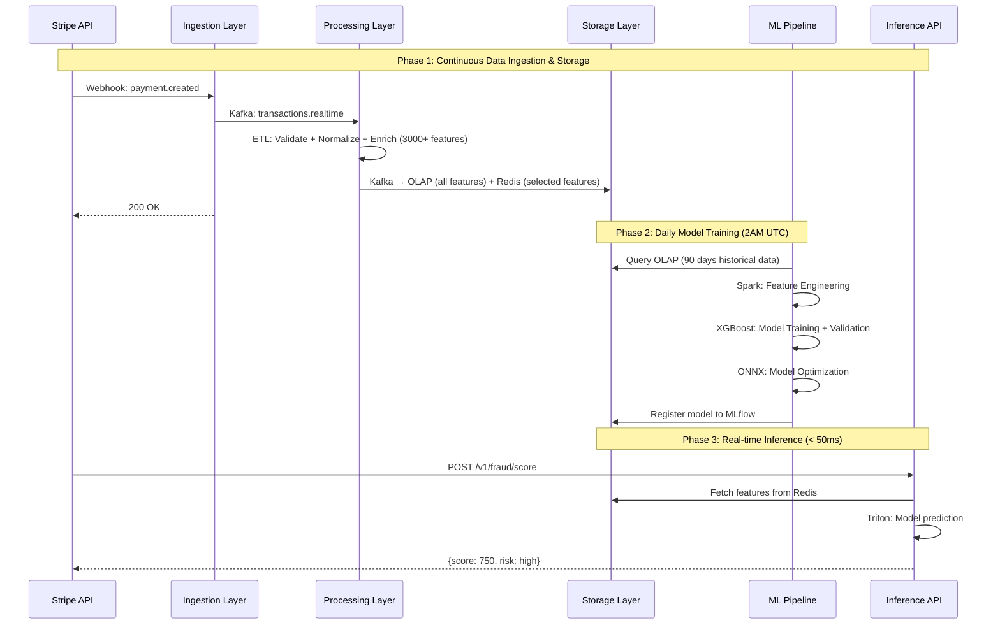
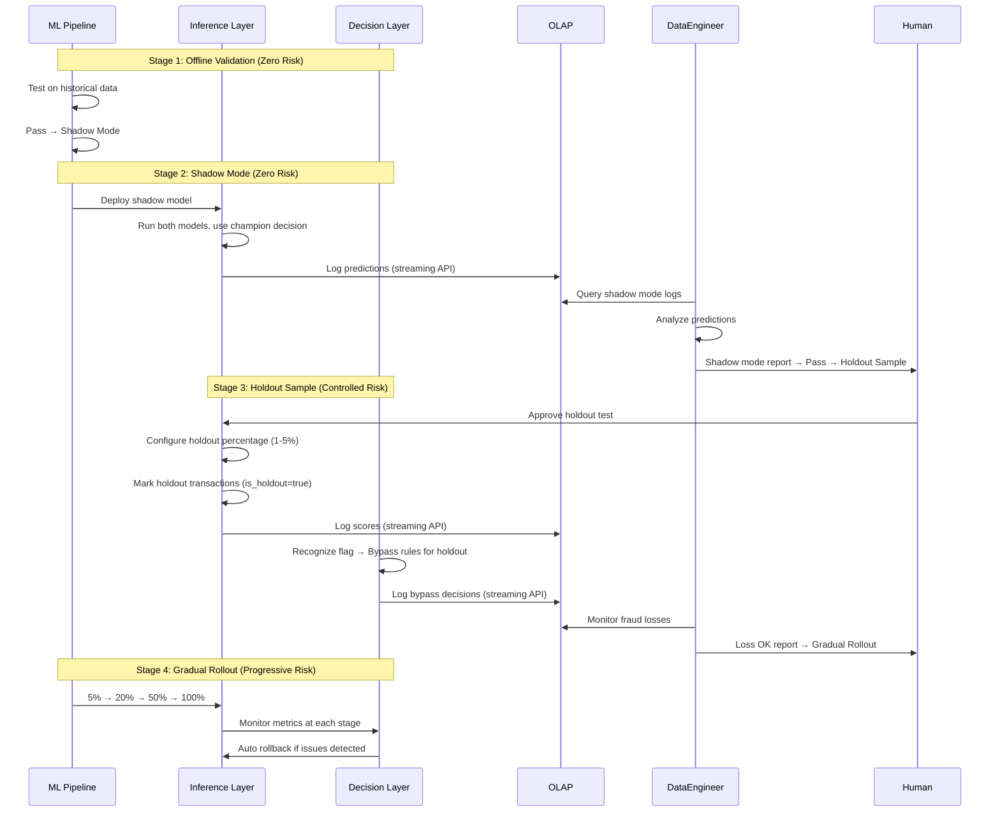
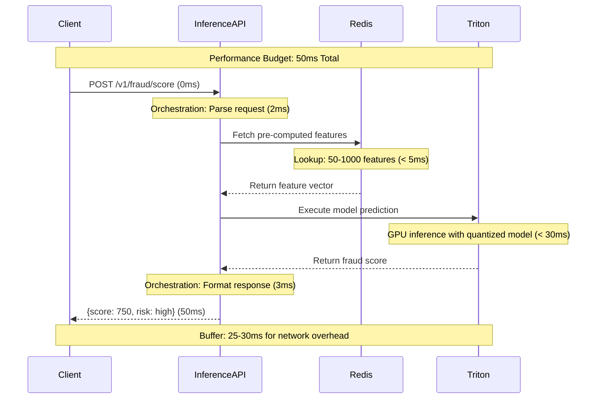

# Design Solutions to Core Challenges

## Document Purpose

This document maps each problem statement from `questions.txt` to the comprehensive system design outlined in `design/00-high-level-design.md`. Each solution includes design logic, layered collaboration details, visual diagrams, and precise source citations for traceability.

---

## Table of Contents

1. [Question 1: API ingestion + ETL + optimized storage + real-time inference](#question-1-api-ingestion--etl--optimized-storage--real-time-inference)
2. [Question 2: Safe Model Evaluation Without Fraud Exposure](#question-2-safe-model-evaluation-without-fraud-exposure)
3. [Question 3: Non-API Provider Integration with External Decision Engine](#question-3-non-api-provider-integration-with-external-decision-engine)
4. [Question 4: High-Performance Inference with 3,000+ Variables](#question-4-high-performance-inference-with-3000-variables)

---

## Question 1: API ingestion + ETL + optimized storage + real-time inference

### Problem Statement

> How would you design a system to ingest data from a payment processor API, run ETL, and store in a database for ML model development on a continuous basis (ideally optimized for data storage and runtime) and then deliver the model for near real time inference? You can select any payment processor. Please be as detailed and specific as possible.

### Solution Summary

**The system uses a layered architecture with event-driven communication, where features are pre-computed during ETL and cached in Redis, enabling continuous model training on OLAP data while serving real-time inference in <100ms.**

### Design Logic

The system implements a **layered architecture with event-driven communication** to achieve end-to-end ML operations. The core strategy addresses the challenge of optimizing for both ML development (batch analytics) and real-time inference (sub-100ms latency) througmarkh:

1. **Multi-Store Architecture**: Separate storage systems optimized for different workloads - OLAP for model training, Feature Store for inference
2. **Feature Pre-computation**: Compute all features during ETL (asynchronous), cache in Redis for inference (HFT-inspired approach)
3. **Event-Driven Pipeline**: Kafka-based decoupling enables continuous data flow from ingestion → processing → storage → training → inference
4. **Automated Continuous Training**: Daily model retraining without manual intervention, with safe deployment mechanisms

**Performance Targets**: <100ms inference latency, 1,000+ TPS throughput, 99.9% availability

*[Ref: [design/00-high-level-design.md](design/00-high-level-design.md#1-architectural-strategy) - Architectural Strategy]*

### Layered Collaboration

The end-to-end ML operations pipeline involves five core layers working together:

#### Architecture Overview

*[Ref: [design/00-high-level-design.md](design/00-high-level-design.md#21-architecture-diagram) - System Architecture]*

#### Component Interactions: End-to-End Data Flow

*[Ref: [design/00-high-level-design.md](design/00-high-level-design.md#22-real-time-fraud-detection-workflow) - Workflow Details]*

### Implementation Details

#### 1. Data Ingestion from Payment Processor

**Dual-Path Ingestion**:

- **Real-time**: Webhook endpoints receive payment events as they occur
- **Batch**: Scheduled file downloads for providers without real-time capabilities (SFTP/S3)

**Output**: Transaction events published to Kafka for downstream processing

*[Ref: [design/01-ingestion-layer.md](design/01-ingestion-layer.md) - Complete implementation details]*

#### 2. ETL Processing

**Three-Stage Pipeline**:

1. **Validation**: Ensure data quality and schema compliance
2. **Normalization**: Transform different provider formats into unified schema
3. **Enrichment**: **Pre-compute all 3,000+ features** (customer history, merchant risk, velocity patterns)

**Key Decision**: Pre-compute features during ETL instead of at inference time

- Moves computational cost from latency-critical inference to asynchronous ETL
- Enables <100ms inference by reducing it to simple Redis lookup

**Output**:

- Validated data → OLAP Warehouse
- Pre-computed features → Feature Store

*[Ref: [design/02-processing-layer.md](design/02-processing-layer.md) - Complete implementation details]*

#### 3. Storage Optimization

**Challenge**: Single database cannot serve both ML training (batch analytics) and real-time inference (<100ms)

**Solution**: Multi-store architecture with purpose-built systems

| Storage | Purpose | Key Benefit |
| ------- | ------- | ----------- |
| **OLAP Warehouse** | ML Training | Stores all 3,000+ features for model development |
| **Feature Store (Redis)** | Inference | Caches selected 50-1,000 features for <5ms lookup |
| **Model Registry** | Versioning | Decouples training from serving |

**Cost Optimization**: Train on all features, deploy with selected features (10x cost reduction)

*[Ref: [design/03-storage-layer.md](design/03-storage-layer.md) - Complete implementation details]*

#### 4. Continuous Model Training

**Daily Automated Pipeline** (2AM UTC):

1. Extract 90-day historical data from OLAP Warehouse
2. Train XGBoost ensemble models with GPU acceleration
3. Optimize via quantization (4x compression, 2-3x speedup)
4. Offline validation: Evaluate optimized model on historical validation set (last 20% of data) and compare with champion model
5. Register to Model Registry with versioning (after human approval)

**Continuous Learning**: Each day's outcomes feed into next day's training

*[Ref: [design/06-ml-pipeline.md](design/06-ml-pipeline.md) - Complete implementation details]*

#### 5. Model Deployment and Inference

**Two-Component Architecture**:

- **Model Serving**: Hosts optimized models, executes predictions
- **Inference API**: Orchestrates feature retrieval + model inference

**Inference Flow**:

1. Request arrives → Fetch features from Redis
2. Execute model prediction via Triton
3. Return fraud score (0-1000)

**Performance**: <50ms end-to-end (feature fetch + model inference + orchestration)

**Decoupling**: Inference polls Model Registry for updates (no direct ML Pipeline dependency)

*[Ref: [design/04-inference-layer.md](design/04-inference-layer.md) - Complete implementation details]*

### Key Architectural Decisions

| Decision | Rationale |
| -------- | --------- |
| **Multi-store architecture** | Optimize each storage for specific workload (batch analytics vs real-time inference) |
| **Feature pre-computation** | Move computation from inference time to ETL time, guarantee <100ms latency |
| **Event-driven pipeline** | Decouple layers via Kafka, enable continuous data flow |
| **Daily automated retraining** | Keep models fresh without manual intervention |

*[Ref: [design/00-high-level-design.md](design/00-high-level-design.md#11-design-principles) - Complete design principles]*

---

## Question 2: Safe Model Evaluation Without Fraud Exposure

### Problem Statement

> One of the classical problems in payments data science is how to measure the effectiveness of a new fraud model, without exposing your business to fraud by substituting a model that performs well in training but fails in production. A potential solution is to use a small holdout sample, which is not subject to any fraud prevention algorithms or rules, and use that sample to A/B test new models vs existing models. How would you design this system? What are the business considerations that you need to take into account? Do you have ideas for other less risky solutions?

### Solution Summary

**The system employs a 4-stage progressive validation strategy (Offline → Shadow Mode → Holdout Sample → Gradual Rollout) where each stage increases risk incrementally, with the Holdout Sample (1-5% traffic bypassing all rules) being the only way to obtain truly unbiased performance metrics.**

### Design Logic

The system implements a **multi-strategy validation approach** with increasing levels of risk, allowing new models to be tested safely before full deployment:

1. **Offline Validation**: Test on historical data (zero risk, but limited reliability)
2. **Shadow Mode**: Run new model in parallel without affecting decisions (zero business risk)
3. **Holdout Sample**: Small subset (1-5%) bypasses fraud prevention for unbiased evaluation (controlled risk)
4. **Gradual Rollout**: Progressive traffic shift with monitoring (5% → 20% → 50% → 100%)

**Core Principle**: Each validation stage must pass before advancing to the next, with automatic rollback if metrics degrade.

*[Ref: [design/00-high-level-design.md](design/00-high-level-design.md#problem-2-safe-model-evaluation-without-fraud-exposure) - Problem Mapping]*

### Layered Collaboration

**Multi-Stage Validation Process**:

*[Ref: [design/00-high-level-design.md](design/00-high-level-design.md#34-ml-pipeline) - Model Validation]*

### Implementation Details

#### 1. Offline Validation (Zero Risk)

**Purpose**: Initial sanity check on historical data

**Process**:

- Test new model on time-based validation set (most recent 20% of historical data)
- Calculate metrics: AUC-ROC, Precision, Recall, F1
- Compare against champion model with statistical significance test

**Limitation**: Historical performance doesn't guarantee production success (data distribution shift, feedback loops)

*[Ref: [design/06-ml-pipeline.md](design/06-ml-pipeline.md) - ML Pipeline Implementation]*

#### 2. Shadow Mode (Zero Business Risk)

**How It Works**:

- Challenger model runs in parallel with champion
- All decisions still made by champion (no business impact)
- Challenger predictions logged for offline analysis

**Benefits**:

- Test real production data distribution
- Measure latency impact
- No fraud exposure risk

**Duration**: 7-14 days to collect sufficient samples

**Decision Criteria**:

- Latency < SLA threshold
- Prediction quality >= champion (measured on subsequent labels)

*[Ref: [design/04-inference-layer.md](design/04-inference-layer.md) - Inference Layer with Shadow Mode]*

#### 3. Holdout Sample (Controlled Risk)

**How It Works**:

- Small percentage (1-5%) bypasses all fraud prevention rules
- Provides unbiased evaluation of both models
- Controlled fraud exposure with capped losses

#### 4. Gradual Rollout (Progressive Risk)

**Progressive Traffic Shift**: 5% → 20% → 50% → 100% with monitoring at each stage

**Automatic Rollback**: If fraud losses, false positive rates, or latency degrade beyond thresholds

*[Ref: [design/README.md](design/README.md#model-validation-multi-layer-collaboration) - Gradual Rollout]*

### Alternative Less Risky Solutions

**1. Time-Based Holdout**: Test during low-traffic hours (e.g., 2-4 AM) to reduce fraud exposure
    - Lower risk but not representative of peak patterns

**2. Geography-Based Testing**: Test in low-risk markets first
    - Isolated risk but may not generalize to other regions

**3. Transaction Amount Capping**: Only test on small transactions (<$100)
    - Bounded risk but small transactions may have different fraud patterns

**4. Hybrid Consensus**: Require both models to agree on decline decisions
    Zero increase in fraud approvals but can't measure false positive improvements

### Key Business Considerations

#### 1. Financial Risk Management

- **Direct Cost**: Expected $1.5K/day fraud loss during testing
- **Opportunity Cost**: Delayed deployment means ongoing fraud continues
- **Budget Authority**: Requires CFO approval for $50K contingency fund
- **ROI Justification**: Must prove 10x return to justify risk

#### 2. Customer Trust & Experience

- **Fraud Victims**: Some customers will suffer losses
  → Requires customer service preparedness and refund policy
- **False Positives**: Legitimate customers may be declined
  → Risk of customer churn, negative reviews
- **Brand Risk**: If testing is exposed publicly, reputational damage

#### 3. Regulatory & Legal

- **Compliance**: May require pre-approval in regulated markets
- **Liability**: Who is responsible for fraud losses during testing?
- **Disclosure**: Do customers need to be informed?
- **Geographic Constraints**: Some regions may prohibit intentional exposure

#### 4. Operational Feasibility

- **Team Bandwidth**: Requires 24/7 monitoring for 6-8 weeks
- **Technical Debt**: Holdout system needs ongoing maintenance
- **Timing**: Avoid peak seasons (Black Friday, holidays)
- **Coordination**: Cross-functional alignment (Risk, Eng, Legal, Support)

#### 5. Statistical vs Business Trade-off

- **Sample Size**: 1,000+ fraud cases = 30-60 days testing
  → Longer testing = more cost and risk
  → Shorter testing = unreliable results
- **Confidence Level**: How certain must we be before rollout?
  → Higher confidence = larger holdout = more risk

#### 6. Decision Framework

- **Go/No-Go Criteria**: What metrics trigger pause? (e.g., daily loss >$5K)
- **Approval Chain**: Who can approve starting/stopping?
- **Exit Strategy**: If model fails, how do we communicate to stakeholders?

*[Ref: [design/05-decision-layer.md](design/05-decision-layer.md) - Decision Layer Implementation]*

### Key Decisions

| Decision | Rationale |
| ------- | --------- |
| **Multi-stage validation** | Progressive risk increase allows early detection of issues |
| **Holdout sample approach** | Only way to get truly unbiased metrics (avoid feedback loop) |
| **Automatic rollback** | Business protection requires no human in the loop for critical issues |
| **Shadow mode first** | Zero-risk way to validate latency and catch obvious errors |

---

## Question 3: Non-API Provider Integration with External Decision Engine

### Problem Statement

> We're working with a new payment provider, and they don't have an API we can use to ingest data. What kind of system/process could you come up with to receive their data, process it and then deliver the model for inference on their architecture? Assume they already have a decision engine on their side that works well.

### Solution Summary

**The system provides flexible file-based ingestion (pull) and webhook ingestion (push) for data collection and offers three integration options for inference delivery: API-based scoring (recommended), batch scoring files, or model export for on-premise deployment, allowing partners to keep their existing decision engines.**

### Design Logic

The system provides **flexible integration options** to accommodate partners without APIs while leveraging their existing decision engines:

1. **Data Ingestion**: Three-tier priority strategy for partners without real-time capabilities
2. **Processing**: Standard ETL pipeline (same as real-time path) once data is ingested
3. **Model Delivery**: Multiple deployment options based on partner's technical capabilities and preferences

**Core Principle**: Minimal partner effort while maintaining data quality and enabling fraud detection with their existing systems.

*[Ref: [design/00-high-level-design.md](design/00-high-level-design.md#problem-3-partner-without-api--inference-integration) - Problem Mapping]*

### Integration Architecture

*[Ref: [design/01-ingestion-layer.md](design/01-ingestion-layer.md#integration-priority-strategy) - Ingestion Priority Strategy]*

### Implementation Details

#### Priority 1: Real-time Push (Preferred)

- **Options**:
  - **Webhook**: Provider calls our webhook endpoint to push transaction events
  - **Message Queue Integration**: We subscribe to provider's Message Queue topics as consumer
- **Advantages**: Near-zero latency, event-driven architecture, no polling overhead
- **Provider effort**: Low (HTTP client for webhooks, or granting MQ/event bus access)
- **Our effort**: Low for webhooks (endpoint ready), medium for MQ (consumer setup, schema mapping)

CDC (Change Data Capture) is excluded from our integration options due to Database and Compliance concerns.
For providers who only have database events, we recommend they implement a lightweight event publisher (webhook or message queue) on their side.

#### Priority 2: File Push to Our S3 with Event Trigger

- **Workflow**:
  1. Provider uploads files to our S3 bucket (via pre-signed URLs or IAM role)
  2. S3 ObjectCreated event triggers Lambda function
  3. Lambda initiates Airflow DAG for file processing
- **Advantages**: Serverless automation, no polling needed, scalable
- **Provider effort**: Low (standard S3 SDK, no file server maintenance)
- **Our effort**: Medium (S3 bucket setup, Lambda function, IAM policies)

#### Priority 3: File Pull from Provider Infrastructure (Last Resort)

- **Options**:
  - **SFTP Pull**: Our Airflow connects to provider's SFTP server periodically
  - **S3 Cross-Account Pull**: We access provider's S3 bucket via IAM role
  - **API-based File Export**: We call provider's export API to download files
- **Advantages**: Zero integration effort for provider
- **Disadvantages**: Polling latency (hours), we manage provider credentials, operational complexity
- **Provider effort**: Minimal (provide credentials, maintain file server)
- **Our effort**: High (credential management, DAG configuration, monitoring polling failures)

*[Ref: [design/01-ingestion-layer.md](design/01-ingestion-layer.md#batch-ingestion) - Complete Batch Ingestion Details]*

#### 2. Processing Pipeline

Once files are ingested, they follow the **same ETL pipeline** as real-time data:

- Validation → Normalization → Enrichment
- **No special handling needed** - batch data processed identically to real-time data

*[Ref: [design/02-processing-layer.md](design/02-processing-layer.md) - Processing Layer Implementation]*

#### 3. Inference Integration: Two Deployment Models

**Clarification on "deliver the model for inference on their architecture"**:

The problem statement can be interpreted in two ways:

1. **Inference as a Service** (95% of industry practice): Model stays on our infrastructure, partner calls our API to get predictions
2. **Model Distribution** (<5% special cases): We export the model file, partner deploys and runs inference on their own infrastructure

We provide solutions for **both scenarios** to accommodate different partner requirements:

**Option A: Inference as a Service (Recommended - Industry Standard)**

**Model Location**: Runs on our infrastructure (our servers/cloud)

Partner calls our Inference API to get fraud scores in real-time:
- **API**: `POST /v1/fraud/score` with transaction ID
- **Response**: Fraud score (0-1000) in <50ms
- **Partner flow**: Get score → Apply own rules → Make decision
- **Model updates**: Automatic, transparent to partner

**Benefits**: Real-time scoring, partner keeps existing decision engine, automatic model updates, no ML infrastructure needed

*[Ref: [design/04-inference-layer.md](design/04-inference-layer.md#1-inference-api-scoring-service) - Inference API Definition]*

*[Ref: [design/04-inference-layer.md](design/04-inference-layer.md#pattern-2-external-decision-engine-partner-integration) - External Decision Engine Pattern]*

**Option B: Model Distribution (Special Cases - Regulatory/Data Sovereignty)**

**Model Location**: Runs on partner's infrastructure (their servers/cloud)

Export trained model for partner to deploy and run inference on their own infrastructure:

- **What we provide**: ONNX model file + feature calculation logic + deployment guide
- **What partner does**: Deploy model on their servers/cloud, integrate with their decision engine
- **Inference location**: Runs on partner's architecture (their infrastructure, their compute resources)
- **Update mechanism**: We publish new model versions, partner downloads and redeploys

**Benefits**: 
- No dependency on our APIs or services
- Partner has full control and data sovereignty
- Can integrate directly with their existing decision engine
- No network latency for external API calls

**Trade-offs**: 
- Partner must implement model serving infrastructure (e.g., ONNX Runtime, TensorFlow Serving)
- Manual model updates required (not automatic like API option)
- Partner responsible for inference performance and availability
- Feature calculation logic must be replicated on partner's side

*[Ref: [design/04-inference-layer.md](design/04-inference-layer.md#pattern-4-model-export-on-premise-deployment) - Model Export Implementation]*

### Key Decisions

| Decision | Rationale |
|----------|-----------|
| **Three-tier ingestion priority** | Balance partner effort vs system capability |
| **Reuse standard ETL pipeline** | No special handling needed, maintain consistency |
| **API integration as default** | Enables real-time scoring while partner keeps existing decision engine |
| **Service separation** | Partner only integrates scoring, keeps existing decision logic |

*[Ref: [design/00-high-level-design.md](design/00-high-level-design.md#36-decision-service-two-implementation-options) - Service Separation Principle]*

---

## Question 4: High-Performance Inference with 3,000+ Variables

### Problem Statement

> What's the best way to take a 3,000 variables and deep learning model (GBDT, XgBoost, Random Forest) for payment fraud to run inference on an incoming payments object with near-real-time inference? (hint: think about high frequency trading)

### Solution Summary

**The system achieves <50ms inference by pre-computing all 3,000+ features during ETL (moving computation from inference time to processing time), storing only model-selected features (50-1,000) in Redis for <5ms retrieval, and deploying quantized ONNX models with GPU acceleration for <30ms prediction.**

### Design Logic

The system achieves **<100ms inference with 3,000+ variables** through a **HFT-inspired architecture** that separates computation from inference:

1. **Feature Pre-Computation**: Move all expensive computation from inference time to ETL time (asynchronous)
2. **Feature Selection**: Train on all 3,000+ features, deploy with selected 50-1,000 features (10x cost reduction)
3. **Model Optimization**: Quantization (4x compression), ONNX format conversion (cross-platform optimization)
4. **Tiered Inference**: Fast path for low-risk transactions, full ensemble for high-risk cases

**Core Insight (HFT-inspired)**: In high-frequency trading, market data is pre-processed and cached; trading decisions only perform lightweight lookups and calculations. Similarly, we pre-compute all features during ETL and cache in Redis, reducing inference to simple lookup + model execution.

**Performance Target**: <50ms end-to-end (feature retrieval + model prediction + orchestration)

*[Ref: [design/00-high-level-design.md](design/00-high-level-design.md#problem-4-high-performance-inference-with-3000-variables) - Problem Mapping]*

### Layered Collaboration

**Performance Architecture**:

*[Ref: [design/00-high-level-design.md](design/00-high-level-design.md#41-performance-optimization-strategies) - Performance Strategy]*

**Latency Breakdown**:

*[Ref: [design/00-high-level-design.md](design/00-high-level-design.md#performance-budget) - Performance Budget]*

### Implementation Details

#### 1. Feature Pre-Computation (HFT-Inspired Approach)

**Challenge**: Computing 3,000+ features at inference time would take seconds, violating <100ms SLA

**Solution**: Pre-compute ALL features during ETL (asynchronous), cache selected features in Redis for inference

**How It Works**:

- **ETL Time**: Flink processes incoming transactions, calculates all 3,000+ features (customer history, merchant risk, velocity patterns, geo features, device fingerprints, etc.)
- **Storage**: OLAP Warehouse stores all features for training; Redis stores selected features for inference
- **Inference Time**: Simple Redis lookup (<5ms) instead of complex computation (seconds)

**Key Decision**: Which features to cache in Redis?

- ML Pipeline trains on all 3,000+ features from OLAP Warehouse
- Feature importance analysis selects top 50-1,000 features (XGBoost `feature_importances_`, SHAP values)
- Only selected features written to Redis (10x storage reduction: 75 GB vs 14.5 TB)

*[Ref: [design/02-processing-layer.md](design/02-processing-layer.md) - Feature Enrichment]*

*[Ref: [design/03-storage-layer.md](design/03-storage-layer.md#feature-store) - Feature Store Strategy]*

#### 2. Model Optimization

**Three-Stage Optimization Pipeline**:

**Stage 1: Feature Selection**

- Train ensemble model on all 3,000+ features
- Identify top features by importance (tree-based importance, permutation importance, SHAP)
- Select N features that maintain 95%+ of model performance
- Typical result: 300-500 features sufficient for production accuracy

**Stage 2: Quantization**

- Convert model weights from FP32 (32-bit float) to INT8 (8-bit integer)
- **Benefits**: 4x model size reduction, 2-3x inference speedup
- **Accuracy**: <1% AUC degradation with proper calibration
- Tools: ONNX Runtime quantization with calibration dataset

**Stage 3: Format Conversion**

- Convert trained models (XGBoost native format) to ONNX (Open Neural Network Exchange)
- **Benefits**: Cross-platform optimization, GPU acceleration, consistent inference API
- Triton Server executes ONNX models with optimized runtime

*[Ref: [design/06-ml-pipeline.md](design/06-ml-pipeline.md) - Model Optimization]*

#### 3. Tiered Inference Strategy

**Adaptive Complexity Based on Risk**:

**Fast Path (70-80% of transactions)**:

- Low-risk patterns (known customer, normal amount, trusted device)
- Lightweight model: 100-feature subset, single tree
- Latency: <20ms

**Standard Path (15-20% of transactions)**:

- Moderate risk patterns
- Full selected feature set (300-500 features)
- Optimized ensemble model
- Latency: <50ms

**Deep Path (1-5% of transactions)**:

- High-risk patterns (new customer, large amount, suspicious device)
- Full feature set + additional enrichment (real-time 3rd party lookups)
- Full ensemble with fallback to rules
- Latency: <100ms

**Routing Logic**: Simple rule-based classifier determines path before model inference

*[Ref: [design/00-high-level-design.md](design/00-high-level-design.md#tiered-inference) - Tiered Inference]*

#### 4. Performance Budget

**Target**: <50ms for standard inference path (p99 latency)

| Component | Latency Budget | Optimization Technique |
| --------- | -------------- | ---------------------- |
| **Feature Retrieval** | <5ms | Redis in-memory cache, pre-computed features |
| **Model Inference** | <30ms | GPU acceleration, quantization, feature selection |
| **Orchestration** | <10ms | Rust zero-cost abstractions, async I/O |
| **Network Overhead** | <5ms | Keep-alive connections, HTTP/2 |
| **Total** | **<50ms** | **Buffer: 50ms for 100ms SLA** |

*[Ref: [design/04-inference-layer.md](design/04-inference-layer.md) - Inference Architecture]*

### Key Decisions

| Decision | Rationale |
| -------- | --------- |
| **Feature pre-computation** | Move computation from latency-critical inference to asynchronous ETL |
| **Feature selection (3000 → 300)** | Maintain accuracy while reducing storage/latency by 10x |
| **Model quantization** | 4x compression + 2-3x speedup with <1% accuracy loss |
| **Tiered inference** | Allocate resources based on risk level (Pareto principle) |
| **GPU acceleration** | Justify cost with 3-5x speedup for ensemble models |

*[Ref: [design/00-high-level-design.md](design/00-high-level-design.md#11-design-principles) - Design Principles]*

---
